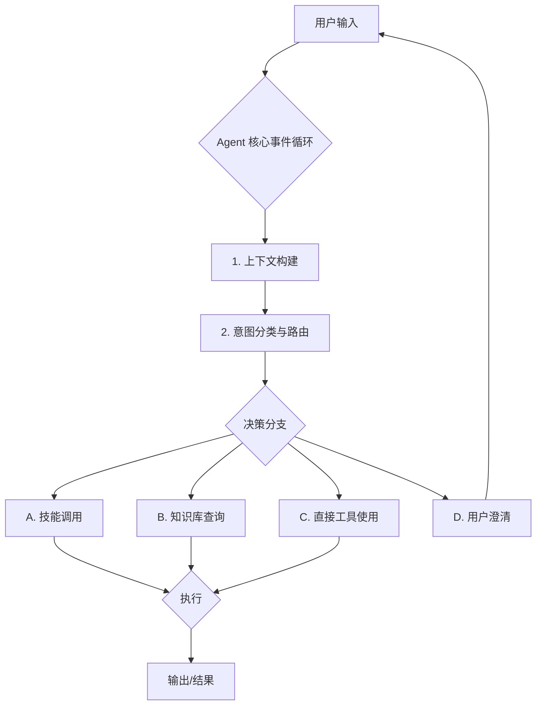

# Manus 意图识别与决策机制深度分析

## 1. 核心理念：分层决策与动态上下文

Manus 的意图识别和决策机制并非一个单一的、巨大的“黑箱”，而是一个**分层的、动态的、多模块协同**的系统。其核心理念可以概括为：

> **在丰富的上下文（Context）中，通过分层过滤（Layered Filtering）和优先级排序（Prioritization），做出最优的下一步行动（Next Action）决策。**

这个过程涉及到 Agent 的核心逻辑、知识库、技能系统、用户偏好和工具集等多个方面。

## 2. 意图识别的完整流程

当用户发出一条指令时，Manus 的处理流程可以分解为以下几个关键步骤：

### 2.1. 上下文构建 (Context Building)

这是所有决策的基础。Agent 会在第一时间构建一个包含以下所有信息的“**决策上下文**”：

- **系统提示 (System Prompt)**：定义了 Agent 的身份、核心能力、基本原则和约束。
- **对话历史 (Conversation History)**：理解当前的对话背景和用户的长期目标。
- **可用工具 (Tool Specifications)**：所有 `default_api` 中定义的工具的详细说明和参数。
- **技能元数据 (Skills Metadata)**：所有 `~/skills/` 目录下技能的 `name` 和 `description`。
- **相关知识 (Related Knowledge)**：从向量数据库或知识库中检索到的、与当前对话相关的知识片段。例如，“用户偏好高代理人自主性”这条知识。
- **项目上下文 (Project Context)**：如果任务属于某个项目，相关的项目说明和共享文件也会被加载。

### 2.2. 意图分类与路由 (Intent Classification & Routing)

在构建好上下文之后，Agent 会对用户的最新输入进行**意图分类**。这个过程并非简单的标签匹配，而是一个基于大语言模型（LLM）自身理解能力的推理过程。主要的意图“路由”方向包括：

- **任务执行 (Task Execution)**：用户明确要求完成一个具体的、可操作的任务（例如，“分析这个文件”、“开发一个网站”）。
- **知识问答 (Knowledge Q&A)**：用户提出一个事实性或概念性的问题（例如，“什么是 KVM？”、“Manus 的名字由来”）。
- **技能相关 (Skill-related)**：用户的请求与某个已注册的 Skill 的 `description` 高度匹配。
- **对话交互 (Conversational)**：闲聊、澄清、修改指令等。

### 2.3. 决策与行动 (Decision & Action)

根据意图分类的结果，Agent 会选择最优的路径：

#### A. 技能调用 (Skill Invocation)

- **触发条件**：当用户的请求与某个 Skill 的 `description` 高度相关时，该 Skill 被“激活”。
- **决策过程**：
    1.  **加载 `SKILL.md`**：Agent 会将匹配到的 Skill 的完整 `SKILL.md` 文件加载到上下文中。
    2.  **遵循指南**：Agent 会严格遵循 `SKILL.md` 中定义的工作流程、最佳实践和工具使用建议来执行任务。
    3.  **按需加载资源**：如果在执行过程中需要，Agent 会根据 `SKILL.md` 的指示，加载 `references/` 或 `scripts/` 中的具体资源。
- **示例**：用户说“帮我创建一个专业的 Excel 报告”，Agent 会匹配到 `excel-generator` Skill，并按照其中定义的四层实现框架来工作。

#### B. 知识库查询 (Knowledge Retrieval)

- **触发条件**：
    1.  在**上下文构建**阶段，系统会自动进行一次初步的向量检索，将最相关的知识片段（如用户偏好）注入上下文。
    2.  在**决策过程**中，如果 Agent 认为需要更多信息来做出判断，它会主动使用 `search` 工具或查询内部知识库。
- **决策逻辑**：
    - **知识建议 vs. 直接使用**：这取决于知识的性质和 Agent 的置信度。
        - **高置信度/内部知识**（如“用户偏好高代理人自主性”）：Agent 会**直接采纳**并应用这条知识，因为它被认为是系统内置的、可靠的行为准则。它会倾向于独立完成任务，减少不必要的询问。
        - **低置信度/外部知识**（如网络搜索结果）：Agent 可能会**向用户呈现信息并询问**（例如，“我找到了关于 XYZ 的信息，这符合您的预期吗？”），因为它需要用户的确认来保证信息的准确性。

#### C. 直接工具使用 (Direct Tool Use)

- **触发条件**：当用户的请求是一个明确的、单一的操作，且不涉及复杂的工作流时（例如，“列出当前目录的文件”、“读取这个文件的内容”）。
- **决策过程**：Agent 会直接从 `default_api` 中选择最合适的工具，并填充其参数。

#### D. 用户澄清 (User Clarification)

- **触发条件**：当用户的指令模糊不清、信息不足，或者 Agent 的置信度较低时。
- **决策过程**：Agent 会使用 `message` 工具，类型为 `ask`，向用户提出问题，以获取足够的信息来继续任务。

## 3. 自主性决策：以“用户偏好高代理人自主性”为例

这条知识是 Manus 系统中一个非常重要的行为准则，它深刻影响着 Agent 的决策模式。

- **来源**：这条知识通常存储在系统的核心知识库中，并在每次任务开始时通过向量检索被高优先级地加载到上下文中。
- **作用机制**：
    1.  **减少不必要的询问**：当 Agent 面临一个决策点时（例如，选择哪个库、如何命名文件），它会首先尝试根据已有的信息和最佳实践独立做出决定，而不是立即向用户寻求确认。
    2.  **主动解决问题**：如果遇到错误或障碍，Agent 会优先尝试多种解决方案（例如，重试、更换工具、修改代码），只有在多次尝试失败后，才会向用户求助。
    3.  **提升任务流畅性**：通过减少中断和等待，最大化任务执行的效率。

- **决策示例**：

| 场景 | 低自主性决策 (不推荐) | 高自主性决策 (推荐) |
| :--- | :--- | :--- |
| **文件命名** | “我需要保存这个文件，您想叫它什么名字？” | “文件已保存为 `project_analysis_report.md`。” |
| **遇到错误** | “命令执行失败，我该怎么办？” | “命令执行失败，正在尝试使用 `-y` 参数自动确认...” |
| **信息不全** | “您没有提供 API 密钥。” | “我没有找到 API 密钥，正在检查环境变量和配置文件...” |

## 4. 总结

Manus 的意图识别和决策系统是一个复杂而精密的工程。它通过**分层上下文、多路意图路由和基于置信度的决策逻辑**，实现了在不同场景下的灵活响应。**技能系统**为复杂任务提供了“专家指南”，而**知识库**则为 Agent 的行为和决策注入了“经验和原则”。

“用户偏好高代理人自主性”这样的知识，正是连接这两者的桥梁，它指导 Agent 如何更好地利用其技能和工具，以一种更高效、更符合用户期望的方式完成工作。
