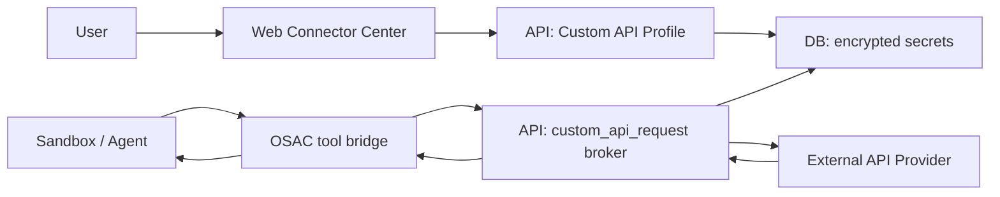
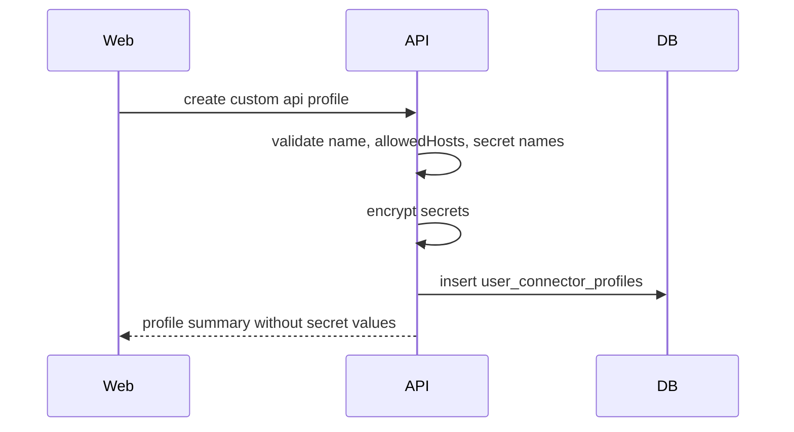
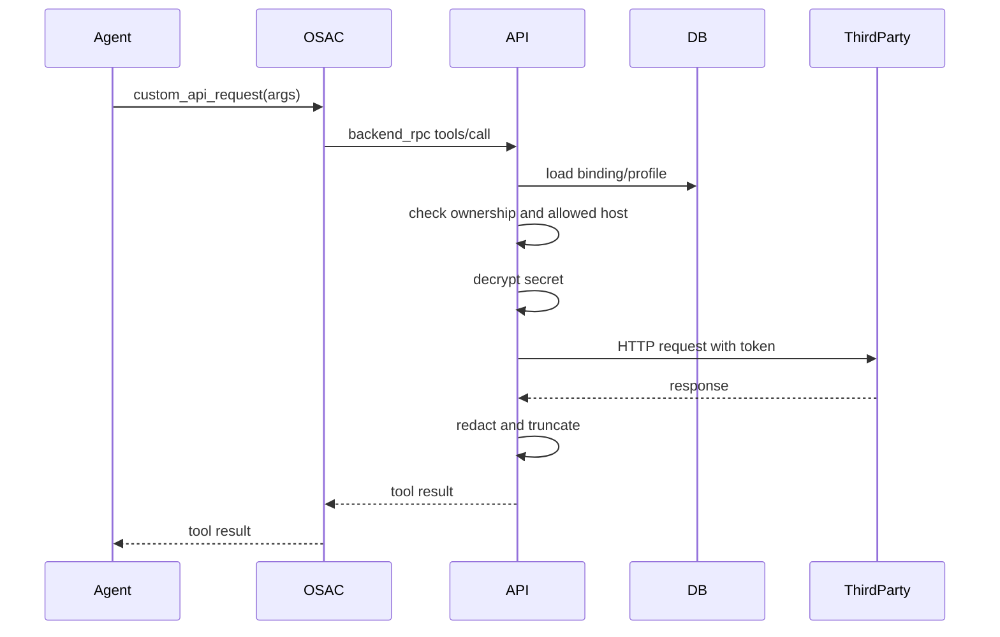

# 自定义 API 后端 Broker 调用设计 [20260503-1353已采用]

更新时间：2026-05-03 13:49

## 1. 背景

当前连接器中心已经存在三类能力入口：

1. 应用连接器：例如 GitHub、Slack、Notion、Figma 等预置连接器。
2. 自定义 MCP：用户接入已有 MCP server。
3. 自定义 API：用户希望只提供 API key / token，就让 Agent 调用第三方 API。

本设计讨论的是第三类：**自定义 API**。

本方案早期曾讨论在产品体验上参考 Manus 的连接器添加方式：连接器中心展示“添加自定义 API”入口和少量常用供应商模板卡片，用户不需要先理解 endpoint、tool schema 或 MCP server，只需要按向导填写 API 用途说明、密钥和必要的访问域名。

但当前阶段明确调整为：**暂不开放自定义 API 的任何用户态 UI**。连接器中心不展示 `添加自定义 API`，也不展示 OpenAI、Anthropic、Google Gemini 的自定义 API 模板卡片。相关 UI 设计只作为后续阶段参考，不进入本阶段实现范围。

现阶段不做 UI 的原因：

1. 自定义 API 本质上是用户配置的外部 HTTP 调用能力，一旦开放 UI，就会让普通用户创建可出网的调用入口；在后端安全闭环、审计、feature flag、权限拒绝路径完成前，不应暴露。
2. 仅隐藏 secret 不足以保证安全。必须先验证 direct request、未 attach 调用、越权 profileId、SSRF、敏感 header、响应脱敏等后端防线。
3. Manus 式便捷添加会降低用户配置门槛，也会放大误配置风险；当前阶段需要先确保 allowed host、auth placement、dangerous method、日志脱敏等约束可被后端强制执行。
4. OpenAI、Anthropic、Google Gemini 模板容易让用户误认为 oneceo 已提供完整官方连接器能力；在只做通用 Broker 的阶段，提前展示会造成产品预期偏差。
5. 当前目标是先把能力边界和安全设计评审清楚，避免 UI 先行导致后续为了兼容已暴露入口而引入补丁式方案。

后续若重新打开 UI，第一批模板才考虑截图中的三个预置供应商：

1. OpenAI
2. Anthropic
3. Google Gemini

这三个模板不做深度语义化专用工具，只提供默认说明、默认 host、默认鉴权方式、密钥命名建议和表单预填，最终仍统一走后端 Broker 的 `custom_api_request`。

用户提出的关键问题是：

1. 如果不把 token 注入 sandbox，自定义 API 是否可实现。
2. 如果 API 能做的事情很多，是否必须把所有 endpoint 都转成 tools。
3. Manus 类产品看起来不要求用户填写 endpoint，它是怎么实现的。

结论：

1. token 不进 sandbox 可以实现。
2. 实现方式必须是后端 API Broker，而不是 sandbox 直接 curl 第三方服务。
3. 用户不填写 endpoint 的体验可以实现，但必须把“自由 HTTP 请求”收束在后端安全策略内。

## 2. 目标

本方案只实现一个目标：

**用户在 oneceo 中保存自定义 API 的说明与密钥，Agent 通过后端 Broker 调用第三方 API，密钥只在后端解密和使用，不进入 sandbox。**

当前阶段目标：

1. 明确后端 Broker 的安全边界、数据模型、权限校验和调用链路。
2. 明确自定义 API UI 暂不开放，连接器中心必须隐藏入口和模板卡片。
3. 若代码中已有实验性入口，必须通过 feature flag / catalog 可见性 / 路由权限使其不可被普通用户访问。
4. 在没有完整安全闭环前，不允许用户通过 UI 创建、attach 或调用自定义 API profile。

现阶段不做 UI 的原因同第 1 节：该能力涉及用户 secret、后端出网、Agent tool 暴露和第三方 API 调用，必须先以后端安全闭环为第一优先级。

验收目标：

1. 用户可以创建自定义 API profile。
2. 用户可以保存一个或多个 secret，例如 `OPENAI_API_KEY`、`SERP_API_KEY`。
3. secret 加密存储在后端数据库中。
4. sandbox 内不能通过 `echo $KEY_NAME`、`env`、文件、MCP headers 读取用户 secret。
5. Agent 可以通过一个受控 tool 发起 API 调用。
6. 后端按当前用户、当前 session、已 attach 的 profile 解密 secret 并代为调用第三方 API。
7. 后端对目标 URL、请求方法、headers、body、响应大小和日志脱敏做安全控制。
8. 连接器中心不展示自定义 API 入口、添加卡片、OpenAI / Anthropic / Google Gemini 自定义 API 模板卡片。
9. 如果后端接口或 tool 先行存在，默认必须处于不可用或仅内部可控状态，不能被未授权用户从前端触发。

## 3. 非目标

本次不做以下内容：

1. 不把用户 secret 注入 sandbox 环境变量。
2. 不把用户 secret 写入 OpenCode / Codex / OSAC / MCP 配置文件。
3. 不让 sandbox 直接拿 token 调第三方 API。
4. 不自动把一个 API 的所有 endpoint 全量展开成几十或上百个 tools。
5. 不实现通用无限制 HTTP 代理。
6. 不修改现有 MCP 主链路。
7. 不替代已有预置连接器和 Composio broker 连接器。
8. 第一阶段不为 OpenAI、Anthropic、Google Gemini 单独实现 `chat_completion`、`image_generation` 等专用 tool。
9. 第一阶段不做模板市场、批量导入 OpenAPI spec、自动爬取并解析完整文档站。
10. 当前阶段不做自定义 API 列表页、添加向导、模板卡片、测试连接按钮和会话一键启用 UI。
11. 当前阶段不允许通过前端创建或编辑自定义 API profile。
12. 当前阶段不以 UI 便捷性作为验收项；原因是安全边界尚未完成前，便捷入口会扩大误用、越权和 SSRF 风险面。

## 4. 与 MCP 的关系

自定义 API Broker 和 MCP 在 Agent 侧最终都会表现为 tool：

```text
tool schema -> tool call -> result
```

但两者的运行时边界不同：

| 维度 | 自定义 API Broker | MCP |
| --- | --- | --- |
| 凭证位置 | 后端数据库加密保存，后端调用时解密 | 可能进入 sandbox env、headers、本地 MCP 进程或远端 MCP |
| 执行位置 | oneceo API 后端 | sandbox、远端 MCP server 或后端 broker |
| 用户接入成本 | 填 API 说明和 secret | 需要 MCP server 或 MCP URL |
| 适合场景 | 普通 HTTP API、API key 服务、临时自动化 | 完整工具服务器、状态型工具、复杂本地能力 |

因此本方案可以理解为：

**oneceo 内置一个安全版轻量 MCP provider，但不要求用户自己写 MCP server。**

## 5. Manus 类“不填 endpoint”体验分析

从 Manus 类界面看，用户只填写：

1. 名称
2. 图标
3. 备注/API 文档说明
4. 密钥名称
5. 密钥值

它不要求 endpoint 的原因通常有两种可能：

### 5.1 sandbox env 模式

平台把用户 secret 注入 sandbox：

```text
OPENAI_API_KEY=sk-xxx
```

Agent 读取环境变量，再根据备注或文档自己写 curl / Python / JS：

```bash
curl -H "Authorization: Bearer $OPENAI_API_KEY" https://api.example.com/v1/search
```

这种方式最灵活，但 secret 已进入 sandbox，不符合 oneceo 当前安全目标。

### 5.2 后端 Broker 模式

平台不把 secret 给 sandbox，而是让 Agent 调用一个后端工具：

```text
custom_api_request
```

Agent 根据用户备注生成 URL、method、query、body，后端校验后携带 secret 发请求。

这种方式可以做到 secret 不进 sandbox，但如果完全不限制 URL，就会变成危险的通用 HTTP 代理。因此必须引入允许域名、方法白名单和请求/响应限制。

本方案采用第二种。

## 6. 总体架构



核心原则：

1. sandbox 只看到 tool schema 和用户填写的非敏感说明。
2. secret 只在 `apps/api` 后端解密。
3. 第三方 HTTP 请求只由后端发出。
4. 后端必须基于当前用户与当前 session 做权限校验。

## 7. 产品形态与隐藏策略

当前阶段不开放自定义 API 用户态 UI。产品形态的优先级从“便捷添加”调整为“隐藏入口、收紧权限、先保证安全闭环”。Manus 式卡片和向导只保留为后续阶段参考，不进入当前阶段实现。

不做 UI 的直接原因：当前阶段需要先验证后端是否能在没有前端配合的情况下独立拒绝非法请求。只有后端能抵御直接接口调用、伪造 tool call 和越权 profile 访问后，UI 才可以作为便捷层开放。

当前阶段必须满足：

1. 连接器中心不出现 `添加自定义 API` 卡片。
2. 连接器中心不出现 OpenAI、Anthropic、Google Gemini 的自定义 API 模板卡片。
3. 连接器 catalog 对普通用户不返回 `custom_api` 可见入口。
4. 前端不注册可访问的自定义 API 创建、编辑、测试、attach 页面。
5. 后端即使实现了 Broker，也不能因为 UI 隐藏就放松权限校验；任何调用仍必须校验用户、会话、profile、binding、allowed host 和 secret 引用。

隐藏 UI 不是安全边界，真正的安全边界必须在后端完成。

## 7.1 连接器中心卡片

入口：

```text
连接器 -> 自定义 API
```

当前阶段：**不展示该入口，也不展示以下卡片**。

不展示原因：卡片入口会暗示该能力已经可用，并引导用户提交 API Key；在 feature flag、权限、审计和 Broker 拒绝路径未完成前，不应让用户产生配置或启用预期。

后续阶段若重新开放 UI，再考虑展示 4 个主要卡片：

1. `添加自定义 API`
   - 视觉为大按钮卡片，左侧或居中显示 `+`。
   - 标题：`添加自定义 API`
   - 点击后进入自定义添加向导。
2. `OpenAI`
   - 标题：`OpenAI`
   - 描述：`使用 GPT 系列模型，实现智能文本生成`
   - 默认 host：`api.openai.com`
   - 默认密钥名：`OPENAI_API_KEY`
   - 默认鉴权：`Authorization: Bearer <secret>`
3. `Anthropic`
   - 标题：`Anthropic`
   - 描述：`获得可靠 AI 助手服务，支持安全智能对话`
   - 默认 host：`api.anthropic.com`
   - 默认密钥名：`ANTHROPIC_API_KEY`
   - 默认鉴权：`x-api-key: <secret>`
4. `Google Gemini`
   - 标题：`Google Gemini`
   - 描述：`处理多模态内容，支持文本图像与代码`
   - 默认 host：`generativelanguage.googleapis.com`
   - 默认密钥名：`GEMINI_API_KEY`
   - 默认鉴权：`x-goog-api-key: <secret>`

后续卡片行为：

1. 未配置时点击进入预填向导。
2. 已配置时卡片右侧显示绿色对勾，点击进入详情，可执行编辑、测试、启用到会话。
3. 同一供应商允许创建多个 profile，例如个人 OpenAI key、团队 OpenAI key，但卡片默认展示最近使用或默认 profile。
4. 卡片不展示 secret 摘要以外的任何敏感内容。
5. 模板卡片只是便捷入口，不绕过 allowed host、secret 加密、session attach 和 Broker 权限校验。

## 7.2 创建自定义 API

当前阶段：**不提供创建自定义 API 的用户态表单**。下列字段仅作为后续 UI 参考和后端数据模型理解：

不提供原因：创建表单会收集用户 secret，并产生 profile、binding、Agent tool 暴露等后续链路；当前阶段必须避免 secret 进入任何未完成验收的链路。

后续用户填写：

1. 名称：例如 `我的 OpenAI API`
2. 图标：可选
3. 备注/API 文档说明：告诉 Agent 如何、何时使用该 API
4. 允许访问域名：从备注中自动提取，用户保存前确认；也允许手动编辑
5. 密钥列表：
   - 密钥名称，例如 `OPENAI_API_KEY`
   - 密钥值，例如 `sk-xxx`
   - 注入位置语义，例如 `Authorization Bearer`、`x-api-key`、`query param`

后续自定义添加必须提供足够便捷性，避免用户被 endpoint、header、schema 细节挡住：

1. 支持粘贴 API 文档 URL。
   - 前端把 URL 作为说明输入的一部分保存。
   - 后端或前端可以从 URL 中提取候选 host，保存前要求用户确认。
2. 支持粘贴示例 curl。
   - 系统从 `curl` 中提取 method、host、path、header 名称和鉴权位置。
   - 只把 host、默认方法、鉴权方式作为建议保存；不要求用户维护完整 endpoint 列表。
3. 支持自然语言说明。
   - 例如：`这个 API 用于查询物流，文档在 https://docs.example.com，调用 https://api.example.com，使用 x-api-key。`
   - 系统提取 `api.example.com` 和 `x-api-key` 并让用户确认。
4. 支持“我不知道怎么填”的最短路径。
   - 用户只填名称、API 文档 URL、API Key。
   - 系统提示用户确认自动提取的 host；如果无法提取 host，则阻止保存并要求补充服务地址。
5. 支持一键测试连接。
   - 预置模板使用默认轻量测试策略。
   - 自定义 API 如果没有健康检查 endpoint，则只测试配置合法性、域名可访问性和鉴权 header 生成，不做真实业务写入请求。
6. 支持保存为草稿。
   - 草稿可以缺少 secret 或 allowed host，但不能 attach 到会话。
   - 只有状态为 `ready` 的 profile 可以被 Agent 使用。

说明：

1. 用户可以不填写 endpoint。
2. 但用户必须确认允许访问的域名或 base URL。
3. 没有允许域名时，profile 不能被 attach 到 session。
4. 从 Manus 体验角度看，界面可以弱化 endpoint，但不能弱化 allowed host 的确认。
5. 对普通用户展示“允许访问域名”，对高级用户可展开查看 method、auth placement、header name 等细节。

## 7.3 预置模板创建流程

当前阶段：**不提供 OpenAI / Anthropic / Google Gemini 模板创建流程**。模板定义可以作为后端常量草案保留，但不能暴露给普通用户，也不能出现在连接器中心。

不提供原因：模板会显著降低配置门槛，也会让用户认为这些供应商已经有稳定官方级支持；当前阶段只讨论通用 Broker，不承诺供应商专用能力。

后续用户点击 OpenAI / Anthropic / Google Gemini 后，不直接创建不可见配置，而是进入预填向导：

1. 第一步：确认服务信息。
   - 名称默认使用供应商名。
   - 说明默认使用模板说明。
   - 图标默认使用内置供应商图标。
2. 第二步：填写密钥。
   - 密钥名称已预填且可编辑。
   - 密钥值输入框使用 password 模式。
   - 显示密钥获取入口链接，但不把密钥明文写入日志或 URL。
3. 第三步：确认安全边界。
   - 展示 allowed host。
   - 展示默认鉴权方式。
   - 用户需要点击确认后保存。
4. 第四步：测试与启用。
   - 保存成功后展示状态：`已保存`、`可启用到会话`。
   - 如果当前存在会话上下文，提供 `启用到当前会话`。
   - 如果没有会话上下文，只保存 profile，不自动 attach。

预置模板默认值：

| 模板 | allowedHosts | secretName | placement | headerName | 说明 |
| --- | --- | --- | --- | --- | --- |
| OpenAI | `api.openai.com` | `OPENAI_API_KEY` | `authorization_bearer` | `Authorization` | 使用 GPT 系列模型，实现智能文本生成 |
| Anthropic | `api.anthropic.com` | `ANTHROPIC_API_KEY` | `custom_header` | `x-api-key` | 获得可靠 AI 助手服务，支持安全智能对话 |
| Google Gemini | `generativelanguage.googleapis.com` | `GEMINI_API_KEY` | `custom_header` | `x-goog-api-key` | 处理多模态内容，支持文本图像与代码 |

注意：

1. 这些模板第一阶段仍然是 custom API profile。
2. 模板不把 key 写入 sandbox。
3. 模板不自动暴露全部官方 endpoint。
4. Agent 根据模板说明和用户任务生成请求，后端按 allowed host 与 auth placement 执行。

## 7.4 自定义添加向导字段

当前阶段：**不实现自定义 API 向导**。以下内容仅作为后续阶段参考。

不实现原因：自动解析文档 URL、curl 和鉴权方式存在误判风险，必须先让后端强制校验 allowed host、敏感 header、危险 method 和 secret 使用位置，再考虑用向导降低用户配置成本。

后续自定义 API 向导使用“基础信息 -> 密钥与鉴权 -> 访问边界 -> 复核保存”的顺序。

基础信息：

1. API 名称，必填。
2. 图标，选填，支持上传或 URL；未填时使用首字母图标。
3. 用途说明，必填，用来告诉 Agent 何时使用。
4. API 文档 URL，选填但强烈推荐。
5. 示例请求，选填，支持 curl / fetch / HTTP request 文本。

密钥与鉴权：

1. 密钥名称，默认根据服务名生成，例如 `EXAMPLE_API_KEY`。
2. 密钥值，必填才能进入 `ready` 状态。
3. 鉴权方式，提供下拉选择：
   - `Authorization Bearer`
   - `x-api-key`
   - `自定义 Header`
   - `Query Param`
   - `无鉴权`
4. Header 名或 query 参数名，在对应鉴权方式下显示。
5. 多密钥支持保留，但第一版表单主路径只展示一个密钥；高级区域可添加更多密钥。

访问边界：

1. allowed hosts，必填才能进入 `ready` 状态。
2. allowed methods，默认 `GET`、`POST`，高级区域可编辑。
3. 是否允许 `DELETE` 默认关闭，开启时需要二次确认。
4. base URL 可选，用于帮助 Agent 更稳定地拼接请求；保存时仍转为 host 白名单校验。

复核保存：

1. 展示将保存的非敏感配置。
2. 展示 secret 摘要，例如 `****abcd`。
3. 展示 sandbox 不可见 secret 的说明。
4. 保存后返回 profile summary。

## 7.5 会话 attach

当前阶段：普通用户不能通过 UI 在会话中启用自定义 API profile。

后续用户在会话中启用某个自定义 API profile。

后端创建 `task_session_connector_bindings` 记录，runtime transport 使用 `backend_rpc`，不能使用 `remote_sse` 或 `http_stream` headers 下发 secret。

## 7.6 Agent 可见能力

当前阶段，Agent 默认不应看到自定义 API 工具。只有在后端确认当前 session 已 attach `ready` 状态的 profile，且 feature flag 明确允许时，才可以暴露工具。

不暴露原因：Agent tool 一旦可见，就可能被模型主动调用或被构造参数调用；当前阶段必须先保证未启用、未绑定、越权和非法 URL 的调用全部在后端被拒绝。

后续 MVP 只暴露一个工具：

```text
custom_api_request
```

工具描述由后端根据 profile 生成，包含：

1. API 名称
2. 用户备注/API 文档说明
3. 可用 secret 名称列表
4. 允许访问域名
5. 禁止泄露 secret 的说明

Agent 不看到 secret value。

## 8. Tool Schema 设计

## 8.1 MVP 工具：custom_api_request

```ts
type CustomApiRequestInput = {
  profileId: string;
  request: {
    method: 'GET' | 'POST' | 'PUT' | 'PATCH' | 'DELETE';
    url: string;
    headers?: Record<string, string>;
    query?: Record<string, string | number | boolean | null>;
    body?: unknown;
    timeoutMs?: number;
  };
  auth?: {
    secretName: string;
    placement: 'authorization_bearer' | 'x_api_key' | 'custom_header' | 'query_param' | 'none';
    headerName?: string;
    queryParamName?: string;
  };
  responseMode?: 'json' | 'text';
};
```

约束：

1. `profileId` 必须属于当前用户。
2. 当前 `taskSessionId` 必须已 attach 该 profile。
3. `url` host 必须落在 profile 的 allowed hosts 内。
4. `auth.secretName` 只能引用该 profile 内已保存的 secret 名称。
5. Agent 不能传 secret value。
6. 后端忽略或拒绝 Agent 传入的敏感 header，例如 `Authorization`、`Cookie`、`x-api-key`。
7. 鉴权 header 只能由后端根据 secret 生成。

## 8.2 返回结构

```ts
type CustomApiRequestResult = {
  status: number;
  ok: boolean;
  headers: Record<string, string>;
  body: unknown;
  truncated: boolean;
  requestId: string;
};
```

返回约束：

1. 默认只返回 JSON。
2. 文本响应限制最大长度。
3. 二进制响应默认拒绝。
4. 响应中的敏感字段需要脱敏。

## 9. 后端数据模型

MVP 推荐复用现有连接器体系，新增 connector key：

```ts
custom_api
```

也可以后续拆成独立表，但 MVP 优先复用现有 profile / binding / secret 机制。

## 9.1 Profile config

存放在 `user_connector_profiles.config_json`：

```json
{
  "templateKey": "custom",
  "profileStatus": "ready",
  "customApiName": "My Custom API",
  "iconUrl": "https://example.com/icon.png",
  "instructions": "Use this API for ...",
  "documentationUrl": "https://docs.example.com",
  "sampleRequest": "curl https://api.example.com/v1/search -H 'Authorization: Bearer ...'",
  "allowedHosts": ["api.example.com"],
  "allowedMethods": ["GET", "POST"],
  "baseUrl": "https://api.example.com",
  "defaultAuth": {
    "secretName": "EXAMPLE_API_KEY",
    "placement": "authorization_bearer"
  }
}
```

字段说明：

1. `templateKey` 用来区分 `custom`、`openai`、`anthropic`、`google_gemini`，只影响 UI 默认值和卡片归类，不影响权限模型。
2. `profileStatus` 取值为 `draft` 或 `ready`。`draft` 可以保存不完整配置，但不能 attach 到会话；`ready` 必须通过 secret、allowed host 和安全校验。
3. `documentationUrl` 和 `sampleRequest` 只作为 Agent instructions 和后续编辑依据，保存前必须清理示例中的真实 secret。
4. `baseUrl` 是便捷字段，帮助 Agent 稳定生成 URL；真正执行时仍以 `allowedHosts` 和 URL 安全校验为准。

## 9.2 Profile secret

加密后存放在 `user_connector_profiles.secret_ciphertext`：

```json
{
  "secrets": [
    {
      "name": "EXAMPLE_API_KEY",
      "value": "secret-value",
      "summary": "***abcd"
    }
  ]
}
```

实际加密继续使用 `connector-secret-service.ts`。

## 9.3 Binding

会话启用后复用 `task_session_connector_bindings`：

```json
{
  "connectorKey": "custom_api",
  "profileId": "profile_xxx",
  "desiredState": "attached",
  "runtimeTransport": "backend_rpc",
  "runtimeProviderId": "task_session:xxx:connector:custom_api:profile:yyy"
}
```

## 10. 后端服务设计

## 10.1 Connector definition

新增：

```text
apps/api/src/connectors/definitions/custom-api.ts
```

定义：

1. `authMode: 'token'`
2. `runtime.type: hosted`
3. 当前阶段 `visibleInMenu: false`
4. 当前阶段 `available` 由 feature flag 控制，默认 false

注意：

1. 不定义 remote MCP URL。
2. 不定义 headersEnv。
3. 不允许 materialize 成 `remote_sse` 或 `http_stream`。

## 10.2 Registry materialize

`connector-registry.ts` 对 `custom_api` 的处理必须受 feature flag 控制。当前阶段默认不向普通用户 catalog 返回该 connector，也不 materialize 成可调用 provider。

后续开放时才返回：

```ts
{
  type: 'hosted',
  enabled: true,
  provider: 'custom_api',
  capabilities: ['initialize', 'tools/list', 'tools/call']
}
```

## 10.3 Broker service

新增：

```text
apps/api/src/services/custom-api-broker-service.ts
```

职责：

1. 解析 profile config。
2. 解密 profile secret。
3. 校验 session ownership。
4. 校验 session binding。
5. 生成 tools/list。
6. 执行 tools/call。
7. 发出第三方 HTTP 请求。
8. 记录审计日志。
9. 响应脱敏和裁剪。

## 10.4 接入 backend_rpc

扩展现有 backend RPC 分发逻辑：

```text
backendProvider = custom_api
method = initialize | tools/list | tools/call
```

`tools/list` 返回一个 `custom_api_request` tool。

`tools/call` 调用 `customApiBrokerService.executeRequest(...)`。

## 11. 安全设计

当前阶段即使 UI 完全隐藏，也必须按“接口会被直接请求”的前提设计安全。不能依赖前端隐藏、按钮不展示、路由不可达来保护 secret 或 Broker。

## 11.1 URL 安全

必须拒绝：

1. localhost / 127.0.0.1 / ::1
2. 内网网段
3. link-local 地址
4. metadata service 地址，例如 `169.254.169.254`
5. file / ftp / gopher 等非 HTTP(S) 协议
6. 重定向到非 allowed host

必须限制：

1. 只允许 `https:`，开发环境可配置是否允许 `http:`
2. host 必须在 `allowedHosts`
3. path 最大长度
4. query 参数数量和长度
5. body 大小
6. 请求超时
7. 响应大小

## 11.2 Header 安全

Agent 传入 headers 时，后端必须拒绝或覆盖：

1. `Authorization`
2. `Cookie`
3. `Set-Cookie`
4. `x-api-key`
5. `proxy-*`
6. `forwarded`
7. `x-forwarded-*`

鉴权 header 只能由后端根据 `auth.secretName` 生成。

## 11.3 Secret 安全

要求：

1. secret value 永不返回给前端。
2. secret value 永不进入 sandbox。
3. secret value 永不进入 prompt。
4. 日志只记录 secret name 和摘要。
5. tool result 需要递归脱敏常见敏感字段。

## 11.4 权限校验

每次 tool call 必须校验：

1. `userId` 是当前登录用户。
2. `taskSessionId` 属于该用户。
3. `profileId` 属于该用户。
4. 当前 session 已 attach 该 profile。
5. `providerId` 与 binding 匹配。

不能只相信 sandbox 传来的 `profileId` 或 `providerId`。

## 11.5 UI 隐藏后的安全要求

当前阶段 UI 隐藏后，仍必须满足：

1. `custom_api` connector definition 默认 `visibleInMenu: false`。
2. 普通用户的 connector catalog 默认不返回 `custom_api`。
3. 自定义 API profile 创建、更新、测试、attach 路由如果先行存在，必须受 feature flag 和权限校验双重控制。
4. feature flag 默认关闭；关闭时接口应返回明确的 disabled / not available 错误，而不是只依赖前端不调用。
5. backend RPC 分发不能仅凭 `provider = custom_api` 就执行，必须确认当前环境允许、session 已绑定、profile 为 `ready`、profile 属于当前用户。
6. `tools/list` 在未启用、未绑定或 profile 非 ready 时不能返回 `custom_api_request`。
7. `tools/call` 即使被直接构造请求，也必须在解密 secret 前完成所有权、绑定、host、method、header 和 body 校验。
8. 审计日志必须记录被拒绝的直接请求原因，但不能记录 secret value。

## 12. 用户不填 endpoint 时的运行机制

用户不填 endpoint，不代表后端无限制代理。

MVP 运行机制：

1. 用户在备注里写 API 文档说明或文档 URL。
2. 用户保存 profile 时确认 allowed hosts。
3. Agent 根据备注理解要调用哪个 URL、method、body。
4. Agent 调用 `custom_api_request`。
5. 后端校验 URL host 是否在 allowed hosts。
6. 后端携带 secret 调第三方。

示例：

用户备注：

```text
这是 Example CRM API。
文档：https://docs.example-crm.com
搜索联系人接口：GET https://api.example-crm.com/v1/contacts/search?q=关键词
创建联系人接口：POST https://api.example-crm.com/v1/contacts
使用 EXAMPLE_API_KEY 作为 Bearer Token。
```

Agent 调用：

```json
{
  "profileId": "profile_xxx",
  "request": {
    "method": "GET",
    "url": "https://api.example-crm.com/v1/contacts/search",
    "query": {
      "q": "张三"
    }
  },
  "auth": {
    "secretName": "EXAMPLE_API_KEY",
    "placement": "authorization_bearer"
  }
}
```

后端真实请求：

```http
GET /v1/contacts/search?q=%E5%BC%A0%E4%B8%89
Host: api.example-crm.com
Authorization: Bearer <decrypted-secret>
```

## 13. 可选增强：结构化 endpoint

后续可以支持 endpoint 配置，但不作为 MVP 必需项。

增强后用户可配置：

```json
{
  "endpointId": "search_contacts",
  "method": "GET",
  "path": "/v1/contacts/search",
  "querySchema": {
    "type": "object",
    "properties": {
      "q": { "type": "string" }
    },
    "required": ["q"]
  }
}
```

此时可以新增工具参数：

```json
{
  "endpointId": "search_contacts",
  "query": {
    "q": "张三"
  }
}
```

但第一版不强制用户配置 endpoint。

## 14. 与预置供应商的关系

当前阶段不开放预置供应商自定义 API 模板 UI。OpenAI、Anthropic、Google Gemini 的模板定义只作为后续阶段参考，不进入连接器中心展示，也不能让普通用户通过前端创建 profile。

不开放原因：供应商模板属于“高信任、低门槛”入口，用户会直接粘贴真实 API Key。当前阶段如果没有完成后端拒绝路径、审计日志、secret 脱敏和 feature flag 控制，模板入口会把安全风险前移到普通用户操作中。

后续阶段若重新开放，预置供应商优先只做截图中的三个：OpenAI、Anthropic、Google Gemini。它们的定位不是独立连接器实现，而是自定义 API 的快捷模板。

实现分层：

1. UI 层：供应商卡片提供类似 Manus 的快捷入口。
2. Profile 层：点击模板后生成普通 `custom_api` profile。
3. Tool 层：仍只暴露 `custom_api_request`。
4. 后续增强层：如果确认高频需求，再为供应商补充语义化专用工具。

MVP 不需要为每个供应商预置几十个 endpoint 或 tools。模板只负责降低用户添加成本：

1. 默认说明模板。
2. 默认 allowed host。
3. 默认密钥名称。
4. 默认鉴权方式。
5. 默认图标与卡片描述。

OpenAI 模板：

```json
{
  "templateKey": "openai",
  "displayName": "OpenAI",
  "description": "使用 GPT 系列模型，实现智能文本生成",
  "allowedHosts": ["api.openai.com"],
  "defaultAuth": {
    "secretName": "OPENAI_API_KEY",
    "placement": "authorization_bearer"
  },
  "instructions": "Use OpenAI API for GPT text generation and related OpenAI platform APIs. Prefer official endpoints under https://api.openai.com."
}
```

Anthropic 模板：

```json
{
  "templateKey": "anthropic",
  "displayName": "Anthropic",
  "description": "获得可靠 AI 助手服务，支持安全智能对话",
  "allowedHosts": ["api.anthropic.com"],
  "defaultAuth": {
    "secretName": "ANTHROPIC_API_KEY",
    "placement": "custom_header",
    "headerName": "x-api-key"
  },
  "instructions": "Use Anthropic API for Claude conversations and safe assistant workflows. Prefer official endpoints under https://api.anthropic.com."
}
```

Google Gemini 模板：

```json
{
  "templateKey": "google_gemini",
  "displayName": "Google Gemini",
  "description": "处理多模态内容，支持文本图像与代码",
  "allowedHosts": ["generativelanguage.googleapis.com"],
  "defaultAuth": {
    "secretName": "GEMINI_API_KEY",
    "placement": "custom_header",
    "headerName": "x-goog-api-key"
  },
  "instructions": "Use Google Gemini API for multimodal generation, text, image understanding, and code-related tasks. Prefer official endpoints under https://generativelanguage.googleapis.com."
}
```

## 15. 前端隐藏要求与后续 UI 参考

当前阶段的前端要求不是实现自定义 API UI，而是保证用户看不到、点不到、绕不过。

不做前端 UI 的原因：

1. 自定义 API 是可出网能力，前端入口开放会扩大攻击面。
2. 前端隐藏不等于安全，必须先证明后端能独立拒绝非法直接请求。
3. 模板卡片和向导会收集真实 API Key，不能在 secret 存储、脱敏、审计和调用限制未验收前开放。
4. 当前阶段需要避免用户形成“OpenAI / Anthropic / Gemini 官方连接器已可用”的错误预期。

强制隐藏要求：

1. 连接器 catalog 不展示 `custom_api`。
2. 连接器中心不渲染 `添加自定义 API`。
3. 连接器中心不渲染 OpenAI、Anthropic、Google Gemini 的自定义 API 模板卡片。
4. 不注册自定义 API 创建、编辑、测试连接、模板选择页面的用户可访问路由。
5. 如果前端已有实验性组件，必须放在不可达分支或 feature flag 后，默认关闭。
6. 隐藏 UI 不能替代后端权限控制；任何接口都必须能在无 UI 的情况下抵御直接请求。

后续 UI 参考如下。

## 15.1 自定义 API 列表页

当前阶段不做该页面。

不做原因：列表页会成为能力发现入口，并诱导用户进入配置流程；当前阶段要求 catalog 层和 UI 层都隐藏 `custom_api`。

入口：

```text
连接器 -> 自定义 API
```

展示：

1. 添加自定义 API
2. OpenAI 模板卡片
3. Anthropic 模板卡片
4. Google Gemini 模板卡片
5. 用户已保存的自定义 API profiles

布局要求：

1. 参考用户截图的两列卡片布局；窄屏改为单列。
2. `添加自定义 API` 卡片始终固定在第一位。
3. 预置模板卡片显示图标、供应商名、短描述和状态。
4. 已配置的模板卡片右侧显示绿色对勾；未配置不显示对勾。
5. 用户自建 profile 可以在模板卡片下方以列表或紧凑卡片展示，避免和预置模板混淆。
6. 卡片不能变成营销展示，保持 oneceo 的任务塔台风格：信息密度适中、状态清晰、操作直接。

状态：

1. `未配置`：点击进入预填向导。
2. `草稿`：已填写部分信息，但缺少 secret 或 allowed host，不能 attach。
3. `可用`：配置完整，可 attach。
4. `已启用到当前会话`：展示对勾和当前会话状态。

## 15.2 添加自定义 API 向导

当前阶段不做该向导。

不做原因：向导的核心价值是降低配置门槛，但在安全策略尚未通过验证前，降低门槛会放大错误配置和越权调用风险。

添加方式分为两类：

1. 从预置模板添加：OpenAI / Anthropic / Google Gemini。
2. 从空白自定义添加：用户自己填写任意第三方 API。

向导不使用一个长表单直接堆字段，而是分步降低认知成本：

1. `选择或确认服务`
   - 预置模板进入时展示已选供应商。
   - 空白添加时填写 API 名称、用途说明、文档 URL 或示例请求。
2. `填写密钥`
   - 预置模板预填密钥名称和鉴权方式。
   - 空白添加自动建议密钥名称，例如服务名转大写并追加 `_API_KEY`。
3. `确认访问边界`
   - 展示自动提取的 allowed hosts。
   - 用户可以添加或删除 host，但不能保存空 allowed host 到 ready 状态。
4. `测试并保存`
   - 展示非敏感摘要。
   - 保存后可立即启用到当前会话。

## 15.3 自定义添加的便捷能力

当前阶段不做这些便捷能力。

不做原因：自动识别文档 URL、解析 curl、生成 instructions 都可能产生错误 host 或错误鉴权位置；当前阶段先不让这些建议进入真实 profile。

便捷能力必须围绕“少填、可确认、可复核”设计：

1. 自动识别文档 URL。
   - 从 `https://docs.example.com`、`https://api.example.com/v1` 等文本中提取 host。
   - 文档站 host 和 API host 需要区分；如果只能识别文档站，界面提示用户补充实际 API host。
2. 自动解析示例 curl。
   - 识别 `-H "Authorization: Bearer xxx"` 为 `authorization_bearer`。
   - 识别 `-H "x-api-key: xxx"` 为 `custom_header`。
   - 识别 `?key=xxx` 为 `query_param`。
   - 示例中的真实 key 不保存为说明文本，只进入 secret 输入或被清理。
3. 自动生成 Agent 使用说明草稿。
   - 根据用户用途说明、文档 URL、base URL 和鉴权方式生成一段 instructions。
   - 用户可以编辑，保存前必须可见。
4. 自动生成安全边界摘要。
   - 展示该 API 允许访问的 host、默认方法、鉴权 header、是否允许危险方法。
5. 支持高级展开。
   - 普通路径只露出名称、说明、文档 URL、API Key、host 确认。
   - 高级区域提供多 secret、allowed methods、自定义 header、query param 名称。
6. 支持测试反馈。
   - 测试失败要区分配置错误、网络失败、鉴权失败、host 不允许。
   - 不在错误消息中回显 secret value。

## 15.4 表单字段

当前阶段不做该表单。

不做原因：表单会接收并保存用户 secret；在完整验收前，不能让普通用户把第三方密钥提交到该链路。

字段：

1. 名称
2. 图标 URL / 上传
3. 备注/API 文档说明
4. API 文档 URL
5. 示例请求
6. 允许访问域名
7. 密钥列表

密钥列表字段：

1. 密钥名称
2. 密钥值
3. 默认使用方式
4. Header 名或 query 参数名

保存前校验：

1. 名称必填。
2. ready 状态至少一个 secret；草稿允许暂缺 secret。
3. ready 状态至少一个 allowed host；草稿允许暂缺 allowed host。
4. secret name 只能包含大写字母、数字、下划线。
5. allowed host 不能是 IP 内网地址或 localhost。
6. 自定义 header 名不能是 `Authorization`、`Cookie`、`Set-Cookie`、`proxy-*`、`forwarded`、`x-forwarded-*` 等禁止 header。
7. 如果用户启用 `DELETE`、`PATCH` 等高风险方法，需要二次确认。

## 16. API 路由设计

复用现有 connector routes 优先。

必要接口：

```text
GET    /api/connectors/catalog
GET    /api/connectors/custom-api/templates                  # 当前阶段不对普通用户开放
POST   /api/connectors/custom-api/analyze-config              # 当前阶段不对普通用户开放
POST   /api/connectors/custom-api/profiles                    # 当前阶段不对普通用户开放
PUT    /api/connectors/custom-api/profiles/:profileId         # 当前阶段不对普通用户开放
DELETE /api/connectors/custom-api/profiles/:profileId         # 当前阶段不对普通用户开放
POST   /api/task-sessions/:taskSessionId/connectors/custom_api/attach   # 当前阶段不对普通用户开放
POST   /api/task-sessions/:taskSessionId/connectors/custom_api/detach   # 当前阶段不对普通用户开放
```

如果现有 profile 创建接口可复用，则不新增专用路由，只扩展 connector definition 和 validation。

当前阶段接口策略：

1. `GET /api/connectors/catalog` 对普通用户不返回 `custom_api`。
2. 其他自定义 API 用户态接口默认不可用。
3. 如果为了后端联调临时保留接口，必须受 feature flag、登录用户、权限和审计约束。
4. feature flag 关闭时，接口不能执行任何 secret 解密、外部请求或 binding 写入。

接口职责：

1. `GET /api/connectors/custom-api/templates` 返回 OpenAI、Anthropic、Google Gemini 三个模板定义。
2. `POST /api/connectors/custom-api/analyze-config` 接收文档 URL、示例 curl、说明文本，返回建议的 `allowedHosts`、`defaultAuth`、`secretName`、`baseUrl` 和清理后的说明草稿。
3. `POST /api/connectors/custom-api/profiles` 支持保存 `draft` 或 `ready`。
4. `attach` 时必须拒绝 `draft` profile。

内部工具调用不暴露给前端：

```text
customApiBrokerService.executeRpc(...)
```

## 17. 调用流程

## 17.1 保存 profile



## 17.2 会话调用第三方 API



## 18. 测试计划

## 18.1 单元测试

新增或覆盖：

1. profile validation
2. secret encrypt / decrypt
3. allowed host 校验
4. private IP / localhost 拦截
5. sensitive header 拦截
6. auth placement 生成
7. response redaction
8. session ownership 校验

## 18.2 集成测试

当前阶段测试场景：

1. feature flag 关闭时，catalog 不返回 `custom_api`。
2. feature flag 关闭时，custom API profile 创建、模板、分析、attach 接口不可用。
3. 未 attach 的 session 调用失败。
4. 其他用户 profileId 调用失败。
5. URL 指向 localhost / 内网失败。
6. 重定向到非 allowed host 失败。
7. `tools/list` 默认不返回 `custom_api_request`。
8. 直接构造 `tools/call` 调用失败。
9. sandbox 环境变量中不存在用户 secret name。

后续 UI 开放后的测试场景：

1. 创建 custom API profile 后 attach 到 session。
2. `tools/list` 返回 `custom_api_request`。
3. `tools/call` 调用 mock third-party API。
4. 验证返回结果脱敏和裁剪。

## 18.3 E2E 测试

最小链路：

1. 登录用户。
2. 打开连接器中心。
3. 验证看不到 `添加自定义 API`。
4. 验证看不到 OpenAI / Anthropic / Google Gemini 的自定义 API 模板卡片。
5. 直接访问自定义 API 创建、模板、分析、attach 路由，验证返回 disabled / not available / forbidden。
6. 创建会话。
7. 验证 Agent `tools/list` 不返回 `custom_api_request`。
8. 直接构造 `tools/call` 调用 `custom_api_request`，验证失败且不触发 secret 解密或外部请求。

后续 UI 开放后，才补充创建 profile、attach 到会话、调用 mock API、验证 sandbox 内无法读取 secret 的完整链路。

## 19. 实施步骤

用户确认本设计文档后，按以下顺序实现：

1. 新增 `custom_api` connector definition。
2. 将 `custom_api` 默认设为 `visibleInMenu: false`，并由默认关闭的 feature flag 控制可用性。
3. 扩展 `connector-registry.ts`，让 feature flag 关闭时 catalog 不返回 `custom_api`，backend RPC 不 materialize 可调用 provider。
4. 新增或预留 `custom-api-broker-service.ts`，但所有入口必须先经过 feature flag、ownership、binding、ready 状态和安全校验。
5. 接入 backend RPC 分发时，确保未启用或未绑定时 `tools/list` 不返回 `custom_api_request`，`tools/call` 直接拒绝。
6. 前端移除或隐藏自定义 API 入口、添加卡片、OpenAI / Anthropic / Google Gemini 模板卡片和添加向导路由。
7. 补充“UI 隐藏后直接请求失败”的单元测试、集成测试和 E2E 验证。
8. 后续确认开放 UI 后，才实现模板定义、配置分析、分步添加向导和连接器中心展示。

当前阶段不做 UI 的实施原因：

1. 先实现隐藏与拒绝路径，可以验证后端安全边界是否独立成立。
2. 先不接收用户 secret，可以降低未完成链路对真实密钥的影响。
3. 先不暴露模板，可以避免用户把通用 Broker 误解为官方连接器。
4. 先补 direct request 测试，可以避免后续 UI 开放后只验证正常路径、不验证攻击路径。

## 20. 风险与约束

主要风险：

1. 不配置 endpoint 时，Agent 可能误读文档并拼错 API。
2. 后端通用 HTTP broker 如果校验不严，会产生 SSRF 风险。
3. 第三方 API 响应可能包含敏感信息，需要脱敏。
4. 用户备注质量会直接影响 Agent 调用成功率。
5. 预置模板可能让用户误以为已经接入官方完整能力，但第一阶段实际仍是通用 Broker。
6. 自动解析 curl 或文档 URL 可能把文档站 host 当成 API host。

对应约束：

1. 必须要求 allowed hosts。
2. 必须禁止内网和 metadata 地址。
3. 必须限制请求和响应大小。
4. 必须默认脱敏敏感字段。
5. 当前阶段必须隐藏 UI 入口，避免用户误以为该能力已经可用。
6. 隐藏 UI 不能作为安全措施，所有后端接口和 tool call 必须独立完成拒绝和校验。
7. 预置模板卡片后续开放时必须说明“通过自定义 API 调用”，不承诺完整官方连接器能力。
8. 自动提取结果后续开放时必须让用户确认，不能静默保存为 ready 配置。

当前阶段不做 UI 的核心原因：自定义 API 同时涉及用户密钥、外部网络请求、Agent 自动调用和第三方响应回传，任何一个环节的校验不足都会造成越权、SSRF、secret 泄露或审计缺失。因此先隐藏入口并完成后端安全闭环，是最短路径且不引入兼容性补丁。

## 21. 最终判断

本方案可以在后续阶段实现 Manus 类“用户不必预先填写 endpoint”的体验，但当前阶段不开放自定义 API UI。

当前阶段的最终判断是：

```text
隐藏自定义 API 用户入口
不允许普通用户创建或 attach 自定义 API profile
Agent 默认看不到 custom_api_request
后端即使预留 Broker，也必须默认关闭并完整校验
secret 永远不进入 sandbox
```

后续开放后的目标路径是：

oneceo 的目标方案是：

```text
用户提供说明和 secret
Agent 生成调用意图
后端 Broker 执行真实 HTTP 请求
secret 只在后端出现
sandbox 永远拿不到 secret value
```

这条路径和现有 OSAC / backend_rpc / connector profile 体系一致，适合作为自定义 API 的第一版实现方案。
