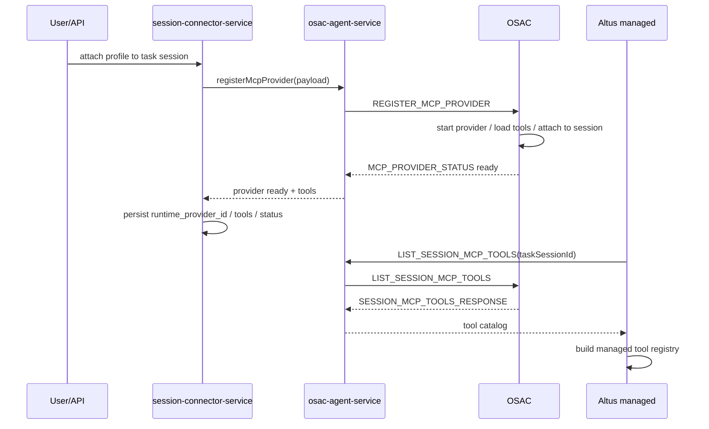

# OSAC 驱动 Altus 模式 MCP 实施文档 [20260330-1027已采用]

更新时间：2026-03-30

## 1. 文档目标

本文档是在以下两份设计文档基础上的实施拆分：

1. [20260330_OSAC驱动Altus模式MCP运行时注册设计.md](/Users/watson/codingProj/oneceo/docs/agent研发文档/20260330_OSAC驱动Altus模式MCP运行时注册设计.md)
2. [20260330_OSAC_MCP控制协议设计.md](/Users/watson/codingProj/oneceo/docs/agent研发文档/20260330_OSAC_MCP控制协议设计.md)

目标不是重复讲架构，而是明确：

1. `apps/api` 要改哪些文件
2. `OSAC` 要新增哪些能力
3. `Altus managed` 在哪里接入 session MCP tools
4. 数据表和状态流怎么变
5. 按什么顺序开发

## 2. 本次实施范围

只覆盖 `Altus mode`。

本期主线：

1. `apps/api`
   - 生成 provider register payload
   - 通过 OSAC 控制链路下发 MCP lifecycle 指令
2. `OSAC`
   - 实现 provider registry / process supervisor / remote client / session tool bridge
3. `Altus managed`
   - 在 run 启动前读取 session attached MCP tools
   - 把这些 tools 装配进 managed tool registry

不在本期实现：

1. direct mode 改造
2. 管理后台 definition/revision UI 实现
3. codex / claudecode 全链路接入

## 3. 实施后的主链路

## 4. `apps/api` 侧实施项

## 4.1 `osac-agent-service.ts`

文件：

1. [osac-agent-service.ts](/Users/watson/codingProj/oneceo/apps/api/src/services/osac-agent-service.ts)

新增方法：

1. `registerMcpProvider(orchestratorSessionId, payload)`
2. `updateMcpProviderEnv(orchestratorSessionId, payload)`
3. `attachMcpProviderToSession(orchestratorSessionId, payload)`
4. `detachMcpProviderFromSession(orchestratorSessionId, payload)`
5. `removeMcpProvider(orchestratorSessionId, payload)`
6. `listSessionMcpTools(orchestratorSessionId, payload)`

实现要求：

1. 统一走 OSAC 消息协议，不直拼 OpenCode `/mcp`
2. 每个请求都生成 `requestId`
3. 支持同步等待 `MCP_PROVIDER_STATUS` 或 `SESSION_MCP_TOOLS_RESPONSE`
4. 超时、provider 启动失败、tool schema 读取失败都要转成明确错误码

## 4.2 `osac-routes.ts`

文件：

1. [osac-routes.ts](/Users/watson/codingProj/oneceo/apps/api/src/routes/osac-routes.ts)

现状：

1. 只支持旧的 `POST /:sessionId/mcp`
2. 语义是“往 OSAC 里加一个 MCP server config”

整改：

1. 保留旧路由作为遗留兼容，不再作为 Altus mode 主入口
2. 新增 provider lifecycle 路由：
   - `POST /:sessionId/mcp/providers`
   - `PUT /:sessionId/mcp/providers/:providerId/env`
   - `POST /:sessionId/mcp/providers/:providerId/attach`
   - `POST /:sessionId/mcp/providers/:providerId/detach`
   - `DELETE /:sessionId/mcp/providers/:providerId`
   - `GET /:sessionId/mcp/session-tools`

这些路由本质上是 API 层对 `osac-agent-service` 的 HTTP 封装，便于调试和管理后台排障，不是主业务直连入口。

## 4.3 `session-connector-service.ts`

文件：

1. [session-connector-service.ts](/Users/watson/codingProj/oneceo/apps/api/src/services/session-connector-service.ts)

本期是核心改造点。

当前职责：

1. 读取 profile
2. materialize runtime config
3. 调 OpenCode `/mcp`
4. 回查运行态

新职责：

1. 读取 connector binding/profile
2. 生成 OSAC provider register payload
3. 调 `osac-agent-service.registerMcpProvider`
4. 持久化 `runtime_provider_id`
5. 维护 attach/detach/env update 状态

需要新增方法：

1. `buildOsacProviderPayload(...)`
2. `attachViaOsacProvider(...)`
3. `detachViaOsacProvider(...)`
4. `refreshProviderEnv(...)`
5. `syncSessionMcpToolsSnapshot(...)`

必须删除的主假设：

1. attach 等于对 `/mcp` 发 `POST`
2. runtime status 只看 OpenCode `/mcp`

## 4.4 `altus-managed-setup-service.ts`

文件：

1. [altus-managed-setup-service.ts](/Users/watson/codingProj/oneceo/apps/api/src/services/altus-managed-setup-service.ts)

新增职责：

1. 在 run 启动前确保 session attached MCP provider 已经 ready
2. 从 OSAC 读取当前 session tools
3. 生成 `managedMcpToolCatalog`

建议新增方法：

1. `ensureSessionMcpProviders(sessionId, userId)`
2. `captureSessionMcpToolSnapshot(sessionId, userId)`

## 4.5 `altus-managed-run-entry-service.ts`

文件：

1. [altus-managed-run-entry-service.ts](/Users/watson/codingProj/oneceo/apps/api/src/services/altus-managed-run-entry-service.ts)

当前 run state 里已有：

1. `connectors`
2. `skills`

本期新增：

1. `mcpTools`
2. `mcpProviderSnapshotId`

`startRun()` 需改为：

1. 先 capture connector snapshot
2. 再 capture session MCP tool snapshot
3. 把 `mcpTools` 注入 `AltusRunState`

## 4.6 `altus-managed-tool-runtime.ts`

文件：

1. [altus-managed-tool-runtime.ts](/Users/watson/codingProj/oneceo/apps/api/src/services/altus-managed-tool-runtime.ts)

当前只有 managed core tools。

本期改造为：

1. 支持“动态注册 MCP tools”
2. MCP tool 的真实执行不直接由 API 侧完成，而是调 `osac-agent-service` 对应的 tool invoke 桥接

本期可以采用最短路径实现：

1. core tools 继续保留
2. 新增一个 `mcp_tool_call` 桥接层
3. 每个 MCP tool 在模型可见 catalog 中展开成真实 tool name

## 4.7 `altus-managed-prompt-service.ts`

文件：

1. [altus-managed-prompt-service.ts](/Users/watson/codingProj/oneceo/apps/api/src/services/altus-managed-prompt-service.ts)

新增一段：

1. `# Session MCP tools`

内容包括：

1. provider displayName
2. 当前可见 tool list
3. 哪些 tools 已 attach 到 session

注意：

1. 这里只做可见性提示
2. 真正的 tool 能力必须来自 runtime registry，不允许只写 prompt 不注册工具

## 5. 数据层实施项

## 5.1 `task_session_connector_bindings`

文件：

1. [schema.ts](/Users/watson/codingProj/oneceo/apps/api/src/db/schema.ts)
2. [migrate.ts](/Users/watson/codingProj/oneceo/apps/api/src/db/migrate.ts)

新增字段：

1. `runtime_provider_id`
2. `runtime_env_version`
3. `runtime_transport`
4. `runtime_attached_tools_json`
5. `runtime_last_started_at`
6. `runtime_last_stopped_at`

字段用途：

1. `runtime_provider_id`
   - 对应 OSAC 内 provider 的稳定 ID
2. `runtime_env_version`
   - 记录当前 env 版本是否与 profile secret 同步
3. `runtime_transport`
   - 标记 `local_stdio / remote_sse / remote_http`
4. `runtime_attached_tools_json`
   - 保存当前 session 实际可见 tools
5. `runtime_last_started_at`
   - 用于排查 provider 重建问题
6. `runtime_last_stopped_at`
   - 用于判断是否异常退出

## 5.2 新增 `task_session_connector_runtime_events`

建议新增表：

1. `task_session_connector_runtime_events`

字段建议：

1. `id`
2. `task_session_id`
3. `binding_id`
4. `provider_id`
5. `event_type`
6. `payload_json`
7. `created_at`

用于审计：

1. register
2. ready
3. env_update
4. restart
5. attach
6. detach
7. failed

## 5.3 新增 `task_session_mcp_tool_snapshots`

建议新增表：

1. `task_session_mcp_tool_snapshots`

字段建议：

1. `id`
2. `task_session_id`
3. `snapshot_json`
4. `created_at`

作用：

1. run 启动时冻结一次当前 session MCP tool catalog
2. 保证单次 run 内能力集稳定

## 6. OSAC 侧实施项

这里不在当前仓库直接改代码，但实施文档必须把它拆清。

## 6.1 新增模块

OSAC 侧需要新增：

1. `mcp_control_server`
2. `mcp_provider_registry`
3. `mcp_process_supervisor`
4. `mcp_remote_client_manager`
5. `mcp_session_tool_bridge`
6. `mcp_event_bus`

## 6.2 provider registry

职责：

1. 保存 provider 生命周期状态
2. 索引 `providerId -> bindingId -> taskSessionId`
3. 保存 attached tools
4. 保存 env version

## 6.3 process supervisor

职责：

1. 启动本地 MCP 子进程
2. 监控退出状态
3. 自动 restart
4. 回写 provider event

## 6.4 remote client manager

职责：

1. 建立远端 SSE MCP client 连接
2. 建立远端 HTTP MCP client
3. 处理重连
4. 处理 header/token 热更新

## 6.5 session tool bridge

职责：

1. provider tools attach 到 `taskSessionId`
2. detach 时移除
3. 对外提供 `LIST_SESSION_MCP_TOOLS`
4. 对外提供 tool invoke bridge

## 6.6 OSAC 消息协议

必须新增实现：

1. `REGISTER_MCP_PROVIDER`
2. `UPDATE_MCP_PROVIDER_ENV`
3. `ATTACH_MCP_PROVIDER_TO_SESSION`
4. `DETACH_MCP_PROVIDER_FROM_SESSION`
5. `REMOVE_MCP_PROVIDER`
6. `LIST_SESSION_MCP_TOOLS`

并补齐返回消息：

1. `MCP_PROVIDER_STATUS`
2. `MCP_PROVIDER_EVENT`
3. `SESSION_MCP_TOOLS_RESPONSE`

## 7. Altus managed 侧实施项

## 7.1 run 启动前装配

落点：

1. [altus-managed-run-entry-service.ts](/Users/watson/codingProj/oneceo/apps/api/src/services/altus-managed-run-entry-service.ts)
2. [altus-managed-setup-service.ts](/Users/watson/codingProj/oneceo/apps/api/src/services/altus-managed-setup-service.ts)

流程：

1. 读取当前 session connectors
2. 确保 provider 已在 OSAC 注册
3. 调 `LIST_SESSION_MCP_TOOLS`
4. 生成 run 级 MCP tool snapshot
5. 注入 `AltusRunState`

## 7.2 tool registry

Altus managed 需要增加一层：

1. `AltusManagedMcpToolRegistry`

职责：

1. 将 OSAC 返回的 session tools 转成模型可见 tool schema
2. 将 tool call 桥接回 OSAC

## 7.3 tool call

模型调用 MCP tool 时：

1. Altus 不直接访问远端 MCP
2. Altus 调 OSAC 的 tool invoke 桥接
3. OSAC 再转发给 provider

这样才能保证 session 工具边界统一由 OSAC 控制。

## 8. 开发顺序

## 阶段 1：API 与协议打底

1. 扩展 `osac-agent-service.ts`
2. 扩展 `osac-routes.ts`
3. 新增数据库字段与事件表
4. 扩展 `session-connector-service.ts` 的 payload 构建逻辑

验收：

1. API 能向 OSAC 发送 `REGISTER_MCP_PROVIDER`
2. 能正确解析 `MCP_PROVIDER_STATUS`

## 阶段 2：OSAC provider runtime

1. 实现 provider registry
2. 实现 local stdio provider
3. 实现 session tool bridge
4. 实现 `LIST_SESSION_MCP_TOOLS`

验收：

1. 本地 MCP 子进程能启动
2. session 能查询到真实 tool list

## 阶段 3：Altus managed 接入

1. run 启动前读取 session tools
2. 将 session tools 注入 managed tool registry
3. tool call 桥接回 OSAC

验收：

1. 模型能看到 MCP tools
2. 模型能真实调用 MCP tools

## 阶段 4：env update 与恢复

1. 实现 `UPDATE_MCP_PROVIDER_ENV`
2. 实现 restart / reconnect
3. 实现 OSAC 重启后的 provider 重放

验收：

1. token 更新后下一次调用生效
2. provider 崩溃能自动恢复

## 9. 测试计划

## 9.1 API 定向测试

新增测试：

1. `osac-agent-service.mcp.test.ts`
2. `session-connector-service.osac-provider.test.ts`
3. `altus-managed-setup-service.mcp-tools.test.ts`

覆盖：

1. register payload 构建
2. OSAC 状态消息解析
3. session tool snapshot 生成

## 9.2 OSAC 联调测试

验证：

1. local stdio provider 启动
2. session tool attach/detach
3. env update 后 restart
4. provider 崩溃恢复

## 9.3 managed run 验证

验证：

1. Altus run 启动后模型能看到 MCP tools
2. 模型调用成功
3. SSE 中能看到 provider attach/fail/restart 归一化事件

## 10. 风险点

1. OSAC 现有协议是“命令/配置导向”，本次要升级成“provider 生命周期导向”，协议改动较大
2. Altus managed 当前 tool runtime 仍偏静态，动态注册工具需要额外抽象
3. local stdio MCP 的 env 更新一定涉及 restart，不能误判成热更新
4. 若 session 同时挂多个 provider，tool naming 与冲突处理必须提前定规范

## 11. 本轮实施结论

本轮开发应以最短路径推进：

1. 先打通 `local_stdio + REGISTER_MCP_PROVIDER + LIST_SESSION_MCP_TOOLS`
2. 再接入 Altus managed tool registry
3. 最后补 `remote_sse` 与 env update/restart

这是当前成本最低、逻辑最稳、且符合你给出的 OSAC 边界的落地顺序。
