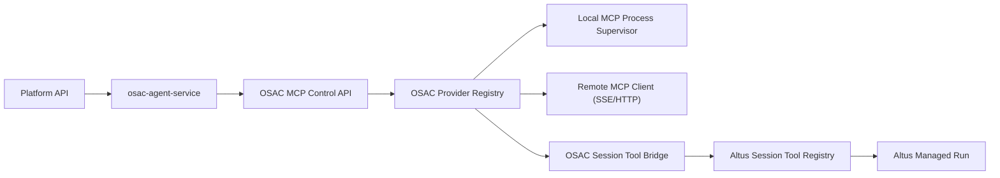

# OSAC 驱动 Altus 模式 MCP 运行时注册设计 [20260330-1027已采用]

更新时间：2026-03-30

## 1. 设计背景

这次需求只针对 `Altus mode`。

你已经明确新的系统边界：

1. `OSAC` 是沙箱内客户端
2. 如果 Altus 模式需要额外 MCP 能力，应优先改 `OSAC`
3. 平台侧通过现有 `apps/api -> OSAC` 链路下发控制指令
4. Altus 自己不直接承担“spawn MCP 进程 / 管理远端 MCP 连接”的底层职责

因此本次设计不再采用“Altus 自己作为 MCP Runtime Host”的口径，而是改为：

**OSAC 作为沙箱内 MCP Runtime Host，Altus 作为上层 session tool assembly 消费者。**

## 2. 目标一句话

平台侧在用户 attach MCP 时，不再写死配置文件，也不依赖执行器 `/mcp` 热插。

新的主链路是：

1. 平台生成 session 级 MCP 注册请求
2. API 通过 `osac-agent-service` 调用 OSAC
3. OSAC 在沙箱内内存态注册 MCP provider
4. OSAC spawn 本地 MCP 子进程，或建立远端 MCP SSE/HTTP 连接
5. OSAC 将 provider tools 挂到 Altus 当前 session 上下文
6. Altus run 执行时直接消费这批已挂载 tools
7. token / env 变化时，平台通知 OSAC 更新 provider 运行环境

## 3. 当前方案为什么不够

当前仓库里的 MCP 主要链路仍是：

1. 写入 OpenCode 配置
2. 调用 OpenCode `/mcp`
3. 再回读 `/mcp` 做状态确认

这条链路的问题是：

1. 它以 `OpenCode runtime` 为中心，不是以 `Altus mode` 为中心
2. 它只能表达“给执行器加一个 MCP server”，不能表达“把 tools 挂到 Altus 当前 session”
3. token/env 变化后通常要重写配置或重连，控制面不统一
4. provider 生命周期不掌握在 OSAC 手里
5. 无法把 MCP 真正纳入 Altus managed tool registry

所以这次必须把主控制面前移到 OSAC。

## 4. 核心边界

## 4.1 平台 API 负责什么

`apps/api` 负责：

1. 维护 connector definition / profile / binding
2. 解析 profile secret 和 config
3. 生成 OSAC 可消费的 provider register payload
4. 调用 `osac-agent-service`
5. 记录 attach / detach / env update 结果

## 4.2 OSAC 负责什么

OSAC 负责：

1. 暴露 MCP 控制 API
2. 维护 provider registry
3. spawn / supervise 本地 MCP 子进程
4. 建立远端 SSE/HTTP MCP client 连接
5. 拉取并缓存 tools schema
6. 把 tools attach 到当前 Altus session
7. 处理 provider restart / reconnect / env update

## 4.3 Altus 负责什么

Altus 负责：

1. 在 run 启动时读取当前 session 已挂载 tools
2. 将这些 tools 注册到 managed tool registry
3. 在 prompt / tool catalog 中向模型暴露能力
4. 执行工具调用时经 OSAC tool bridge 发起实际调用

Altus 不再负责：

1. spawn MCP 进程
2. 直接连远端 MCP
3. 自己管理 provider 生命周期

## 5. 新架构

## 5.1 总体结构



## 5.2 新增核心模块

OSAC 内新增：

1. `McpControlServer`
2. `McpProviderRegistry`
3. `McpProcessSupervisor`
4. `McpRemoteClientManager`
5. `McpSessionToolBridge`
6. `McpEventBus`

API 侧新增：

1. `altus-mcp-runtime-client.ts`
2. `altus-session-tool-assembly-service.ts`

## 6. 运行时对象模型

### 6.1 McpProvider

```ts
type McpProvider = {
  providerId: string;
  bindingId: string;
  profileId: string;
  taskSessionId: string;
  sourceType: 'local_stdio' | 'remote_sse' | 'remote_http';
  displayName: string;
  serverName: string;
  runtimeEnvVersion: number;
  status: 'starting' | 'ready' | 'failed' | 'stopped';
  attachedToolNames: string[];
  lastError?: string | null;
};
```

### 6.2 McpRuntimeEnv

```ts
type McpRuntimeEnv = {
  providerId: string;
  version: number;
  env: Record<string, string>;
  headers?: Record<string, string>;
  updatedAt: string;
};
```

### 6.3 SessionToolAttachment

```ts
type SessionToolAttachment = {
  taskSessionId: string;
  providerId: string;
  toolNames: string[];
  attachedAt: string;
};
```

## 7. OSAC 内部 API 设计

OSAC 内新增一个内部控制端口，例如：

1. `127.0.0.1:18121`

注意：

1. 该端口只允许通过现有 OSAC 控制链路访问
2. 不允许直接公网暴露
3. 认证仍复用 OSAC 自身 token/auth 机制

### 7.1 注册 provider

`POST /internal/mcp/providers`

请求示例：

```json
{
  "bindingId": "binding-1",
  "profileId": "profile-1",
  "taskSessionId": "task-session-1",
  "displayName": "GitHub - Prod",
  "serverName": "github--task-session-1--profile-1",
  "sourceType": "local_stdio",
  "transport": {
    "command": ["npx", "-y", "@modelcontextprotocol/server-github"]
  },
  "runtimeEnv": {
    "GITHUB_PERSONAL_ACCESS_TOKEN": "xxx"
  },
  "headers": {},
  "attachToSession": true
}
```

行为：

1. 校验 payload
2. 创建或替换 provider
3. 启动本地子进程或建立远端连接
4. 读取 MCP tool 列表
5. attach 到 `taskSessionId`
6. 返回 provider 状态和 tools 列表

### 7.2 更新 env

`PUT /internal/mcp/providers/:providerId/env`

行为：

1. 更新 provider 的内存态 env/header
2. 递增 `runtimeEnvVersion`
3. 标记 provider 为 `env_dirty`
4. 按 transport 选择 restart / reconnect 策略

### 7.3 attach tools

`POST /internal/mcp/providers/:providerId/attach`

请求体：

```json
{
  "taskSessionId": "task-session-1"
}
```

### 7.4 detach tools

`POST /internal/mcp/providers/:providerId/detach`

请求体：

```json
{
  "taskSessionId": "task-session-1"
}
```

### 7.5 销毁 provider

`DELETE /internal/mcp/providers/:providerId`

行为：

1. stop 本地子进程或远端连接
2. 从 registry 删除
3. 自动移除所有 session tool 挂载

### 7.6 provider 事件流

`GET /internal/mcp/providers/events`

事件包括：

1. `provider_started`
2. `provider_ready`
3. `provider_failed`
4. `provider_restarting`
5. `provider_reconnected`
6. `provider_stopped`
7. `tool_attached`
8. `tool_detached`

## 8. transport 模式

## 8.1 local stdio

适合：

1. GitHub MCP
2. Postgres MCP
3. 沙箱镜像内已安装的 MCP command

OSAC 负责：

1. `spawn`
2. stdio 握手
3. tools schema 拉取
4. tool call 转发

## 8.2 remote SSE

这是 Altus mode 下的第一优先远端模式。

流程：

1. OSAC 作为 MCP client
2. 与远端 streamable MCP server 建立 SSE/stream 连接
3. 把远端 tools 映射成本地 tool handle
4. attach 到 session

AI 不直接连接远端 MCP。

AI 只会通过 Altus 当前 session 中已经注册好的 OSAC tool handle 来调用。

## 8.3 remote HTTP

如 provider 只支持普通 HTTP request/response，也允许接入。

但本期优先级低于：

1. `local_stdio`
2. `remote_sse`

## 9. token / env 更新语义

你要求“token 改了以后，AI 调用时就是新的环境”。

这里必须明确逻辑：

### 9.1 平台侧

profile secret 更新时：

1. API 更新数据库密文
2. API 重新生成 runtime env
3. API 调用 OSAC 的 `PUT /internal/mcp/providers/:id/env`

### 9.2 OSAC 侧

OSAC 收到更新后：

1. 更新 provider 内存态 env/header
2. 标记 `env_dirty`
3. 如果 transport 支持热更新 client header，则直接更新
4. 如果 transport 是本地启动期 env，则下一次 tool call 前 restart provider

### 9.3 关键结论

对于本地子进程型 MCP：

1. 改 env 并不会让已启动的旧进程自动生效
2. 正确做法是“更新内存态 env + 下一次调用前按需 restart”

这条规则必须写进方案，不能靠口头假设。

## 10. Altus mode 的 tool 挂载方式

新增：

1. `AltusSessionToolAssemblyService`

职责：

1. 从 OSAC 查询当前 `taskSessionId` 的 attached MCP tools
2. 与 managed core tools 合并
3. 输出给 `AltusManagedToolRuntime` / `AltusToolRegistry`

Altus run 启动阶段：

1. 先读取 session connectors binding
2. 确保已在 OSAC 注册并 attach
3. 再拿到最终 tool catalog
4. 再进入模型调用

这样模型看到的是当前会话真实可调用的 MCP tools，而不是 prompt 里写一段说明。

## 11. API 侧改造点

## 11.1 `osac-agent-service.ts`

新增方法：

1. `registerMcpProvider(...)`
2. `updateMcpProviderEnv(...)`
3. `attachMcpProvider(...)`
4. `detachMcpProvider(...)`
5. `removeMcpProvider(...)`
6. `listSessionMcpTools(...)`

## 11.2 `session-connector-service.ts`

主职责调整为：

1. 不再直接调用 OpenCode `/mcp`
2. 改为生成 OSAC provider register payload
3. 调用 `osac-agent-service`
4. 保存 runtime provider 状态回数据库

## 11.3 `altus-managed-tool-runtime.ts`

调整为：

1. 不只暴露硬编码 core tools
2. 要支持 session attached MCP tools 的动态注册与执行桥接

## 12. OSAC 消息协议扩展

现有 OSAC 文档里已经有：

1. `ADD_MCP_SERVER`
2. `REMOVE_MCP_SERVER`

但这套协议过于接近“改 OpenCode 配置”，不足以表达 provider runtime 生命周期。

因此要新增或替换成更细的指令：

1. `REGISTER_MCP_PROVIDER`
2. `UPDATE_MCP_PROVIDER_ENV`
3. `ATTACH_MCP_PROVIDER_TO_SESSION`
4. `DETACH_MCP_PROVIDER_FROM_SESSION`
5. `REMOVE_MCP_PROVIDER`
6. `LIST_SESSION_MCP_TOOLS`

对应状态消息：

1. `MCP_PROVIDER_STATUS`
2. `MCP_PROVIDER_EVENT`
3. `SESSION_MCP_TOOLS_RESPONSE`

## 13. 数据层建议

建议现有 `task_session_connector_bindings` 增补：

1. `runtime_provider_id`
2. `runtime_env_version`
3. `runtime_transport`
4. `runtime_attached_tools_json`
5. `runtime_last_started_at`
6. `runtime_last_stopped_at`

必要时新增：

1. `task_session_connector_runtime_events`

用于记录：

1. provider 启动
2. provider attach
3. env update
4. restart
5. fail/recover

## 14. 恢复与重放

## 14.1 OSAC 重启

OSAC 重启后：

1. 平台重新读取 `desired_state=attached` 的 bindings
2. 重新调用 register + attach
3. 恢复当前 session tools

## 14.2 provider 崩溃

OSAC supervisor 负责：

1. 捕获进程退出或远端连接中断
2. 标记 provider 为 `failed`
3. 尝试自动 restart / reconnect
4. 超阈值后停止重试并通知平台

## 15. 与旧方案的关系

这一版只适用于 `Altus mode`。

边界是：

1. `Altus mode`
   - MCP 主链路改为 `Platform API -> OSAC -> Altus Session Tool Assembly`
2. `direct mode`
   - 可暂时保留现有 executor `/mcp` 遗留路径

不能再把 Altus mode 和 direct mode 混成同一个 runtime 控制面。

## 16. 实施顺序

### 阶段 1

1. OSAC 扩展 provider registry 与 control API
2. 打通 `local_stdio` provider register / attach
3. API 侧接入 `osac-agent-service`

### 阶段 2

1. OSAC 补齐 `remote_sse`
2. 补齐 env update / restart 机制
3. Altus tool assembly 接入 session MCP tools

### 阶段 3

1. managed mode 替换旧 `/mcp` 主链路
2. provider 事件接入 run stream / audit
3. 清理 Altus 自己托管 provider 的旧假设

## 17. 验收标准

达到下面结果才算闭环：

1. 平台 attach profile 后，API 能成功通过 OSAC 注册 provider
2. OSAC 能在沙箱内独立 spawn MCP 子进程
3. OSAC 能建立远端 SSE MCP 连接
4. provider tools 能真实 attach 到当前 `taskSessionId`
5. Altus run 能直接看到这些 session tools
6. 更新 token 后，不写配置文件也能在下一次调用前生效
7. provider 崩溃后可自动 restart / recover
8. managed run 能看到归一化的 provider attach/fail/restart 状态

## 18. 设计结论

本次整改的本质不是“给 Altus 增加一个 MCP API”，而是：

**把 OSAC 升级为 Altus mode 下的 MCP Runtime Host。**

只有这样，才能真正满足：

1. MCP 不写死
2. 工具按 session 动态挂载
3. token/env 运行期可更新
4. 平台通过统一控制面管理 provider 生命周期
