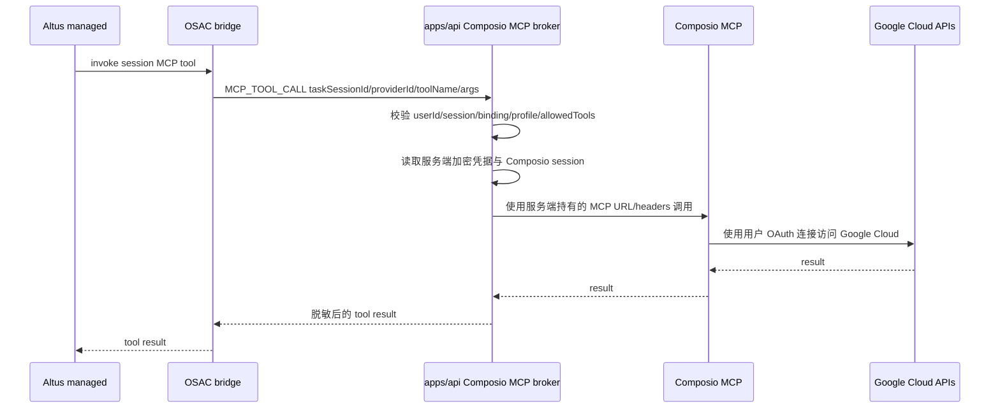
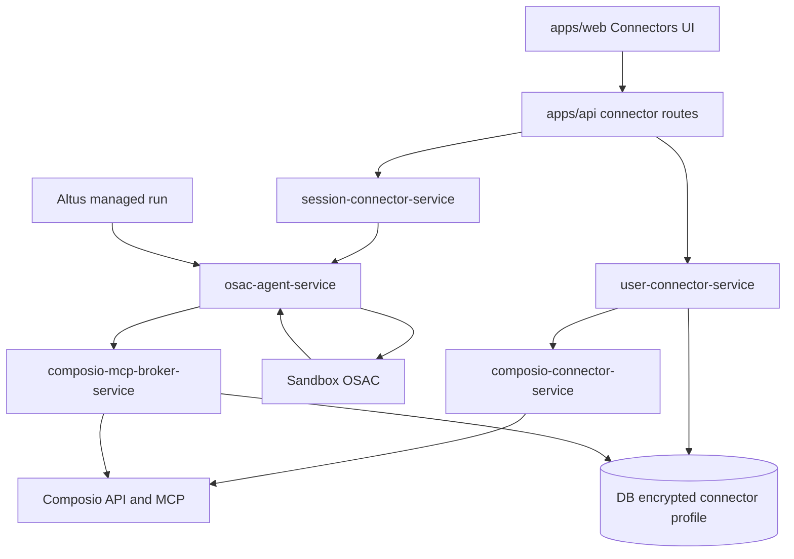

# Composio Google Cloud MCP OAuth 接入设计 [20260429-1843已采用]

更新时间：2026-04-29

## 1. 背景与目标

为了快速增加 MCP 数量，本方案引入 [Composio](https://github.com/ComposioHQ/composio) 的连接器与 MCP 能力，先只开放 Google Cloud 连接器，并为后续继续添加 Composio toolkit 留出统一扩展口。

本次目标：

1. 先新增 `google_cloud` 连接器入口。
2. 用户必须通过 OAuth 完成授权，禁止 token 手填模式作为本期能力入口。
3. Composio、Google OAuth、MCP 访问凭据都只能保存在 `apps/api` 服务端和数据库加密字段内。
4. 不允许把任何 MCP token、Composio API Key、Google access token、refresh token、MCP headers 投放到 Sandbox。
5. 授权成功后可以 attach 到指定 task session，并在 Altus managed run 中正常列出与调用该 session 已挂载的 Google Cloud MCP tools。
6. 接口设计必须支持后续继续添加其他 Composio toolkit，而不是为 Google Cloud 写死一套独立链路。

## 2. 外部依据

Composio 当前文档提供以下能力，本文只采用其中服务端可控的部分：

1. Composio 支持 users 和 sessions，外部应用的 user id 用于隔离不同用户的连接与执行上下文。
2. Composio session 可以限制启用的 toolkits，并通过 `session.authorize(toolkit)` 生成 OAuth Connect Link。
3. Composio session 暴露 MCP URL 和 headers，可交给 MCP client 使用。
4. Composio MCP server 管理 API 支持创建 MCP server、生成用户级 MCP URL、更新与删除 server。
5. Composio toolkit 列表中有 Google 相关 toolkit，例如 `googlebigquery`、`google_cloud_vision`、`googleadmin`、`googleanalytics`、`googlecalendar`、`googledrive` 等；是否存在单一通用 `google_cloud` slug 需要开发前通过 Composio API 再确认。

关键约束：虽然 Composio 示例会把 MCP URL 与 headers 交给 MCP client，但 oneceo 不能把这些 headers 放进 Sandbox。因此本方案不让 Sandbox 内 OSAC 直接连接 Composio MCP，而是由 `apps/api` 承担 Composio MCP 代理与凭据持有职责。

参考链接：

1. [Composio Users & Sessions](https://docs.composio.dev/docs/users-and-sessions)
2. [Composio Authentication](https://docs.composio.dev/docs/authentication)
3. [Composio Configuring Sessions](https://docs.composio.dev/docs/configuring-sessions)
4. [Composio Native Tools vs MCP](https://docs.composio.dev/docs/native-tools-vs-mcp)
5. [Composio Single Toolkit MCP](https://docs.composio.dev/docs/single-toolkit-mcp)
6. [Composio MCP API Reference](https://docs.composio.dev/reference/v3/api-reference/mcp)

2026-04-29 修正：Composio Tool Router 创建 session 的请求字段必须使用请求侧 schema。`toolkits` 白名单写作 `{ "enable": [...] }`，`manage_connections` 开关写作 `{ "enable": true }`，tool 级白名单写作 `{ "<toolkit>": { "enable": [...] } }`。Composio 返回体中的 `config.toolkits.enabled`、`config.manage_connections.enabled` 属于响应侧形态，不能反向照搬到创建请求 payload。

## 3. 本期范围

本期只做：

1. `google_cloud` 作为 oneceo connectorKey。
2. Composio provider 类型的连接器定义与注册扩展。
3. Google Cloud OAuth Connect Link 发起、回调状态确认、授权结果持久化。
4. session attach/detach。
5. API 侧 Composio MCP broker，负责 list tools 和 invoke tool。
6. Altus managed run 启动前读取 session MCP tools，并在工具调用时经 OSAC/API 桥接到 Composio。
7. 审计、状态、错误码、恢复链路文档化。

本期不做：

1. 其他 Composio toolkit 的开放。
2. token/API Key 手填。
3. 在 Sandbox 内安装 Composio SDK、保存 Composio API Key 或保存 Google token。
4. 让 OSAC 在 Sandbox 内直连 `https://backend.composio.dev/...` MCP server。
5. 允许模型直接看到 OAuth token、MCP headers、Composio API Key。
6. Google Cloud 具体工具白名单的最终确认。本期设计保留 `allowedTools` 配置口，开发前需要按 Composio 实际 toolkit schema 明确。

## 4. 核心安全原则

### 4.1 token 不进 Sandbox

禁止进入 Sandbox 的内容：

1. `COMPOSIO_API_KEY`
2. Composio `session.mcp.headers`
3. Composio MCP URL 中任何可复用鉴权参数
4. Google OAuth `access_token`
5. Google OAuth `refresh_token`
6. Composio connected account id 与 auth config id 的敏感组合，如果该组合可绕过 oneceo 用户态鉴权直接访问用户资源

Sandbox 内只允许出现：

1. `taskSessionId`
2. `connectorKey=google_cloud`
3. oneceo 生成的 `runtimeProviderId`
4. 已脱敏的 provider displayName
5. 已过滤后的 tool catalog
6. 经 OSAC 既有控制链路发送的 tool call requestId

### 4.2 API 侧代理为唯一出站执行点

Google Cloud MCP tool 的真实执行路径必须是：



这条链路里，Sandbox 只承担请求发起和结果接收，不持有任何第三方 token。

### 4.3 用户隔离

Composio user id 必须由 oneceo `app_users.id` 派生，格式建议：

```text
oneceo_app_user_{app_users.id}
```

禁止使用匿名 `X-User-Id` 作为 Composio user id。授权、attach、tool call 必须同时校验：

1. 当前登录用户 `app_users.id`
2. `user_connector_profiles.user_id`
3. `task_sessions.user_id`
4. `task_session_connector_bindings.task_session_id`
5. Composio user id 映射

## 5. 总体架构



新增服务职责：

1. `composio-connector-service`
   - 封装 Composio SDK/API。
   - 创建或读取 Composio user/session。
   - 发起 OAuth Connect Link。
   - 查询 connected account 状态。
   - 生成并刷新 API 侧可用 MCP endpoint 信息。

2. `composio-mcp-broker-service`
   - 只运行在 `apps/api`。
   - 持有 Composio MCP URL 与 headers。
   - 对 OSAC 暴露 oneceo 内部 tool list 和 tool invoke 接口。
   - 做 user/session/binding/allowedTools 校验。
   - 做结果脱敏、错误归一、审计事件写入。

3. `connector-registry` 扩展
   - 新增 provider 类型：`composio`。
   - 连接器定义中包含 `composioToolkitSlugs`、`authStrategy`、`allowedTools`、`scopes`、`brokerMode` 等配置。

## 6. 数据模型

### 6.1 复用表

继续复用已有表：

1. `user_connector_profiles`
2. `connector_auth_requests`
3. `task_session_connector_bindings`
4. `task_session_connector_runtime_events`
5. `task_session_mcp_tool_snapshots`
6. `task_session_mcp_recovery_jobs`

### 6.2 `user_connector_profiles` 存储约定

`connectorKey`：

```text
google_cloud
```

`authMode`：

```text
oauth
```

`metadataJson` 建议结构：

```json
{
  "provider": "composio",
  "composioUserId": "oneceo_app_user_123",
  "composioToolkitSlugs": ["googlebigquery"],
  "composioAuthConfigId": "ac_xxx",
  "composioConnectedAccountId": "ca_xxx",
  "connectionStatus": "active",
  "lastConnectionCheckAt": "2026-04-29T00:00:00.000Z"
}
```

`secretCiphertext` 只允许保存服务端需要的敏感材料，必须继续使用 `connector-secret-service.ts` 加密：

```json
{
  "source": "composio",
  "composioMcpUrl": "https://backend.composio.dev/...",
  "composioMcpHeaders": {
    "x-api-key": "***"
  }
}
```

说明：

1. Google OAuth token 不由 oneceo 直接保存，优先交给 Composio connected account 管理。
2. 如果 Composio API 返回可用于直连的 MCP header，该 header 也只能保存为密文。
3. `secretCiphertext` 只能在 `apps/api` 内解密，禁止传给 OSAC/Sandbox/前端。

### 6.3 `task_session_connector_bindings` 存储约定

`runtimeTransport`：

```text
api_brokered_mcp
```

`runtimeProviderId`：

```text
composio_google_cloud_{bindingId}
```

`sessionConfigJson` 建议结构：

```json
{
  "provider": "composio",
  "brokerMode": "api_only",
  "toolkitSlugs": ["googlebigquery"],
  "allowedTools": [],
  "tokenInSandbox": false
}
```

`definitionSnapshotJson` 建议保存连接器定义快照，便于恢复时不受后台配置漂移影响。

### 6.4 是否新增表

本期不强制新增独立表。若实现时发现 Composio session 生命周期需要跨多个 task session 复用，可新增：

```text
composio_connector_sessions
```

建议字段：

1. `id`
2. `user_id`
3. `connector_key`
4. `profile_id`
5. `composio_user_id`
6. `composio_session_id`
7. `toolkit_slugs_json`
8. `mcp_url_ciphertext`
9. `mcp_headers_ciphertext`
10. `status`
11. `created_at`
12. `updated_at`

但优先短路径实现：先放在 `user_connector_profiles.metadataJson` 与 `secretCiphertext`，避免过度建表。

## 7. 连接器定义扩展

当前 `ConnectorKey` 是联合类型，需要新增：

```ts
export type ConnectorKey =
  | 'github'
  | 'notion'
  | 'slack'
  | 'supabase'
  | 'figma'
  | 'vercel'
  | 'postgres'
  | 'google_cloud';
```

新增定义文件：

```text
apps/api/src/connectors/definitions/google-cloud.ts
```

定义结构建议：

```ts
export function buildGoogleCloudDefinition(): ConnectorDefinition {
  return {
    key: 'google_cloud',
    category: 'app',
    name: 'Google Cloud',
    description: 'Use Google Cloud tools through Composio MCP with OAuth.',
    icon: 'google-cloud',
    featured: true,
    isNew: true,
    sortOrder: 80,
    authMode: 'oauth',
    available: Boolean(process.env.COMPOSIO_API_KEY),
    availabilityReason: process.env.COMPOSIO_API_KEY ? undefined : 'COMPOSIO_API_KEY is not configured',
    configFields: [],
    oauth: {
      supported: true,
      provider: 'composio',
    },
    activityMatcherVerified: false,
    visibleInMenu: true,
    runtime: {
      type: 'remote',
      transport: 'streamable_http',
      headerTemplate: 'none',
    },
    composio: {
      toolkitSlugs: resolveGoogleCloudToolkitSlugs(),
      brokerMode: 'api_only',
      allowTokenInSandbox: false,
      allowedTools: resolveGoogleCloudAllowedTools(),
    },
  };
}
```

需要把 `ConnectorOauthProvider['provider']` 扩展为包含 `composio`，但 `composio` 不走本地 OAuth token exchange，而是走 Composio Connect Link。

## 8. OAuth 授权流程

### 8.1 发起授权

入口沿用：

```text
POST /api/connectors/:connectorKey/oauth/start
```

当 `connectorKey=google_cloud` 时：

1. 校验 `COMPOSIO_API_KEY` 已配置。
2. 校验当前用户是用户态 `app_users`。
3. 创建 `connector_auth_requests`，写入 state、returnToSessionId、profileName。
4. 调用 `composio-connector-service.createSession(...)`，只启用 Google Cloud 相关 toolkit。
5. 调用 Composio `session.authorize(toolkitSlug, callbackUrl)`。
6. 返回 Composio Connect Link 给前端。

### 8.2 回调与确认

入口沿用：

```text
POST /api/connectors/:connectorKey/oauth/callback
```

Composio OAuth 可能不直接把 Google code 回传给 oneceo，而是由 Connect Link 完成授权后再回到 callbackUrl。本地 callback 必须做：

1. 校验 `state`。
2. 查询 Composio connected account 状态。
3. 只有 Composio 返回 active/connected 时，才把 `user_connector_profiles.authStatus` 更新为 `authorized`。
4. 保存 Composio user id、connected account id、auth config id、toolkit slugs。
5. 保存 API 侧可用的 MCP URL/headers 密文。
6. 如果 `returnToSessionId` 存在，触发自动 attach。

### 8.3 授权失败

失败时：

1. `authStatus=needs_auth` 或 `error`。
2. `lastError` 记录归一化错误码。
3. 不创建 session binding。
4. 不触发 MCP provider 注册。

## 9. Session attach 流程

入口沿用：

```text
POST /api/task-creation/sessions/:sessionId/connectors/:connectorKey/attach
```

当 `connectorKey=google_cloud` 时：

1. 校验 task session 属于当前 `app_users.id`。
2. 读取默认或指定 profile。
3. 校验 profile `authStatus=authorized`。
4. 调用 `composio-mcp-broker-service.refreshToolCatalog(profileId)`。
5. 写入或更新 `task_session_connector_bindings`：
   - `desiredState=attached`
   - `runtimeStatus=connected`
   - `runtimeTransport=api_brokered_mcp`
   - `runtimeProviderId=composio_google_cloud_{bindingId}`
   - `runtimeAttachedToolsJson=filteredTools`
6. 调用 `osac-agent-service.registerMcpProvider`，但 payload 中不允许包含任何 token/header。
7. OSAC 侧 provider 类型为 `api_brokered_remote`，只记录 providerId、taskSessionId、tool catalog 与 API bridge capability。
8. Altus run 启动前通过既有 `LIST_SESSION_MCP_TOOLS` 读取 tools。

OSAC 注册 payload 建议：

```json
{
  "type": "REGISTER_MCP_PROVIDER",
  "payload": {
    "bindingId": "binding-1",
    "profileId": "profile-1",
    "taskSessionId": "task-session-1",
    "displayName": "Google Cloud",
    "serverName": "composio-google-cloud--task-session-1",
    "sourceType": "api_brokered_remote",
    "transport": {
      "kind": "oneceo_api_broker"
    },
    "runtimeEnv": {},
    "headers": {},
    "attachToSession": true,
    "tokenInSandbox": false
  }
}
```

## 10. Tool list 与 tool call

### 10.1 Tool list

`composio-mcp-broker-service` 负责从 Composio MCP 获取 tool list，并过滤：

1. 只保留 `google_cloud` 连接器定义允许的 toolkit。
2. 只保留 `allowedTools` 中允许的工具；如果 `allowedTools=[]`，开发阶段必须明确是否表示使用 Composio toolkit 全量工具，不能默认为“无限制”。
3. 删除 tool schema 中可能泄漏第三方内部 token 或连接参数的字段。
4. tool name 必须命名空间化，避免不同 provider 冲突。

命名建议：

```text
google_cloud__{composioToolName}
```

### 10.2 Tool call

OSAC 发起 tool call 时，API 必须校验：

1. `taskSessionId` 存在且属于当前用户。
2. `runtimeProviderId` 仍然 attached。
3. `toolName` 在 `runtimeAttachedToolsJson` 中。
4. `profileId` 仍然 authorized。
5. `allowedTools` 未被后台策略禁用。

校验通过后，API 使用服务端持有的 Composio MCP URL/headers 执行调用。

### 10.3 结果脱敏

返回给 Sandbox/Altus 前必须做结果脱敏：

1. 移除 `authorization`、`access_token`、`refresh_token`、`id_token`、`api_key`、`x-api-key`。
2. 对疑似密钥字段做 mask。
3. 错误对象中不得包含完整请求 headers。

## 11. 恢复链路

恢复入口继续使用现有 MCP 恢复链路：

1. `session-mcp-recovery-service.ts`
2. `session-connector-service.reconcileByOrchestratorSessionId(...)`
3. `task_session_mcp_recovery_jobs`

Google Cloud Composio provider 恢复时：

1. 读取 attached binding。
2. 不向 Sandbox 下发 token/header。
3. 在 API 侧刷新 Composio connected account 状态。
4. 重新读取 tool catalog。
5. 重新注册 `api_brokered_remote` provider。
6. 更新 `runtimeAttachedToolsJson`。
7. 写入 `task_session_connector_runtime_events`。

如果 Composio connected account 失效：

1. binding `runtimeStatus=needs_auth`。
2. profile `authStatus=needs_auth`。
3. run 启动前提示用户重新授权。
4. 不做 token fallback。

## 12. 后续扩展接口

新增统一 Composio 连接器定义：

```ts
type ComposioConnectorExtension = {
  provider: 'composio';
  toolkitSlugs: string[];
  authStrategy: 'composio_connect_link';
  brokerMode: 'api_only';
  allowTokenInSandbox: false;
  allowedTools: string[];
  defaultScopes?: string[];
  toolNamePrefix: string;
};
```

后续添加新 MCP 时，只需要新增：

1. connector definition 文件。
2. `CONNECTOR_KEYS` 与 builder 注册。
3. Composio toolkit slug 配置。
4. allowed tools 配置。
5. guide/prompt 文档。

不允许每新增一个 Composio toolkit 就复制一套 OAuth callback、MCP broker、恢复逻辑。

## 13. 需要修改的代码位置

本文件只做设计，用户评审通过后再进入实现。预计修改范围：

1. `apps/api/src/connectors/definitions/types.ts`
2. `apps/api/src/connectors/definitions/index.ts`
3. `apps/api/src/connectors/definitions/google-cloud.ts`
4. `apps/api/src/services/connector-registry.ts`
5. `apps/api/src/services/user-connector-service.ts`
6. `apps/api/src/services/session-connector-service.ts`
7. `apps/api/src/services/osac-agent-service.ts`
8. `apps/api/src/services/session-mcp-recovery-service.ts`
9. 新增 `apps/api/src/services/composio-connector-service.ts`
10. 新增 `apps/api/src/services/composio-mcp-broker-service.ts`
11. `apps/api/src/routes/connector-routes.ts`
12. `apps/api/src/routes/osac-routes.ts`
13. `apps/api/src/services/altus-managed-setup-service.ts`
14. `apps/api/src/services/altus-managed-tool-runtime.ts`
15. `apps/api/src/services/altus-managed-prompt-service.ts`

## 14. 环境变量

新增：

```text
COMPOSIO_API_KEY
COMPOSIO_API_BASE_URL=https://backend.composio.dev
COMPOSIO_GOOGLE_CLOUD_TOOLKITS=googlebigquery
COMPOSIO_GOOGLE_CLOUD_ALLOWED_TOOLS=
```

规则：

1. `COMPOSIO_API_KEY` 只允许在 `apps/api` 运行环境配置。
2. 禁止注入 E2B template、Sandbox env、OSAC 子进程 env。
3. `COMPOSIO_GOOGLE_CLOUD_TOOLKITS` 必须显式配置或由默认安全列表提供。
4. `COMPOSIO_GOOGLE_CLOUD_ALLOWED_TOOLS` 开发前必须确认语义，不能让空值误解为无限制。

## 15. 验证清单

文档评审通过并实现后，至少验证：

1. 未配置 `COMPOSIO_API_KEY` 时，Google Cloud connector 显示 unavailable。
2. OAuth start 能生成 Connect Link。
3. OAuth callback 后 profile 为 authorized。
4. attach 后 `task_session_connector_bindings.runtimeTransport=api_brokered_mcp`。
5. Sandbox 环境变量、OSAC provider payload、日志中不存在 `COMPOSIO_API_KEY`、Google token、Composio MCP headers。
6. Altus run 启动前能通过 `LIST_SESSION_MCP_TOOLS` 看到 Google Cloud tools。
7. tool call 能经 API broker 调用 Composio MCP 并返回结果。
8. detach 后 tool 不再出现在 session tool list。
9. Sandbox 重建后恢复 attached binding，不泄漏 token。
10. Composio connected account 失效后，状态变为 `needs_auth`，不走 fallback。

## 16. 评审确认项

开发前需要用户确认：

1. “Google Cloud”首期对应的 Composio toolkit slug 是单个 `googlebigquery`，还是多个 Google Cloud 相关 slugs 的组合。
2. 首期允许暴露的 tool 白名单。
3. 是否使用 Composio managed OAuth，还是使用 oneceo 自有 Google OAuth app 作为 custom auth config。
4. 是否允许同一用户绑定多个 Google Cloud profile。本设计按现有 profile 模型支持多 profile，但首期 UI 可以只开放默认 profile。

## 17. 当前状态

状态：`[20260429-1843已采用]`

原因：用户已明确要求按本文档进入代码实现阶段，本方案作为本次实现依据。
