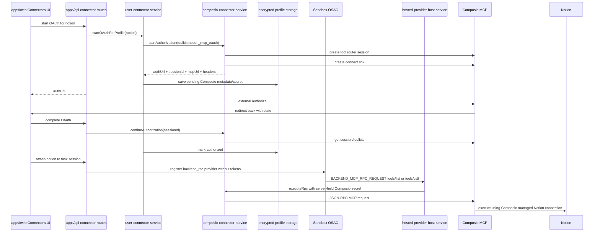

# 20260429 Notion 改走 Composio MCP OAuth 清理方案 [20260429-1958已采用]

状态：`[20260429-1958已采用]`

更新时间：2026-04-29

## 1. 背景与目标

当前 Notion 连接器仍走 oneceo 自建 Notion OAuth 与 Notion 官方 remote MCP 直连链路：

1. `apps/api/src/connectors/definitions/notion.ts` 读取 `NOTION_CONNECTOR_CLIENT_ID`、`NOTION_CONNECTOR_CLIENT_SECRET`、`NOTION_CONNECTOR_REDIRECT_URI`、`NOTION_MCP_REMOTE_URL`。
2. `apps/api/src/services/user-connector-service.ts` 对 `connectorKey === 'notion'` 单独构造 Notion OAuth state、拼接 Notion authorize URL、交换 Notion token、保存 `accessToken`。
3. `apps/api/src/services/connector-registry.ts` 对 Notion 使用 remote SSE/HTTP 配置与 bearer token header。
4. 前端保留 `/notion/callback` 与 Notion 专属 callback 判断。

新目标是：Notion 必须改为通过 Composio 平台管理授权、连接状态、MCP URL 与工具调用。oneceo 只保存 Composio session/MCP 所需的服务端凭据，不再保存 Notion access token，不再把任何 Notion/Composio token 或 MCP header 下发到 Sandbox。

## 2. 外部依据

本方案以 Composio v3 Tool Router 为实现依据：

1. 创建 Tool Router session 使用 `POST /api/v3.1/tool_router/session`。
2. 请求 payload 使用请求侧 schema：
   - `toolkits: { "enable": [...] }`
   - `manage_connections: { "enable": true, ... }`
   - 如限制工具，使用 `tools: { "<toolkit>": { "enable": [...] } }`
3. 授权入口使用 Tool Router session link，为指定 toolkit 生成 Connect Link。
4. Notion 侧使用 Composio 的 Notion MCP toolkit，由 Composio 平台托管 OAuth 与 connected account。

参考链接：

1. Composio Tool Router session API：https://docs.composio.dev/reference/v3/api-reference/tool-router/postToolRouterSession
2. Composio Tool Router REST 示例：https://docs.composio.dev/rest-api/tool-router/post-tool-router-session
3. Composio Notion MCP toolkit：https://docs.composio.dev/toolkits/notion_mcp_oauth

## 3. 本期范围

本期只做 Notion 从旧直连链路迁移到 Composio 链路，并完成旧代码清理。

范围内：

1. `notion` connectorKey 保持不变，避免破坏已有 UI、guide、session binding 的业务语义。
2. Notion 授权入口改为 Composio Connect Link。
3. Notion profile 的 secret 改为保存 Composio MCP URL 与 headers 的服务端加密密文。
4. Notion attach 后注册 `backend_rpc` hosted provider，由 API 侧 broker 调用 Composio MCP。
5. Notion tool list/tool call 复用 Composio broker 逻辑，工具名统一命名空间为 `notion__{toolName}`。
6. 清理旧 Notion OAuth、旧 Notion remote MCP、旧 Notion token 保存与旧 bearer header 下发代码。
7. 更新用户端 guide 文案，删除让用户去 Notion integration 页面手工配置的说明。
8. 更新 `.env.example` 与相关文档，将旧 Notion 必填环境变量改为 legacy 注释停用说明，新增 Composio Notion 配置说明。
9. 保留通用 Composio MCP 接入接口，后续新增其他 MCP 时只新增 connector definition 与 env/toolkit 配置，不复制 Notion 专属服务链路。

范围外：

1. 不新增新的连接器 key。
2. 不保留旧 Notion 直连 OAuth 作为兼容方案。
3. 不让 Sandbox 直连 Composio MCP 或 Notion MCP。
4. 不把 Composio API key、Composio MCP headers、Notion token 暴露给前端、模型或 Sandbox。
5. 不在本期重写 Connector Guide 管理后台。

## 4. 环境变量策略

当前 `apps/.env` 已存在：

```text
COMPOSIO_API_KEY=...
NOTION_CONNECTOR_CLIENT_ID=...
NOTION_CONNECTOR_CLIENT_SECRET=...
NOTION_CONNECTOR_SCOPES=
NOTION_MCP_REMOTE_URL=https://mcp.notion.com/mcp
NOTION_CONNECTOR_SECRET_KEY=...
NOTION_CONNECTOR_REDIRECT_URI=/notion/callback
```

本方案要求代码迁移完成后：

1. Notion 运行时只依赖 `COMPOSIO_API_KEY`。
2. 可选新增：

```text
COMPOSIO_NOTION_TOOLKITS=NOTION_MCP_OAUTH
COMPOSIO_NOTION_ALLOWED_TOOLS=
```

3. 若 Composio 实际 toolkit slug 与 `notion_mcp_oauth` 不一致，必须在实现前通过 Composio 平台或 API 确认后写入 `COMPOSIO_NOTION_TOOLKITS`，不得在代码里做多 slug 兜底。
4. 以下旧变量不再由 Notion 代码读取：
   - `NOTION_CONNECTOR_CLIENT_ID`
   - `NOTION_CONNECTOR_CLIENT_SECRET`
   - `NOTION_CONNECTOR_SCOPES`
   - `NOTION_MCP_REMOTE_URL`
   - `NOTION_CONNECTOR_SECRET_KEY`
   - `NOTION_CONNECTOR_REDIRECT_URI`
   - `NOTION_MCP_REMOTE_HEADERS_JSON`

注意：旧变量可以暂时保留在本地 `.env` 文件里不影响运行，但代码与 `.env.example` 不再把它们作为 Notion 连接器配置项。

环境变量清理方式：

1. 本地 `apps/.env` 中无关或旧 Notion 变量不直接删除，只允许注释停用并标明“legacy Notion direct OAuth/MCP，Composio 方案不读取”。
2. `apps/.env.example` 同样不直接移除旧变量示例，改为注释块，便于回溯历史配置来源，但不能再作为当前 Notion 配置入口。
3. 新增 Composio Notion 变量必须与其他 Composio MCP 使用同一命名规则：

```text
COMPOSIO_{CONNECTOR}_TOOLKITS=
COMPOSIO_{CONNECTOR}_ALLOWED_TOOLS=
```

4. 生产代码不得读取被注释停用的旧 Notion env；测试与文档引用也必须同步改为 Composio 变量。

## 5. 目标架构



## 6. 数据模型约定

继续复用现有表：

1. `user_connector_profiles`
2. `connector_auth_requests`
3. `task_session_connector_bindings`
4. `task_session_connector_runtime_events`
5. `task_session_mcp_tool_snapshots`
6. `task_session_mcp_recovery_jobs`

### 6.1 user_connector_profiles

`connectorKey` 仍为：

```text
notion
```

`metadataJson` 目标结构：

```json
{
  "provider": "composio",
  "composioUserId": "oneceo_app_user_123",
  "composioSessionId": "trs_xxx",
  "composioToolkitSlugs": ["notion_mcp_oauth"],
  "composioConnectedAccountId": "ca_xxx",
  "connectionStatus": "active",
  "lastConnectionCheckAt": "2026-04-29T00:00:00.000Z"
}
```

`secretCiphertext` 解密后目标结构：

```json
{
  "source": "composio",
  "composioMcpUrl": "https://backend.composio.dev/...",
  "composioMcpHeaders": {
    "x-api-key": "***"
  }
}
```

旧结构清理要求：

1. 不再写入 `accessToken`。
2. 不再写入 `refreshToken`。
3. 不再写入 Notion OAuth `tokenType/scope/expiresAt` 作为运行时依据。
4. 已存在旧 profile 在重新授权前视为不满足 Composio 授权要求，attach 时必须提示重新连接，不做自动兼容转换。

### 6.2 task_session_connector_bindings

Notion attach 后：

```json
{
  "provider": "composio",
  "brokerMode": "api_only",
  "toolkitSlugs": ["notion_mcp_oauth"],
  "allowedTools": [],
  "tokenInSandbox": false
}
```

`runtimeTransport` 使用：

```text
api_brokered_mcp
```

`runtimeProviderId` 仍沿用现有 providerId 生成规则：

```text
task_session:{taskSessionId}:connector:notion:profile:{profileId}
```

## 7. 代码修改设计

### 7.0 通用 Composio MCP 扩展接口

为避免后续每新增一个 MCP 都复制一套 OAuth、callback、hosted provider、tool broker 代码，本次 Notion 改造必须先抽出通用接口。

统一 connector definition 扩展结构继续使用：

```ts
type ComposioConnectorExtension = {
  provider: 'composio';
  toolkitSlugs: string[];
  authStrategy: 'composio_connect_link';
  brokerMode: 'api_only';
  allowTokenInSandbox: false;
  allowedTools: string[];
  defaultScopes?: string[];
  toolNamePrefix: string;
};
```

新增任意 Composio MCP 的最小接入面：

1. 在 `apps/api/src/connectors/definitions/{connector}.ts` 增加 connector definition。
2. 配置 `composio.toolkitSlugs`、`allowedTools`、`toolNamePrefix`。
3. 在 `CONNECTOR_KEYS` 增加 connector key。
4. 前端补 icon/文案/guide。
5. 不新增 connector 专属 `startXAuthorization`、`confirmXAuthorization`、`executeX` 服务方法。

实现时优先通过 `catalogItem.composio?.provider === 'composio'` 识别 Composio MCP，减少新增 MCP 时的多处改动。若类型层面必须声明联合类型，后续新增 Composio MCP 时只扩展该类型，不新增整套业务分支。

### 7.0.1 Composio router meta tool 参数约束

Notion 通过 Composio Tool Router 暴露的是 router meta tools，不是直接暴露全部 Notion action。模型必须先调用 `notion__COMPOSIO_SEARCH_TOOLS` 搜索 action，再调用 `notion__COMPOSIO_GET_TOOL_SCHEMAS` 获取目标 action schema，最后通过 `notion__COMPOSIO_MULTI_EXECUTE_TOOL` 执行。

`notion__COMPOSIO_SEARCH_TOOLS` 当前 schema 要求使用 `queries` 数组，不能把 toolkit slug 当成搜索参数：

```json
{
  "queries": [
    {
      "use_case": "search Notion pages by title"
    }
  ],
  "session": {
    "generate_id": true
  }
}
```

API broker 需要对历史/模型误传的 `query`、`use_case`、空参数或仅传 `toolkits` 做一次最小归一化，统一转成 `queries`，避免 Composio 返回 `Required at "queries"` 后让模型退回 shell 安装 Notion MCP CLI。

### 7.1 Composio 服务泛化

文件：`apps/api/src/services/composio-connector-service.ts`

当前问题：

1. 类型 `ComposioRuntimeContext.connectorKey` 写死为 `'google_cloud'`。
2. 方法名 `startGoogleCloudAuthorization`、`confirmGoogleCloudAuthorization` 写死 Google Cloud。
3. 错误文案和 serverInfo 写死 Google Cloud。

修改要求：

1. 新增通用类型或等价的 catalog 判定：

```ts
type ComposioConnectorKey = 'google_cloud' | 'notion';
```

如果类型层面无法自动从 catalog 推导，则先保留明确联合类型；后续新增 Composio MCP 时只扩展此类型，不新增整套分支。

2. 将授权入口改为通用方法：

```ts
startAuthorization(input: {
  connectorKey: ComposioConnectorKey;
  userId: string;
  callbackUrl: string;
  catalogItem: ConnectorCatalogItem;
})
```

3. 将确认入口改为通用方法：

```ts
confirmAuthorization(input: {
  connectorKey: ComposioConnectorKey;
  userId: string;
  catalogItem: ConnectorCatalogItem;
  metadata: Record<string, unknown>;
  secret: ConnectorAccountSecret | null;
})
```

4. 保留 Composio request payload 的正确字段：

```json
{
  "user_id": "oneceo_app_user_xxx",
  "toolkits": { "enable": ["notion_mcp_oauth"] },
  "manage_connections": {
    "enable": true,
    "callback_url": "https://...",
    "enable_wait_for_connections": false,
    "enable_connection_removal": true
  }
}
```

5. 如果 `allowedTools` 非空：

```json
{
  "tools": {
    "notion_mcp_oauth": {
      "enable": ["..."]
    }
  }
}
```

6. `executeRpc` 继续统一完成：
   - `initialize`
   - `ping`
   - `notifications/initialized`
   - `tools/list`
   - `tools/call`
   - schema/result 脱敏
7. `serverInfo.name` 按 connectorKey 生成，例如 `oneceo-composio-notion-mcp-broker`。
8. 工具前缀从 `catalogItem.composio.toolNamePrefix` 读取，Notion 使用 `notion`。

### 7.2 Notion connector definition 改为 Composio

文件：`apps/api/src/connectors/definitions/notion.ts`

清理要求：

1. 删除 `NOTION_DEFAULT_MCP_REMOTE_URL`。
2. 删除 `resolveNotionRedirectUri`。
3. 删除 `resolveNotionOauthProvider`。
4. 删除 Notion OAuth client、token URL、scope、basic auth 相关配置。
5. 删除 remote SSE URL 校验逻辑。

新增要求：

1. `available` 只由以下条件决定：
   - `COMPOSIO_API_KEY` 存在。
   - `resolveNotionToolkitSlugs()` 至少返回一个 slug。
2. 新增：

```ts
export function resolveNotionToolkitSlugs(): string[] {
  return parseCsvEnv('COMPOSIO_NOTION_TOOLKITS', ['notion_mcp_oauth']);
}

export function resolveNotionAllowedTools(): string[] {
  return parseCsvEnv('COMPOSIO_NOTION_ALLOWED_TOOLS');
}
```

3. `oauth` 改为：

```ts
oauth: {
  supported: available,
  provider: 'composio',
}
```

4. `runtime` 改为：

```ts
runtime: {
  type: 'remote',
  transport: 'streamable_http',
  headerTemplate: 'none',
}
```

5. 新增：

```ts
composio: {
  provider: 'composio',
  toolkitSlugs,
  authStrategy: 'composio_connect_link',
  brokerMode: 'api_only',
  allowTokenInSandbox: false,
  allowedTools: resolveNotionAllowedTools(),
  toolNamePrefix: 'notion',
}
```

### 7.3 definitions/index 清理

文件：`apps/api/src/connectors/definitions/index.ts`

修改要求：

1. 不再导入 `resolveNotionOauthProvider`。
2. `resolveOauthProvider('notion')` 不再返回旧 Notion provider。
3. Notion 的 OAuth start 由 `user-connector-service` 的 Composio 分支处理。

### 7.4 user-connector-service 清理旧 Notion OAuth

文件：`apps/api/src/services/user-connector-service.ts`

当前需要清理的旧逻辑：

1. `buildNotionOauthState`
2. `parseNotionOauthState`
3. `resolveNotionWorkspaceName`
4. `buildNotionProfileName` 中依赖 Notion token payload 的分支可以保留命名函数，但不得再读取 Notion token payload。
5. `connectorKey === 'notion'` 与 `slack` 共用旧 state 校验的分支。
6. 旧 Notion token exchange 分支。
7. 旧 Notion `accessToken` secret 写入。

新逻辑：

1. 将 `connectorKey === 'google_cloud'` 的 Composio 授权分支泛化为：

```ts
if (catalogItem.composio?.provider === 'composio') {
  ...
}
```

2. Notion 与 Google Cloud 共用：
   - `connectorAuthRequestDAO.create`
   - random `state`
   - `composioConnectorService.startAuthorization`
   - pending metadata/secret 保存
3. callback 确认时同样按 `catalogItem.composio?.provider === 'composio'` 进入：
   - 校验 request/user/profile/connectorKey/state。
   - 调用 `confirmAuthorization`。
   - 保存 `authStatus='authorized'`。
   - displayName 使用 `catalogItem.name` 或 Composio 返回的连接名称；如果 Composio 未返回 workspace 名，显示 `Notion` 即可。
4. 非 Composio OAuth 分支只保留 GitHub、Slack、Vercel 等仍需要自建 OAuth 的连接器。

### 7.5 connector-registry 运行时改造

文件：`apps/api/src/services/connector-registry.ts`

清理要求：

1. 删除 `buildRemoteUrl` 中 Notion `/sse` 结尾校验。
2. 删除 Notion 依赖 `secret.accessToken` 生成 bearer header 的路径。
3. 不再读取 `NOTION_MCP_REMOTE_URL` 与 `NOTION_MCP_REMOTE_HEADERS_JSON`。

新逻辑：

1. 在 `materializeRuntimeConfig` 中对 `catalogItem.composio?.provider === 'composio'` 统一返回 hosted provider：

```ts
return {
  type: 'hosted',
  enabled: true,
  provider: connectorKey,
  capabilities: ['initialize', 'tools/list', 'tools/call'],
};
```

2. 该逻辑适用于 `google_cloud` 与 `notion`，避免继续新增 connectorKey 特判。
3. 如果 profile 未 authorized，抛出 `${item.name} connector is not authorized`。

### 7.6 hosted-provider-host-service 支持 Notion

文件：`apps/api/src/services/hosted-provider-host-service.ts`

当前问题：

1. Composio runtime context 写死 `connectorKey: 'google_cloud'`。
2. `execute` 只支持 `google_cloud`。
3. `executeGoogleCloud` 写死 catalog/profile 校验。

修改要求：

1. 将 Composio 执行改为通用：

```ts
case 'google_cloud':
case 'notion':
  return this.executeComposio(input, input.backendProvider || input.connectorKey);
```

2. `executeComposio` 校验：
   - binding attached。
   - profile connectorKey 等于请求 connectorKey。
   - profile authStatus 为 `authorized`。
   - catalogItem.composio.provider 为 `composio`。
3. 调用 `composioConnectorService.executeRpc`，传入对应 connectorKey、profileSecret、profileMetadata、catalogItem。

### 7.7 session-connector-service 注册 hosted provider

文件：`apps/api/src/services/session-connector-service.ts`

修改要求：

1. `normalizeSessionConfig` 中把 `connectorKey === 'google_cloud'` 改为 `catalogItem.composio?.provider === 'composio'`。
2. `buildProviderTransport` 中 `runtimeConfig.type === 'hosted'` 的 `transportName` 对 Composio provider 统一使用 `api_brokered_mcp`。
3. 注册 OSAC provider payload 中仍不包含 token/header。
4. Notion attach 后 `runtimeAttachedToolsJson` 来自 Composio MCP `tools/list`，工具名必须为 `notion__...`。

### 7.8 前端 ConnectorCenterPanel 清理

文件：

1. `apps/web/client/src/components/ConnectorCenterPanel.tsx`
2. `apps/web/client/src/components/SettingsDialog.tsx`
3. `apps/web/client/src/App.tsx`
4. `apps/web/client/src/lib/connector-guides.ts`
5. `apps/web/client/src/locales/en.json`
6. `apps/web/client/src/locales/zh.json`

清理要求：

1. 删除 Notion 专属旧 callback 说明中“去 Notion integration 页面创建 OAuth app / 共享 integration”的引导。
2. `/notion/callback` 可保留为 Composio redirect landing path，但语义改为 Composio 授权返回，不再代表 Notion 官方 OAuth code exchange。
3. `shouldUseConnectorLevelOauth('notion')` 保持 true。
4. 点击连接后只调用统一 connector OAuth start，由后端返回 Composio Connect Link。
5. Guide 文案改为：
   - 点击连接。
   - 在 Composio/Notion 授权页完成工作区授权。
   - 返回 oneceo 后自动保存 profile。
   - Sandbox 不接收 token。
6. 删除指向 Notion my-integrations 与 Notion OAuth authorization docs 的主引导链接，改为 Composio Notion MCP toolkit 文档。

### 7.9 .env.example 和文档清理

文件：

1. `apps/.env.example`
2. 相关 connector 文档
3. 本文档评审通过后，必要时更新 `docs/agent研发文档/20260411_Notion_MCP接入后Admin连接器Guide实时更新改造设计_[20260411-1519已采用].md` 的过时描述

清理要求：

1. 旧 Notion 配置说明不直接删除，改为 legacy 注释块，并明确“当前 Composio Notion 不读取”。
2. 新增：

```text
COMPOSIO_API_KEY=
COMPOSIO_API_BASE_URL=https://backend.composio.dev
COMPOSIO_NOTION_TOOLKITS=notion_mcp_oauth
COMPOSIO_NOTION_ALLOWED_TOOLS=
```

3. 明确说明 Notion OAuth app、Notion access token、Notion remote MCP URL 均由 Composio 平台管理。
4. 对旧变量使用注释停用方式，例如：

```text
# Legacy Notion direct OAuth/MCP variables. Composio Notion does not read them.
# NOTION_CONNECTOR_CLIENT_ID=
# NOTION_CONNECTOR_CLIENT_SECRET=
# NOTION_CONNECTOR_SCOPES=
# NOTION_MCP_REMOTE_URL=
# NOTION_CONNECTOR_SECRET_KEY=
# NOTION_CONNECTOR_REDIRECT_URI=
# NOTION_MCP_REMOTE_HEADERS_JSON=
```

## 8. 旧代码清理清单

必须删除或停止使用：

1. `resolveNotionOauthProvider`
2. `resolveNotionRedirectUri`
3. `NOTION_DEFAULT_MCP_REMOTE_URL`
4. Notion `/sse` endpoint 校验。
5. Notion token exchange 请求。
6. Notion OAuth state 打包/解析专用逻辑。
7. `resolveNotionWorkspaceName(tokenPayload)`。
8. Notion bearer-token runtime header。
9. Notion `accessToken`/`refreshToken` 写入 secret。
10. 前端 guide 中让用户配置 Notion integration/OAuth app 的说明。

必须保留：

1. `connectorKey='notion'`。
2. `/notion/callback` 作为授权返回页面路径。
3. Connector Guide 对 `notion` 的支持。
4. 现有 profile、binding、guide 表结构。
5. `notion` 的 icon、菜单、attach/detach UI。

## 9. 迁移后行为

### 9.1 新授权

1. 用户点击 Notion 连接。
2. 后端创建 Composio Tool Router session。
3. 后端拿到 Connect Link。
4. 用户在 Composio 托管页面完成 Notion 授权。
5. 回到 `/notion/callback`。
6. 后端查询 Composio session/toolkits，确认 connected account active。
7. profile 标记 `authorized`。

### 9.2 已有旧 Notion profile

旧 profile 可能保存 Notion access token。新代码不得继续使用该 token。

处理规则：

1. 旧 profile 如果 `metadataJson.provider !== 'composio'` 或 secret 缺少 `composioMcpUrl`，attach 时返回 needs_auth。
2. 用户重新点击连接后，走 Composio 授权并覆盖 profile secret。
3. 不做旧 token 到 Composio connected account 的迁移。

### 9.3 Tool list/call

1. OSAC 只知道 backend provider，不知道 Composio URL/header。
2. `tools/list` 由 API 调 Composio MCP 后脱敏返回。
3. `tools/call` 校验 tool 前缀与 allowedTools 后再调用 Composio MCP。
4. 返回结果递归脱敏 `authorization/access_token/refresh_token/id_token/api_key/x-api-key`。

## 10. 验证计划

### 10.1 静态验证

1. `pnpm --filter api type-check`
2. `pnpm --filter web check` 或项目实际 web 检查命令。
3. 全仓搜索确认旧 Notion runtime 配置不再被生产代码读取：

```text
NOTION_CONNECTOR_CLIENT_ID
NOTION_CONNECTOR_CLIENT_SECRET
NOTION_CONNECTOR_REDIRECT_URI
NOTION_MCP_REMOTE_URL
NOTION_MCP_REMOTE_HEADERS_JSON
resolveNotionOauthProvider
resolveNotionWorkspaceName
```

### 10.2 API 链路验证

1. Notion catalog 在 `COMPOSIO_API_KEY` 存在时 available。
2. Notion OAuth start 返回 Composio Connect Link。
3. callback 后 profile：
   - `authStatus=authorized`
   - `metadataJson.provider=composio`
   - `secretCiphertext` 解密后只有 Composio MCP 信息
4. attach session 后 binding：
   - `runtimeTransport=api_brokered_mcp`
   - `sessionConfigJson.provider=composio`
   - `tokenInSandbox=false`
5. `LIST_SESSION_MCP_TOOLS` 能看到 `notion__...` 工具。
6. `tools/call` 通过 API broker 调用 Composio MCP。

### 10.3 安全验证

1. Sandbox env 不包含 `COMPOSIO_API_KEY`。
2. OSAC provider payload 不包含 MCP URL/header。
3. 前端 profile 响应不包含 Composio MCP headers。
4. 日志不输出 Composio API key、Notion token、MCP headers。

## 11. 实施顺序

1. 先抽出通用 Composio MCP 判定与接口，确保后续 MCP 只需新增 definition 与配置。
2. 泛化 `composio-connector-service.ts`。
3. 修改 `notion.ts` 为 Composio connector definition。
4. 清理 `definitions/index.ts` 的旧 Notion OAuth provider。
5. 泛化 `user-connector-service.ts` 的 Composio OAuth start/complete。
6. 泛化 `connector-registry.ts` 的 Composio hosted runtime。
7. 泛化 `hosted-provider-host-service.ts` 的 Composio RPC。
8. 泛化 `session-connector-service.ts` 的 Composio attach config。
9. 更新前端 Notion guide/callback 文案。
10. 更新 `.env.example` 与过时文档；旧 env 只注释停用，不直接删除。
11. 跑静态验证和真实 Notion OAuth start/callback/attach/tool list 联调。

## 12. 风险与约束

1. Composio Notion toolkit slug 必须与平台配置一致。若 `notion_mcp_oauth` 不是当前平台实际 slug，必须先改 env，不允许代码里做隐式多 slug 尝试。
2. 旧 Notion profile 会要求重新授权，这是本方案的明确清理结果，不做兼容。
3. Notion 工作区可访问范围由 Composio/Notion 授权决定，oneceo 不再管理 Notion integration share 状态。
4. Composio Tool Router 请求字段必须保持请求侧 schema，禁止重新使用响应侧的 `enabled` 字段。

## 13. 评审确认项

进入代码实现前，需要确认：

1. Notion Composio toolkit slug 是否就是 `notion_mcp_oauth`。
2. 是否需要配置 `COMPOSIO_NOTION_ALLOWED_TOOLS` 工具白名单；若不配置，是否允许暴露该 toolkit 返回的全部工具。
3. 是否接受旧 Notion profile 全部要求重新走 Composio 授权。
4. 是否同意 `.env.example` 与文档将旧 Notion OAuth/MCP 直连配置改为 legacy 注释停用说明，而不是直接删除。
5. 是否确认后续其他 MCP 也统一走 `catalogItem.composio` 扩展接口，不再新增 connector 专属 Composio 服务分支。

## 14. 当前状态

状态：`[20260429-1958已采用]`

原因：本方案是 Notion 改走 Composio 的修改与清理设计文档。按仓库规范，需用户评审确认后，才能把状态更新为 `[yyyymmdd-hhmm已采用]` 并进入代码实现阶段。

