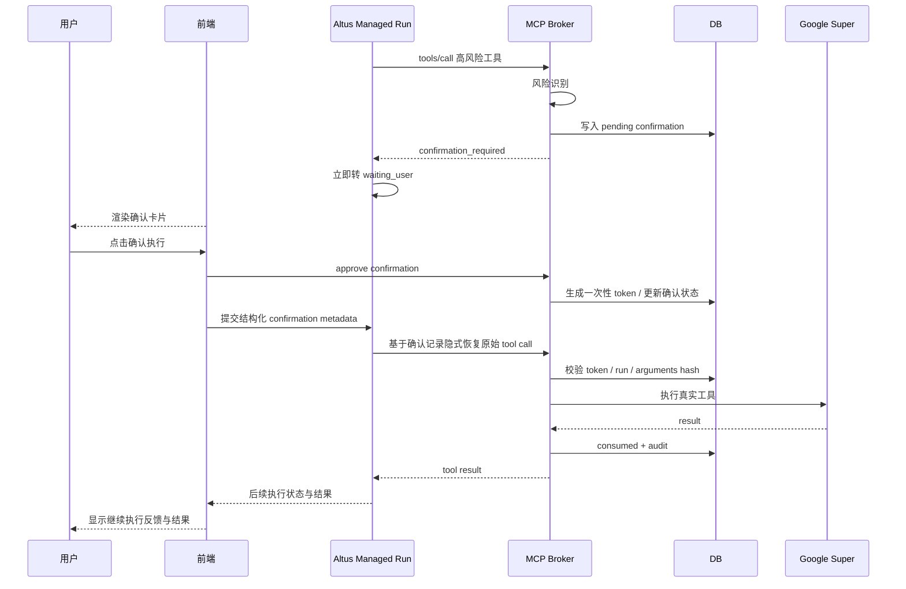

# MCP 高风险确认挂起恢复闭环修复方案 [20260504-1815已采用]

状态：`[20260504-1815已采用]`

编写日期：2026-05-04

## 1. 背景

现有仓库已经具备 MCP 高风险操作确认的基础能力：

1. 后端能够识别 `google_super` 等连接器中的高风险写操作。
2. Broker 能在真实工具执行前返回 `confirmation_required`。
3. 确认记录已能落库，并绑定 user、session、run、tool、summary、token。
4. approve 后后端已具备隐式恢复并重放原始待确认 tool call 的方向性实现。

但从最近真实联调与手工验证看，链路还没有形成稳定闭环，主要问题集中在“挂起后的 UI 呈现”和“用户确认后的恢复反馈”两段。

用户期望的标准流程是：

1. 识别
2. 拦截
3. 挂起
4. 通知与确认
5. 恢复
6. 给出执行反馈

当前状态是：

1. `识别`、`拦截`、`挂起` 已基本具备。
2. `通知与确认` 和 `恢复后的可见反馈` 仍不稳定。
3. 因此前端真实体验上还不能认定为“点完确认后就像 Codex 一样自然继续执行”。

## 2. 现状问题

本次专项修复只处理已经暴露出来的主链问题，不扩展需求，不引入兼容性分支。

### 2.1 真实问题清单

最近真实运行中出现了以下问题：

1. 高风险 MCP 操作被拦截后，Altus 没有立即停在等待用户，而是在同一轮继续搜索工具、换工具、重复尝试，导致同一操作出现多个确认请求。
2. 用户点击 `确认执行` 后，没有稳定看到“正在继续处理”的会话反馈，体感像按钮点了但系统没有继续工作。
3. 某些场景点击确认会报 `mcp_confirmation_not_pending`，说明前端仍能操作一条实际上已经不该再次确认的旧记录。
4. 某些场景点击确认后前端报 `setMessages is not defined`，说明页面层调用了不存在的状态更新入口。
5. 更关键的是，在真实手工测试里，后端消息已经进入“请确认是否继续执行”，但前端没有稳定渲染统一确认卡片，而是退化成普通“需要补充信息”输入框。
6. 某些新建会话没有显式提示“当前会话未连接 Google Workspace”，而是让模型先走到中途再退化成补充问题，导致用户难以分辨“未连接”和“高风险待确认”是两种不同状态。
7. 某些已 attach `google_super` 的会话在首轮真实调用时，连接器运行态仍是 `pending_recover`，模型只能返回“Google Workspace MCP 当前处于恢复等待状态”，导致用户还未进入确认链路就先失败。
8. 某些 Gmail 发送场景虽然已经触发确认卡片，用户点击 `确认执行` 后也能看到“已确认执行，正在继续处理...”，但后端恢复 run 仍会再次出现 `google_super__COMPOSIO_SEARCH_TOOLS`、`google_super__COMPOSIO_GET_TOOL_SCHEMAS`、`google_super__COMPOSIO_MULTI_EXECUTE_TOOL`，说明恢复链路存在退化回重新规划的情况。
9. 某些邮件发送场景在确认前后仍会落到 `google_super_confirmation_target_missing` 或 `managed_model_plain_text_without_tool_call`，说明“确认目标提取”和“批准后原始调用直恢复”都还有边界缺口。

### 2.2 根因拆解

问题不是单点 bug，而是三层状态模型没有完全对齐：

1. **Broker 层**
   - 已能返回 `confirmation_required`，但前端/运行态并未始终把它视为独立状态节点。
2. **Managed run 状态层**
   - 运行流在收到 `confirmation_required` 后，必须进入明确的 `waiting_user`，而不是继续同轮推理。
3. **前端会话渲染层**
   - 必须把“高风险确认”渲染成一等 UI 卡片，而不是普通 assistant 文本或 clarification。
   - 必须把“确认后继续执行”渲染成一等运行态反馈，而不是只依赖 toast 或无提示提交。
4. **连接器运行态层**
   - `google_super` 在真实会话中还会出现 `pending_recover -> recovering -> connected` 的异步恢复窗口。
   - 当运行态仍是 `pending_recover` 时，模型拿到的是“工具不可用”提示，而不是确认卡片；这说明连接器可用性前置条件和确认闭环之间仍缺一个稳定衔接。

当前最大缺口不再只剩第 3 层，而是：

1. 前端是否稳定把 `confirmation_required` 渲染为确认卡片。
2. approve 后是否一定恢复原始待确认 tool call，而不是静默退化回重新规划。
3. `pending_recover` 场景是否能在连接恢复完成前给出稳定、可区分的阻塞状态。

## 3. 目标

本方案的唯一目标是把高风险 MCP 调用确认链路做成稳定闭环，满足以下产品体验：

1. Agent 发起高风险 MCP 操作时，系统在执行前必定拦截。
2. 被拦截后，当前 run 必定挂起在 `waiting_user`，不得继续尝试同类操作。
3. 前端必定显示统一确认卡片，而不是退化成普通追问。
4. 用户点击 `确认执行` 后，前端必定立即给出“正在继续执行”的反馈。
5. 后端基于结构化确认记录恢复原始待确认 tool call，用户时间线不出现“注入提示”的痕迹。
6. 执行完成后，前端继续收到正常的工具执行结果或失败反馈。
7. 页面刷新、历史回放、重复渲染后，旧确认卡片不得再次可点。

## 4. 非目标

本方案不做以下事项：

1. 不重做整套 Altus 消息协议。
2. 不新增第二套“文本确认”兼容方案。
3. 不允许通过聊天输入“我确认了”替代按钮。
4. 不扩展到所有连接器的视觉定制卡片，仅沿用统一高风险确认卡片。
5. 不改变 Google Super 的工具发现策略本身，本方案只解决确认闭环。

## 5. 方案原则

### 5.1 单一确认协议

高风险 MCP 调用只能通过以下单一路径确认：

1. Broker 返回结构化 `confirmation_required`。
2. 前端渲染确认卡片。
3. 用户点击按钮。
4. 前端调用 approve/reject 接口。
5. 前端将结构化 confirmation metadata 交回 managed run。
6. 后端按确认记录恢复原始 tool call。

禁止出现以下并行协议：

1. 一部分走卡片确认，一部分走普通澄清问题。
2. 一部分靠聊天文字确认，一部分靠按钮确认。
3. 一部分靠提示词恢复，一部分靠结构化恢复。

### 5.2 用户感知必须是“自然继续”

用户确认后不应看到任何“系统注入”“恢复提示”“请重新调用工具”的显式痕迹。

用户应只看到：

1. 已确认执行
2. 正在继续处理
3. 工具执行结果或失败信息

### 5.3 不做补丁式兜底

本方案不采用“如果卡片识别失败，就退化成普通澄清问题”的兼容逻辑。原因是这会破坏高风险确认的一致性，并继续制造真假状态混淆。

正确做法是：

1. 明确区分 `clarification_request` 与 `confirmation_required`
2. 前端按消息元数据与类型严格分流
3. 未命中确认协议的高风险消息一律视为渲染错误并修正，不允许继续混流

## 6. 目标链路

### 6.1 标准时序



### 6.2 关键状态

必须明确区分以下状态：

1. `connector_missing`
   - 当前会话未 attach 对应连接器。
2. `clarification_required`
   - 用户目标缺少必要参数，需要补充信息。
3. `confirmation_required`
   - 目标参数已足够，但因高风险被拦截等待确认。
4. `waiting_user`
   - run 已挂起，等待前端确认或拒绝。
5. `resuming`
   - 用户已确认，后端正在恢复并重放原始 tool call。
6. `completed` / `failed`
   - 执行终态。

本次改造的重点是让 `confirmation_required` 永远不会被错误归类到 `clarification_required`。

## 7. 详细改造方案

## 7.1 后端：确认成为显式运行态节点

涉及文件：

1. `apps/api/src/services/altus-run-coordinator.ts`
2. `apps/api/src/services/altus-run-loop-state.ts`
3. `apps/api/src/services/altus-run-state.ts`
4. `apps/api/src/services/altus-managed-tool-executor.ts`

改造要求：

1. 工具返回 `confirmation_required` 时，协调器必须立刻结束当前轮。
2. 当前轮后续不得继续：
   - 搜工具
   - 换 schema
   - 改参数
   - 重试相同操作
3. 运行态必须记录显式原因：
   - `tool_confirmation_requested`
4. managed run 对外状态必须是：
   - `waiting_user`
5. 一旦进入 `waiting_user`，同一 run 在没有用户反馈前不得再写入新的高风险确认请求。

验收标准：

1. 同一高风险操作只出现一张确认卡片。
2. 不再出现同轮多次 `multi_execute_tool` 写操作尝试。

## 7.2 后端：确认记录模型收紧

涉及文件：

1. `apps/api/src/services/mcp-tool-confirmation-service.ts`
2. `apps/api/src/dao/task-session-mcp-tool-confirmation-dao.ts`
3. 相关 migration / schema 文件

改造要求：

1. `pending`、`approved`、`rejected`、`consumed` 状态语义必须收紧。
2. `approved` 但未 `consumed` 的记录，允许安全重发一次性 token。
3. `consumed` 的确认不得再 approve。
4. approve/reject 后必须写审计事件。
5. 所有确认记录必须能回推：
   - appUserId
   - taskSessionId
   - agentRunId
   - connectorKey
   - toolName
   - argumentsHash
   - summaryJson
   - status
   - expiresAt

验收标准：

1. 点击旧卡片不再直接报 `mcp_confirmation_not_pending`。
2. 刷新后重复点击已 approve 但未 consumed 的场景，可恢复，不会卡死。

## 7.3 后端：恢复链路统一为隐式重放

涉及文件：

1. `apps/api/src/services/altus-managed-run-entry-service.ts`
2. `apps/api/src/services/managed-mcp-tool-confirmation.ts`
3. `apps/api/src/services/mcp-tool-confirmation-service.ts`
4. `apps/api/src/services/altus-run-coordinator.ts`

改造要求：

1. approve 后，前端只提交结构化 confirmation metadata。
2. 后端根据 `confirmationId` 读取原始待确认 tool call 快照。
3. 下一次 managed run 启动时，先在内存态执行隐藏重放。
4. 工具结果再续接回模型上下文。
5. 不允许往用户时间线额外插入“恢复提示”文本。

验收标准：

1. 用户点击确认后，界面上只看到“正在继续处理”，而不是提示词痕迹。
2. 恢复的必须是原始被拦截那次 tool call，而不是新规划出的另一条调用。

## 7.4 前端：确认消息必须渲染为一等卡片

涉及文件：

1. `apps/web/client/src/pages/Home.tsx`
2. `apps/web/client/src/components/...` 中确认卡片组件
3. `apps/web/client/src/hooks/useTaskCreationAgent.ts`
4. `apps/web/client/src/tests/mcp-tool-confirmation.test.ts`

改造要求：

1. 前端识别高风险确认时，不能只看普通文本内容。
2. 必须优先依据结构化 metadata / message type / event source 渲染确认卡片。
3. `confirmation_required` 类型一律走确认卡片分支，不得落入：
   - clarification 卡片
   - 普通 assistant 消息
   - “需要补充信息”输入态
4. 确认卡片必须显示：
   - connector
   - toolName
   - action
   - target
   - impact
   - 参数摘要
   - `确认执行`
   - `拒绝`

验收标准：

1. 页面中出现“请确认是否继续执行”时，必须同时存在按钮卡片。
2. 不允许仅剩文本和输入框。

## 7.5 前端：确认后的即时反馈改为 hook 内部能力

涉及文件：

1. `apps/web/client/src/hooks/useTaskCreationAgent.ts`
2. `apps/web/client/src/pages/Home.tsx`

改造要求：

1. 页面层不能直接操作 hook 内部未暴露的 `setMessages`。
2. 由 hook 暴露正式的 `appendLocalMessage()` 或同类接口。
3. 点击 `确认执行` 后，前端立即插入一条本地系统状态消息：
   - `已确认执行，正在继续处理 Google Workspace 操作...`
4. 该消息必须参与历史合并与 pending 消息 reconcile。

验收标准：

1. 点击确认后没有运行时异常。
2. 用户能立即看到继续执行反馈。

## 7.6 前端：历史去重与旧卡片隐藏

涉及文件：

1. `apps/web/client/src/pages/Home.tsx`
2. 消息归并与视图派生逻辑文件

改造要求：

1. 已处理确认 ID 不能只放在页面临时 state。
2. 必须从历史消息元数据中反推已处理确认：
   - approved
   - rejected
   - followup submitted
3. 页面刷新、SSE 重连、历史回放后，旧确认卡片必须自动隐藏。
4. 同一 `confirmationId` 不允许在同一视图中重复出现多个可点击实例。

验收标准：

1. 刷新页面后旧卡片不再可点。
2. 同一确认不会出现多个按钮实例。

## 7.7 前端：未连接连接器与高风险确认彻底分流

涉及文件：

1. `apps/api/src/services/connector-guide-service.ts`
2. `apps/api/src/services/altus-managed-setup-service.ts`
3. `apps/web/client/src/pages/Home.tsx`
4. 连接器状态相关 UI

改造要求：

1. 如果当前会话未 attach `google_super`，模型或运行态应明确给出“当前会话未连接 Google Workspace”。
2. 这种状态必须走“连接器缺失”分支，而不是进入确认协议。
3. 不允许把“未连接”与“待确认”都表现成补充问题。

验收标准：

1. 未连接时，用户看到的是连接器缺失提示。
2. 已连接但高风险时，用户看到的是确认卡片。
3. 两种状态在 UI 上完全可区分。

## 8. 数据契约

### 8.1 `confirmation_required` 输出契约

后端返回给运行态的最小结构必须稳定：

```json
{
  "type": "confirmation_required",
  "connectorKey": "google_super",
  "toolName": "google_super__COMPOSIO_MULTI_EXECUTE_TOOL",
  "confirmationId": "uuid",
  "summary": {
    "action": "google_workspace_write",
    "target": "oneceo manual confirmation test",
    "impact": "将创建 Google Docs 文档",
    "parameterSummary": {
      "title": "oneceo manual confirmation test"
    }
  }
}
```

### 8.2 前端 follow-up metadata 契约

前端提交 approve 后的结构化 metadata 必须稳定：

```json
{
  "mcpToolConfirmation": {
    "action": "approve",
    "confirmationId": "uuid",
    "confirmationToken": "one-time-token",
    "connectorKey": "google_super",
    "toolName": "google_super__COMPOSIO_MULTI_EXECUTE_TOOL"
  }
}
```

### 8.3 历史消息标记契约

前端为去重和隐藏旧卡片，必须在本地和历史回流消息中识别这些 `source`：

1. `google_workspace_confirmation_approved`
2. `google_workspace_confirmation_rejected`
3. `google_workspace_confirmation_followup`

## 9. 详细实施步骤

### 阶段一：后端状态机收口

1. 收紧 `confirmation_required -> waiting_user` 转场。
2. 禁止同轮继续工具尝试。
3. 补充确认状态与审计测试。

完成标志：

1. 后端单测可稳定证明“只产生一次确认并停机等待用户”。

### 阶段二：前端卡片识别修正

1. 明确确认消息与澄清消息的分流函数。
2. 把当前“文本兜底识别”替换为“结构化协议优先识别”。
3. 修正旧卡片重复渲染问题。

完成标志：

1. 浏览器中出现真实按钮卡片，不再退化为普通补充问题。

### 阶段三：确认后恢复可见反馈

1. 前端确认按钮调用 hook 正式接口插入“继续处理中”消息。
2. 后端隐式重放后，后续状态与结果继续回流。

完成标志：

1. 用户点击确认后立即看到继续执行反馈。
2. 后续执行结果能正常显示。

### 阶段四：真机回归

1. 真实 Google Workspace 已连接会话中验证创建文档。
2. 验证发送 Gmail。
3. 验证拒绝路径。
4. 验证刷新后旧卡片隐藏。

完成标志：

1. 至少一条 create 文档和一条 send mail 真链路完整通过。

## 10. 测试方案

## 10.1 后端单元测试

必须补齐：

1. 高风险工具触发 `confirmation_required`
2. run 收到确认后进入 `waiting_user`
3. 同一轮不再继续调用工具
4. approve 后恢复原始 tool call
5. `approved` 未 `consumed` 时可重发 token
6. `consumed` 时再次 approve 失败
7. reject 后 run 不再恢复执行

目标文件：

1. `apps/api/tests/mcp-tool-confirmation-service.test.ts`
2. `apps/api/tests/altus-run-coordinator.test.ts`
3. `apps/api/tests/altus-managed-run-entry.service.test.ts`

## 10.2 前端单元测试

必须补齐：

1. `confirmation_required` 渲染确认卡片
2. clarification 不渲染确认卡片
3. approve 后插入“继续处理中”消息
4. 已处理确认在刷新后隐藏
5. 同一 `confirmationId` 不重复展示多个按钮

目标文件：

1. `apps/web/client/src/tests/mcp-tool-confirmation.test.ts`

## 10.3 浏览器手工回归

必须按真实页面验证：

1. 触发创建 Google Docs 文档
2. 页面出现确认卡片
3. 点击 `确认执行`
4. 不报前端 JS 错误
5. 不报 `mcp_confirmation_not_pending`
6. 会话里立即出现“已确认执行，正在继续处理...”
7. 后续返回成功或明确失败

## 11. 验收标准

只有同时满足以下条件，才算方案走通：

1. 高风险 MCP 调用只出现一次确认卡片。
2. 确认卡片带有明确目标对象、动作和影响信息。
3. 用户点击确认后，前端无报错。
4. 用户点击确认后，run 继续执行而不是停住。
5. 用户点击确认后，看不到“恢复提示注入”痕迹。
6. 页面刷新后旧确认按钮不会再次出现。
7. 未连接连接器与待确认高风险操作不会混淆。
8. 至少一条真实 Google Workspace 写操作在真机联调中闭环成功。

## 12. 风险与注意事项

1. 如果前端继续允许把确认消息降级为普通澄清，将持续制造状态混乱，必须彻底移除这条混流路径。
2. 如果恢复逻辑重新依赖提示词，会再次出现模型重规划、错误搜工具、重复确认的问题。
3. 如果已处理确认 ID 只保存在页面内存，刷新后仍会复现旧卡片点击问题。
4. 如果未连接连接器与待确认状态不分流，用户会误以为所有失败都来自确认机制。

## 13. 与现有文档关系

本方案是以下已采用文档的专项闭环修复方案，不替代其总体标准：

1. `docs/agent研发文档/20260504_MCP高风险工具调用统一确认标准_[20260504-1256已采用].md`
2. `docs/features/connectors/google_super_composio_mcp_oauth_doc_[20260504-1118已采用].md`
3. `docs/agent研发文档/20260504_MCP高风险确认_GoogleWorkspace浏览器回归记录_[20260504-2345已采用].md`

如果本方案评审通过并进入实施：

1. 本文状态更新为 `[yyyymmdd-hhmm已采用]`
2. 同步更新上述两份已采用文档中的“现状说明”和“已知问题”
3. 相关测试文档与回归记录同步挂接到本文

## 14. 建议评审顺序

建议用户优先确认以下三点：

1. 是否同意“高风险确认不得退化为普通澄清”的单一路径原则
2. 是否同意“确认后必须走后端隐式重放，不向用户暴露注入痕迹”
3. 是否同意“未连接连接器”和“高风险待确认”在 UI 上彻底分流

这三点确认后，再进入代码实施，能避免后续返工。
