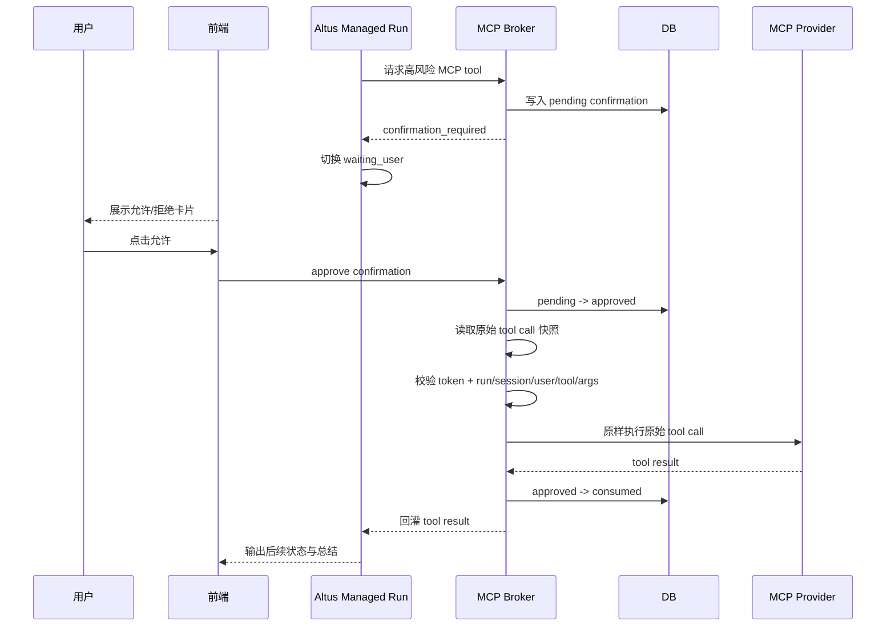

# MCP 高风险确认改为待执行动作直恢复方案（交互语义对齐 Cluade，底层保留持久化恢复）[20260504-1902已采用]

状态：`[20260504-1902已采用]`

编写日期：2026-05-04

## 1. 背景

本次修订基于两个事实：

1. `Cluade` 当前的用户感知是正确的：
   - 工具请求被拦下
   - 用户看到允许/拒绝
   - 点击允许后自然继续
   - 不会重新让模型再想一轮
2. oneceo 当前的底层架构与 `Cluade` 不同：
   - Altus managed run 是显式 run 状态机
   - 高风险 MCP 确认已经依赖持久化 confirmation 记录
   - 前后端之间通过 API、SSE、历史回放、刷新恢复协作

因此，修订方向不能简单理解为：

1. 完全照搬 `Cluade` 的同步挂起 promise 机制
2. 删除 `confirmationId / confirmationToken / consumed`
3. 改成纯内存里的 `ask / allow / deny`

正确方向应是：

> 交互语义对齐 `Cluade`，底层仍保留 oneceo 必需的持久化确认与受限恢复机制。

## 2. 问题判断

当前真实问题不是“确认卡片长得不像 `Cluade`”，而是：

1. 被拦截的高风险工具调用结束得太早。
2. 用户确认后，系统一度仍通过 follow-up 把“已确认”当作新的输入交给模型。
3. 模型重新搜工具、重新构参、重新触发风险检查。
4. 于是用户会看到：
   - 明明已经确认过，却再次要求确认
   - 或者确认目标缺失
   - 或者确认记录与当前工具调用不再匹配

一句话概括：

> 当前要修的不是“有没有确认 UI”，而是“确认之后谁来继续执行，以及如何保证继续执行的是原始那次调用”。

### 2.1 2026-05-05 真机补充结论

最新真机测试表明，这个问题已经从“确认后还会发继续消息”进一步收口，但仍存在两个剩余缺口：

1. `google_super` 在部分新会话首轮调用时会先落入 `pending_recover`，模型直接返回“Google Workspace MCP 当前处于恢复等待状态”，此时还没有机会进入高风险确认链路。
2. 某些 Gmail 发送场景在用户点击 `确认执行` 后，恢复 run 仍会再次出现 `COMPOSIO_SEARCH_TOOLS -> COMPOSIO_GET_TOOL_SCHEMAS -> COMPOSIO_MULTI_EXECUTE_TOOL`，说明“原始待确认 tool call 直恢复”还存在静默退化回重新规划的边界情况。
3. 上述退化场景继续叠加后，会把问题放大成：
   - `google_super_confirmation_target_missing`
   - `managed_model_plain_text_without_tool_call`
4. 因此，本方案方向已经确认是正确的，但真机链路仍不能认定为完全达成“批准后必定直恢复原始调用”。

### 2.2 2026-05-05 数据库与自动化补充结论

继续对真实会话数据库与最小自动化回归进行核对后，当前实现与本方案之间还存在几条必须被文档明确写出的偏差：

1. `confirmation_required` 在真实链路中不一定以顶层对象返回。
   - 它可能被 Altus runtime 包装进 provider envelope。
   - envelope 外层常见结构为：
     - `providerId`
     - `toolName`
     - `result`
   - 真正的 `confirmation_required` 可能位于：
     - `result.structuredContent`
     - `result.content[].text`
2. 如果协调器只检查顶层 `type === confirmation_required`，原始 run 就可能在拿到待确认结果后仍继续执行。
   - 当前已通过真实数据库确认：
     - 原始待确认 run 在未批准前没有稳定停在 `waiting_user`
     - 反而继续写出“已成功发送邮件”等成功总结
3. `/approve` 后首轮 synthetic replay 即使失败，当前实现也可能继续退化为普通规划 run。
   - 当前已通过真实数据库确认：
     - replay 首轮可先失败为 `connector_guide_blocked:google_super`
     - 之后 run 仍继续进入 `SEARCH_TOOLS -> GET_TOOL_SCHEMAS -> MULTI_EXECUTE_TOOL`
4. `task_session_mcp_tool_confirmations.agent_run_id` 在真实样本中存在空值。
   - 这会导致 confirmation 与 originating run 的绑定不稳定
   - 审计、排障、恢复核对链会天然缺一段关键证据
5. `approved replay` 目前把“connector guide 已加载”错误地绑定成了 runtime 内存态。
   - 新恢复 run 虽然持有有效 `confirmationToken`，但如果 `confirmationAgentRunId` 为空，就不会命中 replay 预加载分支。
   - 结果是首个真实 replay tool call 在进入 provider 前就先报 `connector_guide_blocked:google_super`。
6. `approved replay` 消费确认 token 时，当前实现会在 `confirmationAgentRunId` 为空时错误回退到“当前恢复 run 的 runId”。
   - 若 confirmation 落库时的 `agentRunId` 本来就是 `null`，这次消费就无法匹配已批准记录。
   - 随后链路会再次创建 pending 或继续退化回 `SEARCH_TOOLS -> GET_TOOL_SCHEMAS -> MULTI_EXECUTE_TOOL`。
7. `approve/reject` 的 metadata-only 响应被后端强行写成 `[mcp_tool_confirmation:approve] / [mcp_tool_confirmation:reject]` 占位文本。
   - 这会让历史恢复和前端流合并把内部控制消息当成普通用户输入渲染出来。
   - 由于本地 optimistic 消息是空内容、而持久化消息是占位文本，所以表现会呈现“有时出现、有时不出现”的间歇性。
8. 命中高风险拦截后，当前确认摘要的 `target` 提取仍可能失败并直接抛 `google_super_confirmation_target_missing`。
   - 这会导致 run 已经进入高风险分支，却没有产出 `confirmation_required` 结构化结果。
   - 用户侧表现为“操作已被拦截，但没有弹确认卡，而是被当作普通失败继续解释”。

因此，本方案的“剩余缺口”不应再仅表述为“偶发退化重规划”，而应明确为：

1. `confirmation_required` 识别边界尚未写死并被完整实现
2. replay 首轮失败后的终止语义尚未写死并被完整实现
3. confirmation 与原始 run 的绑定约束尚未在真实链路中完全收紧
4. approved replay 的 connector guide 预加载语义尚未独立于 runtime 内存态写死
5. approved replay 在 `confirmationAgentRunId` 缺失时的消费匹配语义尚未写死
6. metadata-only confirmation 响应的持久化与渲染隐藏语义尚未写死
7. 命中高风险拦截后，确认摘要 `target` 提取失败会导致确认卡整体丢失

## 3. 核心判断

### 3.1 可以借鉴什么

可以借鉴 `Cluade` 的是：

1. `ask / allow / deny` 交互语义
2. 用户点击允许后自然继续的体验
3. 不把“已确认”当成新的普通用户输入

### 3.2 不能直接照搬什么

不能直接照搬 `Cluade` 的是：

1. 纯会话内挂起原调用、依赖未 resolve promise 等用户回来
2. 只用 `requestId + toolUseId` 绑定，不落确认记录
3. 放弃 `confirmationId / token / arguments hash / consumed`
4. 完全去掉持久化恢复能力

### 3.3 原因

因为 oneceo 当前需要稳定支持：

1. 刷新页面后恢复状态
2. SSE 重连
3. 历史回放
4. 幂等确认
5. 用户点击确认后只执行一次
6. 同一确认只对同一个 `toolName + argumentsHash` 生效

这些能力都要求：

1. 有持久化确认记录
2. 有一次性消费语义
3. 有 run/session/user/tool/args 的强绑定

## 4. 目标

本方案唯一目标是把高风险 MCP 确认链路改成：

> 交互上像 `Cluade`，恢复上仍走 oneceo 的持久化受限恢复闭环。

需要同时满足：

1. 高风险工具被拦截后，用户看到的是允许/拒绝语义，而不是补充问题语义。
2. 用户点击允许后，不再向模型发送“请继续执行”的普通文本或普通 follow-up。
3. 用户点击允许后，后端必须直接恢复原始待确认工具调用。
4. 恢复执行必须严格绑定：
   - `confirmationId`
   - `appUserId`
   - `taskSessionId`
   - `agentRunId`
   - `connectorKey`
   - `toolName`
   - `argumentsHash`
5. 同一确认只能成功消费一次。
6. 工具结果继续回流给模型做总结，但模型不再负责决定“要不要重新调用这个工具”。
7. 只要任一层 payload 中识别到 `confirmation_required`，当前 run 必须原子切到 `waiting_user`。
8. `/approve` 后首轮 replay 如果失败，run 必须显式结束为恢复失败，而不是继续普通规划。
9. 成功总结必须以真实 provider 执行结果为依据，不能仅凭模型看到待确认语义后自行生成成功文本。

## 5. 非目标

本方案不做以下事项：

1. 不重做整套 Altus run 架构为 `Cluade` 的同步挂起 promise 模型。
2. 不删除现有 `confirmation_required` 协议。
3. 不删除 `confirmationId / confirmationToken / approved / consumed` 模型。
4. 不把确认改成跨调用可复用的临时通行证。
5. 不允许前端再通过普通消息驱动“继续执行”。

## 6. 修订原则

### 6.1 交互语义对齐 Cluade

用户感知上统一为：

1. `ask`
   - 当前高风险操作需要允许或拒绝
2. `allow`
   - 用户已允许，系统立即继续执行
3. `deny`
   - 用户已拒绝，本次操作终止

### 6.2 恢复机制保持持久化

底层仍保留：

1. `confirmation_required`
2. 持久化确认记录
3. 一次性 token
4. `approved -> consumed`
5. `toolName + argumentsHash` 强绑定

### 6.3 模型不再参与批准后的再规划

批准后禁止出现以下路径：

1. 再给模型发“用户已确认，请继续”
2. 再让模型搜工具
3. 再让模型重组参数
4. 再让模型决定这次是否调用同类写操作

### 6.4 识别边界必须覆盖外层包装

高风险确认不是只有一种返回形态，本方案要求协调器识别以下所有等价形态：

1. 顶层对象：
   - `{"type":"confirmation_required", ...}`
2. provider envelope 内的结构化结果：
   - `{"providerId":"...","toolName":"...","result":{"structuredContent":{"type":"confirmation_required", ...}}}`
3. provider envelope 内的文本结果：
   - `result.content[].text` 中承载的结构化 `confirmation_required` JSON
4. 其他与上述等价、但仅改变传输包装层的 MCP/managed runtime 返回形式

只要任一层被识别为 `confirmation_required`：

1. 当前 run 必须立即停止同轮剩余规划
2. 当前 run 必须进入 `waiting_user`
3. 不得继续产出“成功执行”“已发送邮件”等最终总结

## 7. 目标架构

### 7.1 标准时序



### 7.2 关键点

这个时序里必须注意：

1. 前端交互语义像 `Cluade`
2. run 的等待态仍然是 oneceo 的 `waiting_user`
3. 批准后的执行者是后端恢复器，不是模型
4. 模型只消费结果，不重新决定计划

## 8. 数据模型

### 8.1 保留确认记录主路径

确认记录仍然是恢复执行的权威来源，至少保留：

```ts
type McpConfirmationRecord = {
  confirmationId: string
  appUserId: string
  taskSessionId: string
  agentRunId: string
  connectorKey: string
  toolName: string
  argumentsJson: unknown
  argumentsHash: string
  summaryJson: unknown
  status: "pending" | "approved" | "rejected" | "consumed"
  confirmationTokenHash?: string | null
  approvedAt?: Date | null
  consumedAt?: Date | null
  expiresAt: Date
}
```

### 8.2 不放弃的字段

以下字段必须继续保留：

1. `confirmationId`
2. `toolName`
3. `argumentsJson`
4. `argumentsHash`
5. `agentRunId`
6. `taskSessionId`
7. `appUserId`
8. `confirmationTokenHash`

### 8.3 不采用的简化

本方案明确不采用以下“Cluade 式简化”：

1. 只保留内存里的挂起请求
2. 只靠 `requestId` 绑定
3. 不落 `consumed`
4. 用户刷新后靠前端自己猜测状态

## 9. 协议设计

### 9.1 面向前端的交互语义

前端展示与本地状态统一按 `ask / allow / deny` 理解：

1. `ask`
   - 对应后端 `confirmation_required`
2. `allow`
   - 对应用户点击 `确认执行`
3. `deny`
   - 对应用户点击 `拒绝`

### 9.2 面向后端的恢复协议

后端仍然使用结构化确认协议，例如：

```json
{
  "mcpToolConfirmation": {
    "action": "approve",
    "confirmationId": "uuid",
    "confirmationToken": "one-time-token",
    "connectorKey": "google_super",
    "toolName": "google_super__COMPOSIO_MULTI_EXECUTE_TOOL"
  }
}
```

### 9.3 约束

本方案明确禁止：

1. `approve` 后再发普通“继续执行”消息
2. `approve` 后让模型重新规划
3. `approve` 后重新搜索工具
4. `approve` 后对不同参数复用同一确认
5. `approved replay` 解析失败后静默降级为普通 managed run
6. 识别到 `confirmation_required` 后继续进入下一轮模型调用
7. 在没有真实 provider 成功回执的前提下写出高风险写操作成功总结

## 10. 前端改造要求

### 10.1 UI 语义

前端卡片文案与行为统一改成权限决策语义：

1. 标题可展示为“确认高风险 MCP 操作”
2. 主动作语义是“允许执行”
3. 次动作语义是“拒绝”
4. 状态反馈统一为：
   - 已允许，正在继续执行...
   - 已拒绝，本次操作已取消

### 10.2 approve 行为

点击允许后：

1. 先调 approve 接口
2. 本地立即显示继续处理中
3. 不再提交普通 follow-up 文本
4. 只提交结构化恢复 metadata，或由 approve 直接触发恢复

### 10.3 reject 行为

点击拒绝后：

1. 调 reject 接口
2. 本地立即显示已取消
3. 卡片不可再次操作

## 11. 后端改造要求

### 11.1 approve 的职责

approve 的职责应明确为：

1. 校验确认仍是 `pending`
2. 更新为 `approved`
3. 生成一次性 token
4. 读取原始待确认 tool call
5. 恢复并执行该原始 tool call
6. 成功后原子消费为 `consumed`
7. 回灌工具结果
8. 如果首轮 replay 执行失败，必须显式结束为恢复失败并暴露失败原因
9. 首轮 replay 失败后，不允许继续退回普通模型规划

### 11.2 reject 的职责

reject 的职责应明确为：

1. `pending -> rejected`
2. 写审计
3. 通知当前 run 本次高风险操作终止
4. 不允许再恢复

### 11.3 风险校验职责

恢复执行时，风险校验必须走“同动作受限放行”：

1. 校验 `confirmationId`
2. 校验 `confirmationToken`
3. 校验 `appUserId`
4. 校验 `taskSessionId`
5. 校验 `agentRunId`
6. 校验 `connectorKey`
7. 校验 `toolName`
8. 校验 `argumentsHash`

只有全部一致时才允许真实执行。

### 11.4 run 绑定职责

confirmation 记录必须稳定绑定 originating run：

1. 创建 pending confirmation 时，不允许长期落成 `agentRunId = null`
2. 如果运行态上下文缺失到无法绑定 originating run，应直接暴露诊断错误，而不是默默创建一条失去 run 归属的 confirmation
3. 审批、消费、审计和恢复都应能回溯到同一 originating run

## 12. 为什么不直接采用纯同步门控

如果完全改成 `Cluade` 式的“挂起原调用等待 allow/deny”，需要同时重构：

1. run 生命周期
2. coordinator 挂起恢复点
3. 跨请求 waiter 管理
4. 刷新与重连后的状态恢复
5. 多实例场景下的挂起请求定位

这已经不是一次确认链路修复，而是 Altus run 模型重构。

因此，本方案的结论是：

> 不直接照搬 `Cluade` 的底层机制，只吸收它的交互语义，并保留 oneceo 已经形成的持久化安全闭环。

## 13. 详细实施步骤

### 阶段一：清理继续消息路径

1. 清理前端“确认后再发继续执行消息”的旧路径
2. 确保确认后不再把“allow”变成普通用户输入

完成标志：

1. 点击允许后，不再出现模型重新规划

### 阶段二：交互语义收口

1. 卡片文案和状态改成 `ask / allow / deny` 语义
2. 保持当前 `confirmation_required` 数据契约不变

完成标志：

1. 用户感知与 `Cluade` 接近

### 阶段三：恢复链路收紧

1. approve 后由后端恢复器直接执行原始 tool call
2. 风险检查只对同一 `toolName + argumentsHash` 放行
3. 执行成功后原子消费
4. 如果恢复所需的 replay 上下文缺失或不匹配，必须显式失败并暴露诊断信息，不允许静默退回模型重新规划
5. 如果 `confirmation_required` 被 provider envelope 包裹，也必须在进入 replay 之前被统一识别并截停
6. approved replay 只要持有有效 `confirmationToken`，就必须视为“同一受控恢复动作”，不能再因为新的 runtime 未调用 `load_connector_guide` 而被本地 guide 门禁拦回
7. 如果 replay metadata 没有 `confirmationAgentRunId`，消费确认 token 时必须优先按原 confirmation 记录的空值语义匹配，不能错误回退成当前恢复 run 的 runId
8. `approve/reject` 的 metadata-only confirmation 响应必须允许空内容持久化，不能再注入可见占位文本；前端对历史中的旧占位文本也必须按隐藏控制消息处理
9. 只要命中高风险拦截，就必须稳定产出 `confirmation_required`；确认摘要 `target` 即使无法从原参数中直接抽出，也必须走受控兜底而不是直接抛错

完成标志：

1. 点击允许后，真实执行的是原始待确认动作

### 阶段四：结果回灌与幂等

1. 工具结果继续回流到 run
2. 刷新后旧卡片隐藏
3. 二次点击确认不重复执行

完成标志：

1. 不再出现“明明确认过还要再确认”的问题

## 14. 测试要求

### 14.1 后端测试

必须补齐：

1. approve 后直接恢复原始 tool call
2. approve 后不会重新搜工具
3. 风险放行仅对相同 `toolName + argumentsHash` 生效
4. `approved` 只能被消费一次
5. reject 后不会执行真实工具
6. `approved replay` 解析失败时，run 必须显式报恢复失败，不得继续落入 `SEARCH_TOOLS`
7. `confirmation_required` 被 provider envelope 包裹时，run 仍必须立刻进入 `waiting_user`
8. 原始 run 在未批准前不得继续写出高风险成功总结
9. replay 首轮失败后，不得继续进入 `load_connector_guide / SEARCH_TOOLS / GET_TOOL_SCHEMAS / MULTI_EXECUTE_TOOL`
10. confirmation 落库时必须绑定 originating `agentRunId`
11. approved replay 在 `confirmationAgentRunId` 为空时，仍能跳过本地 connector guide 门禁并直达同一原始 tool call
12. approved replay 在 `confirmationAgentRunId` 为空时，消费确认 token 传入 DAO 的 `agentRunId` 必须保持 `null`，不能回退成当前 runId
13. `approve/reject` 后的 timeline 中不得再出现可见的 `[mcp_tool_confirmation:*]` 用户输入气泡；旧历史中的同类 marker 进入聊天渲染时也必须被隐藏
14. `GOOGLESUPER_CREATE_DOCUMENT_MARKDOWN` 等 multi execute 写操作即使参数形态变化，也必须稳定弹出确认卡，不能再因 `google_super_confirmation_target_missing` 退化成普通失败

### 14.2 前端测试

必须补齐：

1. 确认卡片以允许/拒绝语义展示
2. 点击允许后不再发送普通继续消息
3. 点击拒绝后本地立即显示取消
4. 已处理卡片刷新后隐藏

### 14.3 真机回归

必须验证：

1. 触发 Google Docs 创建
2. 出现允许/拒绝卡片
3. 点击允许后，不再重新搜工具
4. 真实执行原始被拦截的工具调用
5. 返回成功结果或明确失败
6. 不出现第二张重复确认卡片
7. 若会话连接器处于 `pending_recover`，页面必须明确展示“恢复等待中”，且在恢复完成前不得误报为确认链路失败
8. 在没有 Gmail `messageId` / `threadId` 或等价 provider 回执的情况下，不得出现“已成功发送邮件”总结

## 15. 验收标准

只有同时满足以下条件，本方案才算通过：

1. 用户点击允许后，后端执行的是原始待确认 tool call
2. 点击允许后，不再出现重新搜索工具
3. 点击允许后，不再出现重复确认卡片
4. 同一确认只对同一个 `toolName + argumentsHash` 生效
5. 同一确认只成功执行一次
6. 工具结果继续自然回流到会话
7. 用户感知上接近 `Cluade`，但底层仍可刷新、回放、幂等恢复
8. `approved replay` 上下文缺失时，系统能明确暴露恢复失败原因，而不是退化成 `managed_model_plain_text_without_tool_call`
9. `confirmation_required` 无论位于顶层对象、provider envelope 还是结构化文本中，都能被统一识别并截停
10. `/approve` 后首轮 replay 失败时，系统不会继续普通规划，也不会再写出伪成功总结
11. confirmation 记录稳定绑定 originating run，审计链可完整追溯

## 16. 与现有文档关系

本方案是对以下文档中“确认后恢复”部分的修订候选：

1. `docs/agent研发文档/20260504_MCP高风险确认挂起恢复闭环修复方案_[20260504-1815已采用].md`
2. `docs/agent研发文档/20260504_MCP高风险工具调用统一确认标准_[20260504-1256已采用].md`
3. `docs/agent研发文档/20260504_MCP高风险确认_GoogleWorkspace浏览器回归记录_[20260504-2345已采用].md`

修订重点是：

1. 保留持久化确认主链
2. 去掉“继续消息驱动恢复”
3. 前端交互语义向 `Cluade` 对齐
4. 底层恢复仍由 oneceo 后端闭环完成

## 17. 建议评审点

建议优先确认以下三点：

1. 是否同意只借鉴 `Cluade` 的交互语义，不照搬其纯同步挂起底层机制
2. 是否同意继续保留 `confirmationId / token / argumentsHash / consumed`
3. 是否同意批准后由后端直接恢复原始 tool call，而不是再向模型发送继续消息
