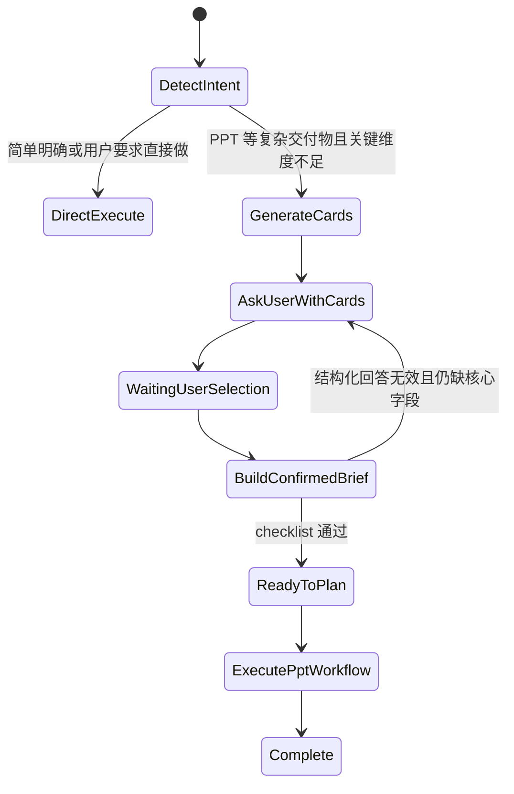

# 20260526 Altus 结构化澄清卡片与 PPT 先计划后执行方案 [20260526-2123已采用]

## 1. 背景

用户反馈：PPT 生成等复杂交付任务不能在用户只给一句简单请求时直接执行，否则容易出现内容方向、受众、资料来源和视觉风格不可靠的问题。但澄清也不能变成长问卷，用户不应被要求自己写完整需求。

本方案借鉴 DeepWiki 中 `code-yeongyu/oh-my-openagent` 的先询问、再清单过关、再计划执行思想，但在 oneceo 内收敛为更轻量的产品交互。2026-05-26 追加统一约束：所有 Altus `ask_user` / `clarification_request` 都必须通过结构化卡片呈现，不再显示普通“需要补充信息”自由文本块。

- 最多 4 张澄清卡片。
- 每张卡片只解决一个高价值决策。
- 每张卡片展示 4 个选项：前三项由 AI 根据当前任务动态生成，第四项固定为用户自定义输入。
- 用户主要通过点选完成；只有选择第四项时才输入自定义答案。
- 4 张卡片结束后必须生成 confirmed brief，并进入现有 Altus / PPT 工作流。

## 2. 目标

1. 对所有需要用户补充关键信息的 Altus 任务，统一使用结构化卡片，不再显示普通“需要补充信息”文本。
2. 对 PPT / slides / 演示文稿这类复杂交付物，先形成受控 brief，再执行检索、规划和渲染。
3. 将澄清问题从“自由文本追问”升级为“AI 生成的选择卡片”，降低用户输入负担。
4. UI 风格符合 oneceo “任务塔台”：紧凑、可扫描、可复核，不做营销式表单或浮夸卡片。

## 3. 非目标

1. 不重写 Altus managed 主循环。
2. 不替换现有 `ask_user` 能力；结构化澄清是 `ask_user` 的增强型 payload。
3. 不引入新的前端依赖。
4. 不把 PPT 工作流改回自由 `python-pptx` 或绕过现有渲染器。
5. 不把所有任务都强制澄清；简单明确任务仍直接执行。
6. 不保留自由文本澄清作为用户可见主路径；历史或漏字段事件必须由前端 fallback 成卡片。

## 4. 触发规则

触发对象：

- 任何 Altus 判断 `needsClarification=true` 的任务。
- 任何模型主动调用 `ask_user` 的任务。
- PPT 请求仍保留更高价值的 4 卡默认 brief：当用户请求包含 `PPT`、`pptx`、`PowerPoint`、`slides`、`演示文稿`，且当前消息没有明确覆盖以下关键维度中的至少 3 项时触发：
  - 目的与受众
  - 内容来源
  - 页数/深度
  - 视觉与叙事风格
  - 必含内容或禁止内容

不触发对象：

- 用户已给完整 brief。
- 用户明确说“不要问，直接按默认做”。
- 用户只是咨询能力、询问怎么做或要求先给方案。
- 当前处于已有结构化澄清回答后的执行阶段。

## 5. 卡片生成原则

AI 生成 `StructuredClarificationCardPlan`，但必须遵守硬约束：

1. `cards.length <= 4`。
2. 如果 2 张卡即可补齐关键决策，不强行生成 4 张。
3. 每张卡片只问一个决策问题。
4. 每张卡片由 AI 生成 3 个业务选项。
5. 第 4 个选项固定为“自定义补充”，用户选择后输入自己的答案。
6. 每张卡片必须有一个推荐选项。
7. 每个选项必须说明对最终产物的影响。
8. 已从用户原话明确得到的信息不得重复询问。
9. 所有选项使用业务语言，不暴露内部工具、模型或技术名。
10. 每张卡片只保留一个自定义输入入口，不再额外展示“补充说明”输入框。
11. 4 张卡片结束后必须生成 confirmed brief，不允许继续追问。

PPT 场景默认高价值维度排序：

1. 目的与受众：决定叙事视角和专业术语密度。
2. 内容来源：决定是否联网、可信资料范围和引用要求。
3. 深度与页数：决定工作量、结构粒度和是否直接渲染。
4. 视觉与叙事风格：决定 layout、色彩、图表和页面节奏。
5. 必含/禁止内容：仅当用户已有目的、来源、页数和风格时替换进入前 4。

## 6. Schema

```ts
export type StructuredClarificationOption = {
  id: string;
  label: string;
  description: string;
  impact: string;
  recommended?: boolean;
};

export type StructuredClarificationCard = {
  id: string;
  title: string;
  question: string;
  why: string;
  selectionMode: 'single' | 'multiple';
  required: boolean;
  options: StructuredClarificationOption[];
  allowOther: boolean;
  allowNote: boolean; // 统一为 false，第四项自定义输入承接补充
  notePlaceholder?: string;
};

export type StructuredClarificationCardPlan = {
  kind: 'structured_clarification';
  taskType: 'ppt' | 'report' | 'website' | 'generic';
  title: string;
  summary: string;
  maxCards: 4;
  cards: StructuredClarificationCard[];
  briefFields: string[];
};

export type StructuredClarificationAnswer = {
  planId: string;
  answers: Array<{
    cardId: string;
    selectedOptionIds: string[];
    otherText?: string;
    note?: string; // 兼容旧数据，新 UI 不再单独采集
    skipped?: boolean;
  }>;
};
```

## 7. 状态链路



## 8. Prompt 生成器约束

后端给 AI 的卡片生成 prompt 必须表达：

```text
你是任务澄清设计器。
目标：用最多 4 张选择卡，让用户用最少操作补齐影响交付质量的关键决策。

规则：
- 不要生成开放式长问题。
- 每张卡只解决一个决策。
- 每张卡 3 个 AI 生成选项。
- 第 4 个选项由 UI 固定渲染为用户自定义输入。
- 每个选项必须说明会如何影响产物。
- 已从用户原话明确得到的信息，不要再问。
- 如果任务可以用默认值完成，不要问低价值问题。
- PPT 场景优先考虑目的与受众、内容来源、深度页数、视觉叙事。
- 输出严格 JSON，不要输出 Markdown。
```

如果 AI 生成失败或 schema 不合格，运行时必须使用内置 fallback card plan，仍然最多 4 张；非 PPT 澄清退化为 1 张关键决策卡，而不是普通文本。

## 9. UI 设计

结构化澄清卡片显示在对话流中，视觉遵循 oneceo “任务塔台”：

- 容器：浅色 surface，1px 边框，12px 圆角，不使用装饰阴影。
- Header：左侧为卡片标题，右侧显示 `第 N / M 项` 和进度百分比。
- 选项：每张卡固定展示 4 个选项，两列响应式布局；移动端单列。
- 选项控件：使用 radio / checkbox 语义，整行可点。
- 推荐项：使用小型 `推荐` badge，不使用大面积高亮。
- 自定义输入：只有选择第 4 项时出现，36px 高紧凑输入，placeholder 由 AI 或 fallback 生成。
- 操作区：`跳过`、`下一项` / `完成确认`，主按钮使用 command-blue。
- 最后一项提交后生成摘要，摘要不是第 5 张卡片，而是执行前 brief。

文案要求：

- 问题使用用户能理解的业务语言。
- 选项描述不超过 24 个汉字。
- `why` 文案不超过 30 个汉字，用于说明为什么问这一项。
- 不显示 `structured_clarification`、`schema`、`tool` 等内部词。

## 10. Confirmed Brief 注入

用户完成卡片后，后端将回答汇总为：

```text
# Confirmed Task Brief
- task_type: ppt
- purpose_audience: ...
- content_source: ...
- depth_page_count: ...
- visual_story_style: ...
- user_notes: ...
```

该 brief 注入 `AltusManagedPromptService.buildSystemPrompt()` 的运行时上下文中。PPT 工作流必须基于该 brief 执行：

1. 先生成 `PptTaskAnalysis`。
2. 再生成 `PptResearchPlan`。
3. 再执行资料收集、视觉规划、结构规划、渲染指令、预检。
4. 只有预检通过且用户要求最终 PPTX 时才调用渲染器。

## 11. 测试计划

后端：

1. `task-intent-shape-service` 或新增服务测试：一句话 PPT 请求触发结构化澄清。
2. card plan fallback 测试：最多 4 张、每张 2 到 4 个选项、推荐项存在。
3. brief 汇总测试：用户选择结果可生成 `Confirmed Task Brief`。
4. prompt 注入测试：brief 出现在 managed system prompt 中。

前端：

1. 卡片渲染测试：单选、多选、跳过、补充说明。
2. 进度测试：最多 4 项，显示 `第 N / M 项`。
3. 提交测试：生成结构化回答 payload。
4. 响应式检查：桌面两列、移动端单列，不出现文字溢出。

集成 smoke：

输入：`帮我分析一下沐曦股份，做个 ppt`

预期：

1. 首轮不直接联网搜索、不直接生成 PPT。
2. 对话中出现结构化澄清卡片。
3. 卡片数量不超过 4。
4. 用户选择后，后续 run 的 prompt 包含 confirmed brief。

## 12. 风险与边界

1. AI 生成卡片质量不稳定：用 schema validator 和 fallback plan 兜住。
2. 用户跳过所有卡片：允许进入 brief，但标记默认假设，PPT 工作流应使用保守默认。
3. 卡片太多导致干扰：硬限制 4 张，且允许提前结束。
4. 历史消息回放：结构化澄清 payload 必须落入 message metadata，刷新后仍可操作或显示已回答状态。
