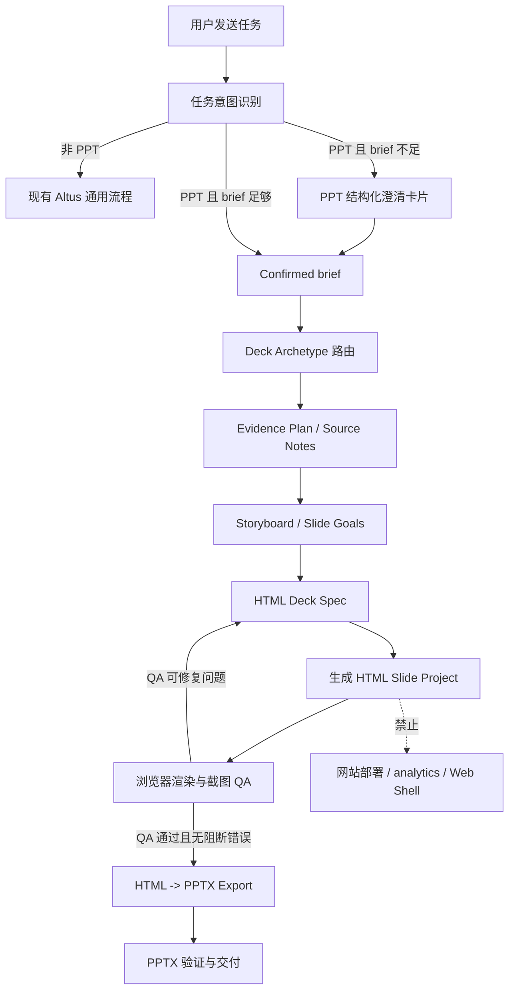
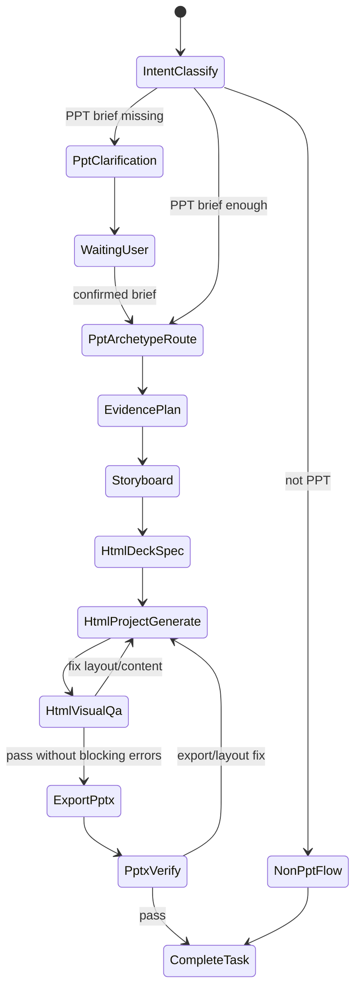
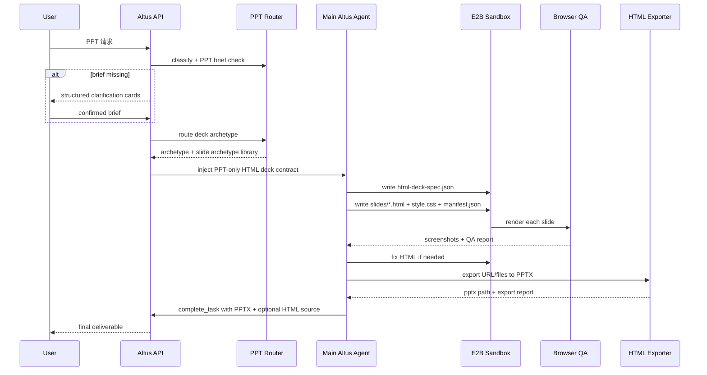

# 20260527 PPT HTML 中间形态导出 PPT 方案 [20260527-1046已采用]

## 1. 背景

用户提供 DeepWiki 导出的 `presenton/presenton` PPT 核心链路，希望 oneceo 的 PPT 生成也改成“先生成 HTML，再由 HTML 导出 PPT”的架构。

DeepWiki 关键信息：

1. Presenton 内部先生成 `HTML / Tailwind / React`，不是直接生成 PPTX。
2. 最终通过 export service 从 URL 导出 `pptx` 或 `pdf`。
3. 编辑有两条路径：
   - 内容编辑：重新生成 slide content，并复用未变更资源。
   - HTML 编辑：LLM 直接修改 HTML，保持结构和样式。
4. 每次编辑后给 slide 分配新 UUID，让前端能正确追踪更新。

参考来源：

- DeepWiki 搜索页：`https://deepwiki.com/search/-ppt-ppt-html_7ce8b81c-dcf6-441f-9813-d4402ca219a8?mode=fast`
- Presenton 代码位置：
  - `servers/fastapi/api/v1/ppt/endpoints/prompts.py`
  - `servers/fastapi/models/generate_presentation_request.py`
  - `servers/fastapi/services/export_task_service.py`
  - `servers/fastapi/api/v1/ppt/endpoints/slide.py`
  - `servers/fastapi/utils/llm_calls/edit_slide_html.py`

当前 oneceo 的 PPT 链路已经具备：

1. PPT 结构化澄清卡片。
2. PPT task-scoped contract。
3. Deck Archetype 路由。
4. `ppt-workflow` 多阶段规划。
5. `render_pptx_from_instructions` 结构化渲染工具。

但现有渲染器是直接消费 `PptRenderInstruction` 并通过 `pptxgenjs` 生成 PPTX，视觉表达能力和可视化 QA 的上限较低。HTML 中间形态可以提升布局表达、浏览器预览、编辑闭环和视觉验证能力。

## 2. 目标

1. 新增一条 PPT 专用的 `HTML Deck -> PPTX` 渲染分支。
2. PPT 任务先产出可预览的 HTML slides，再由导出器生成最终 PPTX。
3. 保持泛化能力：不把方案写死成投资路演、硬科技、某一行业或某一个模板。
4. 严格隔离：HTML Deck 逻辑只对 PPT 任务生效，不影响网站、DOCX、XLSX、普通代码、部署等能力。
5. 保留现有 PPT renderer 作为过渡期回退路径，避免一次性替换导致交付链路失稳。
6. 为后续“编辑 PPT”打基础：编辑源头优先修改 HTML slide project，再重新导出 PPTX。

## 3. 非目标

1. 不把 HTML deck 当作网站任务，不触发部署链路。
2. 不在全局 Agent prompt 中加入 HTML PPT 规则。
3. 不要求所有 PPT 都套同一套通用提示词。
4. 第一阶段不承诺生成的 PPTX 内所有元素都是 Office 原生可编辑形状。
5. 第一阶段不支持用户上传任意 PPT 模板并像素级复刻。
6. 第一阶段不替换 DOCX/XLSX/网页生成流程。
7. 不改写 Altus managed 主循环、通用任务规划、通用工具选择和非 PPT 完成条件。
8. 不因为中间产物是 HTML 就继承网站生成、网站调试、部署、analytics、public preview 或 Web Shell baseline 的任何规则。

## 3.1 强制设计边界

本方案只定义 PPT 生成的泛化流程，不定义新的 Altus 主工作流。

必须保持以下不变量：

1. `ppt_generation` 是进入本分支的唯一业务入口；`deployable_web_app`、`non_deployable_artifact`、`neutral` 等非 PPT mode 不得被本方案重解释。
2. PPT HTML 规则只能作为 task-scoped context 注入当前 run，run 结束后不留下全局 prompt 影响。
3. `HtmlDeckSpec`、`ppt-html-deck/`、`render_pptx_from_html_deck` 都是 PPT 私有命名空间；不得复用 Web app manifest、deployment manifest 或 preview service 状态。
4. PPT HTML QA 可以使用浏览器渲染能力，但这是 renderer 内部验证动作，不等同于 `debug_open_page`、`browser_interact` 或网站视觉检测工作流。
5. HTML 源是 PPT 的可编辑源，不是用户请求的网站交付物；不能进入部署、绑定域名、注入 analytics 或生成站点卡片。
6. 回退到 `render_pptx_from_instructions` 只能发生在 PPT 分支内部，并必须记录在 PPT export report；不得回退到自由脚本、网站截图或通用文件写入。

## 4. 核心判断

采用 HTML 中间形态是合理的，但必须拆成 PPT 专用分支。

原因：

1. HTML 的布局能力更强，适合处理复杂图文、卡片、表格、数据大字报和视觉节奏。
2. 浏览器可以在导出前做真实截图 QA，提前发现溢出、空白、重叠和低对比度。
3. HTML 文件可以作为可编辑源，后续用户要求“改第 3 页标题 / 换风格 / 调色”时，可以修改 HTML 后重新导出。
4. 如果把这套规则写进通用 Agent，会让非 PPT 任务误以为要产出 HTML deck，风险很高。

因此架构上必须满足：

```text
Altus existing main flow
  -> classify task intent
  -> if PPT intent:
       enter PPT scoped adapter
       -> HTML Deck branch
       -> HTML visual QA
       -> PPTX export
     else:
       continue existing normal Altus flow

PPT scoped adapter is additive only.
It must not mutate the non-PPT flow.
```

## 5. 总体流程



流程解释：

1. `任务意图识别` 仍沿用现有 Altus intent profile，不因本方案新增一个全局 agent。
2. `PPT 结构化澄清卡片`、`Deck Archetype 路由`、`Evidence Plan` 继续沿用已采用方案。
3. 本方案只把原来的 `PptRenderInstruction -> PPTX` 末端，扩展为 `HtmlDeckSpec -> HTML Slide Project -> Browser QA -> PPTX`。
4. `HTML Slide Project` 是 renderer 输入源，不是 deployable artifact；即使包含 `index.html`，也不能进入网站交付状态。
5. `PPTX 验证与交付` 仍通过现有 `complete_task.attachments` 完成，不新增一条用户可见交付主链。

## 6. 状态图



## 7. 时序图



## 8. 新增数据契约

### 8.1 HtmlDeckSpec

`HtmlDeckSpec` 是 PPT 专用中间契约，不进入非 PPT 任务。

```json
{
  "schemaVersion": "1.0",
  "taskType": "ppt_html_deck",
  "deck": {
    "title": "string",
    "audience": "string",
    "purpose": "string",
    "archetype": "investor_pitch | internal_strategy_review | brand_business_intro | industry_research_report | technical_seminar | product_solution_deck | consulting_recommendation | periodic_review",
    "slideCount": 12,
    "aspectRatio": "16:9",
    "language": "zh-CN",
    "outputFileName": "deck.pptx"
  },
  "styleKit": {
    "visualStyle": "string",
    "colorTokens": {},
    "fontTokens": {},
    "density": "low | medium | high",
    "layoutRhythm": [],
    "forbiddenPatterns": []
  },
  "slides": [
    {
      "id": "uuid",
      "index": 1,
      "slideArchetype": "cover",
      "slideGoal": "string",
      "evidenceNeed": "string",
      "htmlFile": "slides/001-cover.html",
      "data": {},
      "sourceRefs": []
    }
  ],
  "sources": [],
  "openQuestions": []
}
```

### 8.2 HtmlSlideProject

Sandbox 内建议目录：

```text
ppt-html-deck/
  manifest.json
  html-deck-spec.json
  package.json
  index.html
  src/
    deck.tsx
    slides/
      001-cover.tsx
      002-thesis.tsx
    styles.css
  screenshots/
    001-cover.png
  export/
    deck.pptx
    export-report.json
    visual-qa-report.json
```

第一阶段也可以使用静态 HTML 文件，不强制 React 编译；但契约上保留 React/TSX 目录，方便后续做组件化编辑。

### 8.3 HtmlDeckExportResult

```json
{
  "status": "completed",
  "pptxPath": "ppt-html-deck/export/deck.pptx",
  "htmlManifestPath": "ppt-html-deck/manifest.json",
  "visualQaReportPath": "ppt-html-deck/export/visual-qa-report.json",
  "exportReportPath": "ppt-html-deck/export/export-report.json",
  "slideCount": 12,
  "warnings": [],
  "repairHints": []
}
```

## 9. 工具与服务边界

### 9.1 新工具

建议新增工具：

```text
render_pptx_from_html_deck
```

职责：

1. 校验当前 run 是 PPT 任务。
2. 校验 `ppt-workflow` 或 PPT scoped context 已激活。
3. 校验 `HtmlDeckSpec` 与 HTML 文件存在。
4. 启动本地预览服务或直接加载静态 HTML。
5. 对每页截图并生成 QA report。
6. 导出 PPTX。
7. 返回 `HtmlDeckExportResult`。

### 9.2 保留旧工具

现有 `render_pptx_from_instructions` 不立刻删除。

过渡策略：

1. 新 PPT 默认走 `render_pptx_from_html_deck`。
2. 如果 HTML export runtime 不可用，可回退到 `render_pptx_from_instructions`。
3. 回退必须在 run summary / report 中记录，便于后台复查。
4. 等 HTML 分支稳定后，再决定是否收敛旧 renderer。

### 9.3 不复用网站调试链路

HTML deck 虽然是 HTML，但不能当成网站生成任务。

约束：

1. 不触发 `deploy_application`。
2. 不进入网站模板 baseline。
3. 不注入网站 analytics bootstrap。
4. 不调用 Web 任务专用视觉检测/调试规则。
5. PPT HTML QA 使用专用 `ppt_html_visual_qa` 阶段和 report。

### 9.4 与 Altus 主流程的接入方式

接入方式必须是“PPT scoped adapter”，不是重写主循环。

建议落点：

1. Intent 层：沿用现有 PPT intent / `ppt_generation` 识别结果，只补充 `pptRenderMode: "html_deck"` 这类 PPT 私有字段。
2. Prompt 层：只在 `taskIntentProfile` 明确为 PPT 且 `ppt-workflow` active 时追加 HTML deck contract。
3. Tool registry 层：新增 `render_pptx_from_html_deck`，但工具描述必须声明只接受 `ppt_html_deck` 产物；非 PPT run 调用直接失败。
4. Runtime 层：渲染工具在 Sandbox 内执行 HTML 生成、浏览器截图、PPTX 导出和 report 写入；API 服务只负责转发、校验和记录结果。
5. Completion 层：仍走现有 `complete_task.attachments`，附件是 `.pptx`；HTML source 可作为辅助过程产物或后台下载材料，不替代最终 PPTX。

禁止落点：

1. 不在 `altus-managed-prompt-service` 的全局基础规则中要求所有任务先生成 HTML。
2. 不在部署 skill、网站 baseline、analytics 注入或 debug browser prompt 中引用 `ppt-html-deck/`。
3. 不把 `ppt-html-deck/index.html` 写入网站预览/交付卡片逻辑。
4. 不把 PPT HTML visual QA 的截图证据计入网站 visual detection evidence。

### 9.5 模式判定矩阵

| 用户意图 | 中间形态 | QA 方式 | 最终交付 | 禁止触发 |
| --- | --- | --- | --- | --- |
| 生成 PPT / slides / 演示文稿 | `ppt-html-deck/` | `ppt_html_visual_qa` | `.pptx` | 部署、analytics、Web Shell、网站 debug |
| 生成网站 / Web app / HTML 页面 | Web project | 网站视觉检测 | 公网 URL / Web artifact | PPT renderer |
| 生成 DOCX/XLSX/PDF | 对应 Office 文档源 | 对应文档验证 | `.docx` / `.xlsx` / `.pdf` | PPT HTML deck |
| 普通代码/调试/连接器任务 | 原有任务工作区 | 原有最小验证 | 原有交付物 | PPT HTML deck |

如果用户同时要求“网页形式展示并导出 PPT”，必须按最终交付物拆分：

1. 最终要 PPTX：进入 PPT HTML deck 分支，HTML 只是 PPT 中间源。
2. 最终要网站：进入 Web app 分支，不能顺带调用 PPT renderer。
3. 同时要网站和 PPTX：需要两个明确交付物，分别走 Web 与 PPT 分支，不能让任一分支隐式触发另一分支。

## 10. 导出实现策略

### 10.1 第一阶段：浏览器截图型 PPTX

最短稳定路径：

1. 每页 HTML 固定 16:9 画布，例如 `1280x720`。
2. Playwright/Chromium 渲染每页并截图。
3. 用 `pptxgenjs` 将每张截图铺满一页。
4. PPTX 视觉和 HTML 预览一致。

优点：

1. 实现快。
2. 视觉一致性高。
3. QA 简单，截图就是最终视觉基础。
4. 不需要复杂 HTML DOM 到 Office shape 的转换。

代价：

1. PPTX 内元素主要是图片，不是 Office 原生可编辑对象。
2. 后续编辑应修改 HTML 源，再重新导出 PPTX。

这和用户当前“生成质量优先”的目标一致；如果后续用户明确要求 Office 内部可编辑，再进入第二阶段。

### 10.2 第二阶段：语义型 PPTX

增强路径：

1. 限定一组 HTML 组件语义，例如 heading、paragraph、metric、table、image。
2. 导出器从 DOM 读取布局盒模型。
3. 文本、表格、图片分别转为 PPTX 原生对象。
4. 对不支持的复杂视觉保留为 raster layer。

优点：更可编辑。

代价：工程复杂度高，需要大量布局兼容测试。

## 11. LLM Prompt 隔离原则

HTML deck prompt 只能出现在以下位置：

1. PPT scoped runtime context。
2. `ppt-workflow` skill resource。
3. `render_pptx_from_html_deck` 工具说明。
4. HTML deck renderer 内部模板。

不得出现在：

1. Altus 全局 system prompt。
2. 非 PPT task intent prompt。
3. Web app generation prompt。
4. DOCX/XLSX prompt。
5. 部署、连接器、数据库、Sandbox 通用工具 prompt。

PPT scoped contract 的表达应聚焦产物流程，而不是改写 Altus 人格：

```text
You are in a PPT-generation scoped branch.
Produce an HtmlDeckSpec and a ppt-html-deck source project.
Use browser rendering only for PPT slide QA.
Export the verified slide screenshots into a PPTX.
Do not deploy this HTML, do not inject analytics, and do not use website debug tools.
Non-PPT tasks are outside this contract.
```

这段 contract 只能由 PPT task-scoped context 注入，不允许复制到全局 system prompt 或通用 managed tool 指南。

## 12. 泛化设计

不要写一个“万能 PPT 提示词”，而是拆为四层：

```text
Deck Archetype
  -> Slide Archetype
  -> Layout Component
  -> HTML Render Contract
```

### 12.1 Deck Archetype

沿用现有：

- `investor_pitch`
- `internal_strategy_review`
- `brand_business_intro`
- `industry_research_report`
- `technical_seminar`
- `product_solution_deck`
- `consulting_recommendation`
- `periodic_review`

### 12.2 Slide Archetype

继续使用页面功能，而不是行业模板：

- cover
- executive_summary
- market_map
- evidence_table
- product_matrix
- risk_matrix
- roadmap
- appendix_sources

### 12.3 Layout Component

HTML 层的组件应泛化：

- hero-cover
- two-column-evidence
- metric-grid
- comparison-table
- timeline
- image-plus-insight
- quote-divider
- source-appendix

### 12.4 HTML Render Contract

所有 slide 必须满足：

1. 固定 16:9 canvas。
2. 无滚动条。
3. 文本不溢出。
4. 图片有明确容器比例。
5. 每页有 `data-slide-id` 和 `data-slide-index`。
6. 来源和 open questions 不凭空消失。

## 13. QA 设计

HTML deck 的 QA 分三层。

### 13.1 Contract QA

检查：

1. manifest 存在。
2. slideCount 与文件数一致。
3. 每页有唯一 `slide.id`。
4. 每页 HTML 可读取。
5. 不存在外部未授权脚本。

### 13.2 Browser Visual QA

用浏览器渲染每页，检查：

1. 页面非空。
2. 截图尺寸正确。
3. 没有滚动条。
4. 关键文本没有明显溢出。
5. DOM 中不存在 `NaN`、`undefined`、`[object Object]`。
6. 文本对比度低于可读阈值、内容溢出、空 DOM、缺 CSS 或占位符文本属于阻断错误，必须回到 HTML 修复后再导出。

### 13.3 Export QA

检查：

1. PPTX 文件存在。
2. slideCount 正确。
3. 文件大小合理。
4. export report 无 fatal error。
5. warning 进入 final summary 或 report。

## 14. 编辑闭环设计

第一阶段只做生成与导出，但目录结构要给编辑留口。

后续编辑请求：

```text
用户：把第 4 页改成更商业路演风
  -> 找到 HtmlSlideProject
  -> 修改 slides/004-*.tsx 或 html
  -> 更新 slide id / revision
  -> 重新截图 QA
  -> 重新导出 PPTX
```

编辑模式：

1. 内容编辑：改 slide data，再重新渲染组件。
2. HTML 编辑：直接改 slide TSX/HTML。
3. 风格编辑：改 styleKit 和全局 CSS，再重新导出。

每次编辑必须创建新 `slide.revisionId` 或更新 manifest revision，避免前端缓存旧截图。

## 14.1 生成模式与编辑模式分离

PPT 生成模式和后续编辑模式使用同一个 HTML 源，但入口不同：

1. 新建生成：从 confirmed brief 生成 `HtmlDeckSpec`，再生成完整 `ppt-html-deck/`。
2. 局部编辑：读取已有 `manifest.json` 和目标 slide 文件，只修改相关 slide、styleKit 或 data。
3. 重新导出：编辑完成后必须重新运行 PPT HTML QA 和 PPTX export。
4. 版本追踪：manifest 记录 `deckRevision`、`slide.revisionId`、`sourcePptxPath` 和 `exportedAt`。

编辑请求不得重新进入通用 Agent 主流程重建整个项目，除非用户明确要求“重做整份 PPT”。

## 15. 与现有方案关系

本方案如果被采用，将替换或修订以下旧判断：

1. `20260527_PPT任务作用域Archetype路由与质量增强方案` 中“不强制使用 HTML 作为 PPT 生成中间形态”的非目标。
2. `27_PPT渲染器接入方案` 中“不做 HTML deck、PDF deck、Keynote 或 Google Slides 输出”的非目标。

但不替换以下部分：

1. PPT 结构化澄清卡片。
2. Deck Archetype 路由。
3. Evidence-first 研究计划。
4. PPT scoped context 隔离原则。
5. 当前交付物闭环和 `complete_task.attachments`。

## 16. 实施计划

### 阶段 0：方案采纳与旧文档状态更新

1. 用户确认本方案采用。
2. 将本文档状态从 `[尚未采用]` 更新为 `[yyyymmdd-hhmm已采用]`。
3. 在被替换的旧方案文档末尾追加“被 HTML 中间形态方案修订”的说明。

### 阶段 1：Prompt / Skill 契约隔离

1. 新增 PPT HTML deck scoped contract。
2. 更新 `ppt-workflow` 资源，要求 PPT 任务输出 `HtmlDeckSpec`。
3. 确保非 PPT prompt 不包含 HTML deck 规则。
4. 增加测试：网站任务不出现 `render_pptx_from_html_deck`。
5. 增加测试：PPT 任务不出现部署、analytics、Web Shell baseline 和 `debug_open_page` 强制规则。

### 阶段 2：HTML Deck Project 生成

1. 定义 `HtmlDeckSpec` validator。
2. 在 Sandbox 内写入 `ppt-html-deck/` 文件结构。
3. 支持静态 HTML 或 React/Vite 两种生成模式，第一阶段优先静态 HTML。
4. 输出 manifest 和 slide HTML 文件。

### 阶段 3：HTML Visual QA

1. 用 Chromium/Playwright 渲染每页。
2. 生成截图和 `visual-qa-report.json`。
3. 对 fatal 问题回到 HTML 修复。
4. 对资料不足等非视觉 fatal 问题记录 warning；低对比度、溢出、空白和缺 CSS 必须阻断交付。

### 阶段 4：HTML -> PPTX Export

1. 新增 `render_pptx_from_html_deck`。
2. 第一版采用截图型 PPTX。
3. 输出 `deck.pptx` 和 `export-report.json`。
4. 接入现有 `complete_task` 附件闭环。

### 阶段 5：后台观测与回归

1. 管理后台 API traces 能看到 HTML deck 生成、QA、export 三个阶段。
2. session detail 能下载 HTML source 或至少看到 manifest。
3. 新增测试题库：PPT HTML 分支、非 PPT 隔离、资料不足不断链、编辑预留。

## 17. 测试计划

后端单测：

1. PPT 请求注入 HTML deck scoped contract。
2. 非 PPT 请求不注入 HTML deck contract。
3. `render_pptx_from_html_deck` 只能在 PPT run 调用。
4. HtmlDeckSpec schema 校验 slideCount、slide ids、文件路径。
5. export result 必须包含 pptxPath、reportPath、slideCount。

集成测试：

1. `帮我分析一下沐曦股份，做个 ppt` -> 生成 HTML deck project -> 导出 PPTX。
2. `帮我做企业官网` -> 不出现 HTML deck 分支，不出现 PPTX export 工具。
3. 资料不足场景 -> 继续导出，summary/report 说明缺口。
4. HTML 页面有文本溢出 -> QA 发现并要求修复。
5. HTML export 失败 -> 回退旧 renderer 或报告可修复错误。
6. `帮我做一个产品介绍网页` -> 仍走 Web app 分支，不出现 PPT scoped adapter。
7. `帮我做一个产品介绍 PPT，参考官网资料` -> `官网` 解释为资料来源，不触发 Web app 分支。

人工验收：

1. 管理后台查看 session，能看到 HTML deck 分支步骤。
2. PPTX 可下载、可打开、页数正确。
3. HTML 预览和 PPTX 视觉一致。
4. 非 PPT 任务执行链路无变化。

## 18. 风险与控制

1. 风险：PPTX 变成图片，不可直接编辑。
   - 控制：第一阶段明确以视觉质量和生成稳定为目标；后续用 HTML 源编辑再导出，第二阶段再做语义型 PPTX。

2. 风险：HTML deck 被误判为网站任务。
   - 控制：目录、manifest、toolName、prompt 全部使用 `ppt_html_deck` 命名，并禁止部署/analytics/web debug 链路介入。

3. 风险：Prompt 污染通用 Agent。
   - 控制：只在 PPT task-scoped context 和 `ppt-workflow` 中注入，不进入全局 prompt。

4. 风险：导出 runtime 复杂。
   - 控制：第一阶段采用浏览器截图 + pptxgenjs，降低 HTML 到 Office 原生对象转换复杂度。

5. 风险：资料覆盖不足仍导致内容空。
   - 控制：沿用非阻断式 source coverage guidance，缺口必须进入 source notes / openQuestions / final summary。

## 19. 结论

建议采用“PPT 专用 HTML Deck 分支”：

```text
PPT brief
  -> archetype
  -> evidence/storyboard/style
  -> HtmlDeckSpec
  -> HTML slide project
  -> browser QA
  -> PPTX export
  -> complete_task
```

这条路线吸收 Presenton 的核心优点：HTML 中间形态、可视化 QA、可编辑源、导出服务；同时通过 task-scoped contract、专用工具和 manifest 隔离，避免干扰 oneceo 的通用 Agent 和其他任务能力。

## 20. 2026-05-27 审计修复补充

本轮针对 PPT 生成链路审计后，补充以下收口约束：

1. `ppt-workflow` 完成态必须包含 `.pptx` 附件；仅附带 `export-report.json`、HTML、截图或 manifest 不能完成任务。
2. HTML Deck 第一阶段仍为截图型 PPTX，导出报告必须显式标记 `exportMode=rasterized_html_screenshots` 与 `editablePptx=false`，避免误认为 PowerPoint 内文本和形状可直接编辑。
3. HTML Deck 必须按 `deck.aspectRatio` 选择截图和 PPTX 几何尺寸：`16:9` 使用 1280x720 / 13.333x7.5，`4:3` 使用 1024x768 / 10x7.5。
4. `openQuestions` 非空时禁止进入 HTML Deck 渲染，避免需求未闭合就交付。
5. HTML Deck 仍不触发网站部署、analytics、Web Shell baseline 或网站 debug 视觉检测；它只使用 PPT 私有 visual QA report。

## 21. 2026-05-28 会话复测修复补充

针对会话 `5b71e725-b7c7-426a-83cd-9275914a34a5`，后台与 sandbox 证据显示：`ppt-html-deck/slides/*.html` 是 slide fragment，真正的共享 CSS 在 `ppt-html-deck/index.html`；旧 renderer 直接打开 fragment 截图，导致 HTML 预览有样式而导出的 PPT 页面像纯文本。同时 HTML Deck export 失败后，最终交付回退到了 `render_pptx_from_instructions`，造成 PPTX 与 HTML Deck 源不对应。

本轮补充以下实现约束：

1. `render_pptx_from_html_deck` 在截图前必须把每个 slide fragment 规范化为完整 HTML，注入 `index.html` 中的 `<style>` / stylesheet，并写入 `ppt-html-deck/.oneceo-rendered-slides/` 作为可审计渲染源。
2. visual QA report 必须记录每页 `renderedHtmlPath`、CSS 来源状态和截图路径，便于对照 PPTX 与 HTML 源。
3. 如果 slide 源与 `index.html` 都没有可用 CSS，HTML Deck renderer 必须以 `slide_stylesheet_missing` 阻断，而不是继续导出纯文本 PPT。
4. HTML Deck renderer 使用平台预装 Playwright 与 `/opt/ms-playwright` 浏览器缓存；不得在任务运行时安装本地 Playwright 并引入版本不匹配的浏览器路径。
5. 一旦本轮已经创建 `ppt-html-deck/` 或尝试 `render_pptx_from_html_deck`，最终 PPTX 必须来自同一份 HTML Deck；禁止再改走 `render_pptx_from_instructions` 交付不对应的 PPTX。

## 22. 2026-05-28 交付物展示与可读性质量门补充

针对新一轮 PPT 生成复测，补充以下泛化约束：

1. `ppt-html-deck/index.html`、`ppt-html-deck/slides/**`、`ppt-html-deck/.oneceo-rendered-slides/**`、截图和 QA/report JSON 都是 PPT 私有中间产物；除 `ppt-html-deck/export/*.pptx` 外，不得作为用户可见完成卡片或最终交付文件展示。
2. 当同一 managed run 已有可下载正式附件（PPTX/DOCX/XLSX/PDF/ZIP 等）时，完成卡片必须优先展示正式附件，不得因为同一 run 写过 `.html` 文件而切到网页预览卡片。
3. `complete_task` 在 `ppt-workflow` active 时如果附带 HTML Deck 源文件、manifest、截图或 report，必须拒绝完成；只允许 renderer 成功返回的 `.pptx` 作为最终 PPT 交付。
4. 配色可读性改为前置约束：在补全用户关键信息后先形成 `colorApplicationPlan`，把背景、标题、正文、弱化文字、强调色与正负向提示色落成固定变量，再由 HTML/CSS 与 instruction renderer 统一引用。
5. HTML Deck renderer 的 visual QA 只保留技术渲染事实记录，不再把低对比度文字当作 fatal 阻断；`render_pptx_from_html_deck` 成功后必须立即 `complete_task` 交付 PPTX，若用户后续反馈看不清，再根据反馈调整 `colorApplicationPlan` 后重导。
6. `outputFileName` 必须保留用户给出的 Unicode 文件名；文件名清洗只能去除路径穿越和危险字符，不能把中文标题清洗成默认 `oneceo-presentation.pptx`，否则模型会额外尝试重命名并触发 post-render 护栏。
