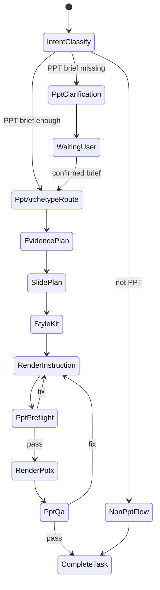
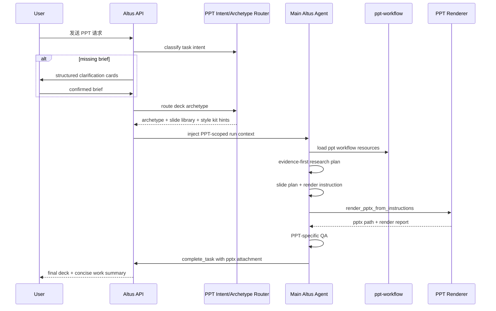

# 20260527 PPT 任务作用域 Archetype 路由与质量增强方案 [20260527-0015已采用]

## 1. 背景

用户对当前 PPT 生成质量提出反馈：现有链路已经能完成检索、规划、渲染和交付，但生成内容仍偏“通用研究报告”，缺少高质量演示文稿应有的范式选择、论证结构、页面原型、视觉系统和可见 QA。

对比竞品后可见，竞品效果好的核心不在于“用 HTML 生成再导出 PPT”，而在于它先识别演示文稿范式，再围绕该范式检索证据、组织页面、套用视觉原型并做截图检查。HTML 只是承载形式，不应成为 oneceo 当前 PPT 能力的直接实现前提。

本方案目标是把这些优点抽象为通用 PPT 能力增强，同时避免两个风险：

1. 不能把“投资人路演 / AI-Hardtech-Pitch”写成默认规则，导致所有 PPT 都被专攻成同一种类型。
2. 不能污染 Altus 通用 Agent，使非 PPT 任务受到 PPT 规则影响。

## 2. 目标

1. PPT 任务进入执行前，先做 `Deck Archetype` 路由，而不是直接套固定大纲。
2. 根据 PPT 类型生成不同的研究问题、页面结构、视觉约束和 QA 要求。
3. PPT 增强逻辑只在 PPT / slides / presentation 任务作用域内生效。
4. 保持当前“规则分类服务 + 主 Altus 智能体”结构，不先引入独立 PPT Agent。
5. 为后续拆分独立 PPT Agent 保留模块边界。

## 3. 非目标

1. 不把所有 PPT 默认做成投资路演。
2. 不把竞品的具体页面、行业、公司或硬科技话术写死进 prompt。
3. 不改造网页、代码、DOCX、XLSX、连接器、调试等非 PPT 能力。
4. 不强制使用 HTML 作为 PPT 生成中间形态。
5. 不替换现有 `ppt-workflow` 渲染器和 `render_pptx_from_instructions` 交付链路。

## 4. 总体架构

继续沿用当前主结构：

```text
规则分类服务
  -> 主 Altus Agent
      -> 按任务作用域注入短生命周期 context
```

PPT 质量增强作为 task-scoped module：

```text
Altus managed run
  -> classify task intent
  -> if ppt_generation:
       buildPptRunContext()
       inject PPT generation contract
       execute ppt-workflow
       run PPT-specific QA
     else:
       keep existing non-PPT flow unchanged
```

不新增全局人格，不把 PPT 规则写入所有任务的主提示词；PPT contract 只在当前 run 被判定为 PPT 时出现，run 结束即失效。

## 5. Deck Archetype 路由

`Deck Archetype` 是 PPT 专用的演示范式，不等同于行业模板。它决定“这份 PPT 应该如何组织论证”，而不是决定“所有 PPT 长得一样”。

首批建议枚举：

| Archetype | 适用场景 | 结构重心 |
| --- | --- | --- |
| `investor_pitch` | 融资、上市、投资人沟通 | 机会、产品、增长、护城河、风险、团队、资金用途 |
| `internal_strategy_review` | 内部高管、战略研讨、经营复盘 | 现状、关键判断、问题、选项、风险、建议、行动计划 |
| `brand_business_intro` | 企业品牌、客户、合作伙伴推介 | 定位、能力、产品/服务、客户价值、案例、合作方式 |
| `industry_research_report` | 行业分析、市场研究、趋势判断 | 市场结构、驱动因素、竞争格局、趋势、机会、风险 |
| `technical_seminar` | 技术研讨、培训、专家分享 | 背景、原理、架构、指标、实验/案例、局限、趋势 |
| `product_solution_deck` | 产品方案、售前方案、解决方案 | 痛点、方案、架构、功能、价值、落地路径、案例 |
| `consulting_recommendation` | 咨询建议书、决策提案 | 问题定义、诊断、洞察、方案选项、推荐、路线图 |
| `periodic_review` | 周报、月报、项目复盘 | 目标、进展、指标、问题、风险、下步计划 |

路由规则：

1. 用户已明确选择或填写的演示目的优先。
2. 结构化澄清 confirmed brief 优先于模型默认判断。
3. 无法确定时选择最保守的通用类型，例如 `industry_research_report` 或 `internal_strategy_review`，但必须在 brief 中记录假设。
4. 不允许因为企业、芯片、融资等单个词命中就强制进入 `investor_pitch`；必须结合用户目的与受众。

## 6. Slide Archetype Library

页面原型库是泛化积木，不绑定某个行业。每个 Deck Archetype 从库中选择不同组合。

首批页面原型：

- `cover`: 封面与核心判断。
- `executive_summary`: 一页式结论。
- `context_background`: 背景和现状。
- `problem_definition`: 问题定义。
- `evidence_table`: 证据表格或 benchmark。
- `market_map`: 市场结构或竞争地图。
- `product_matrix`: 产品/能力矩阵。
- `traction_chart`: 增长、进展或关键指标。
- `moat_stack`: 护城河、优势与可持续性。
- `risk_matrix`: 风险、约束和缓解措施。
- `decision_options`: 方案选项对比。
- `recommendation`: 推荐结论。
- `roadmap`: 路线图与里程碑。
- `ask_or_action`: 资金用途、资源请求或行动项。
- `appendix_sources`: 附录、来源和方法说明。

原则：

1. 页面原型只描述页面功能和信息结构，不写死具体内容。
2. 不同 archetype 的页面组合不同。
3. 同一 deck 内避免重复使用同一种版式造成“流水账”。
4. 每页必须有一个明确的判断或证据目标。

## 7. Evidence-First Research Plan

PPT 检索不再只围绕“公司简介、财报、业务”这类泛化关键词展开，而是由页面目标反推证据问题：

```text
slide_goal -> evidence_question -> source_priority -> search_query -> extract_target
```

示例：

- `market_map` 需要证明市场结构：优先找行业报告、监管文件、权威媒体和公开数据。
- `traction_chart` 需要证明增长或进展：优先找公告、财报、招股书、公司披露。
- `risk_matrix` 需要证明约束：优先找招股书风险因素、审计报告、监管问询和行业瓶颈资料。
- `technical_seminar` 需要证明技术原理或指标：优先找论文、官方文档、技术白皮书和 benchmark。

来源纪律：

1. 外部事实必须保留 URL。
2. 高冲击数字必须优先使用一手来源或交叉验证。
3. 对不确定数据要降级表达，不能为了演示效果夸大。
4. 最终 PPT 必须包含来源页或 notes/source 区。

## 8. Style Kit

把“科技投研风 / 商业路演风 / 管理咨询风”等风格词转换成结构化 style kit，而不是只留抽象形容词。

Style Kit 至少包含：

- 色彩 token：背景、正文、强调、边框、辅助色。
- 字体层级：标题、副标题、正文、数据、注释。
- 信息密度：低、中、高。
- 图表风格：表格、柱状、折线、矩阵、时间线。
- 页面节奏：封面、重数据页、过渡页、总结页的比例。
- 禁用项：例如禁用空泛口号、禁用过度装饰、禁用低对比文字。

Style Kit 只作用于 PPT 渲染指令，不影响网页 UI、代码生成或其他文档能力。

## 9. PPT 专用 QA

PPT 不走网站 `debug_open_page` / `browser_interact` / n.eko 视觉检测链路，但需要自己的质量检查。

PPT QA 分两层：

1. 结构 QA：
   - 是否匹配 Deck Archetype。
   - 是否每页有明确页面目标。
   - 是否来源可追溯。
   - 是否高冲击数字有来源。
   - 是否存在重复空泛页面。

2. 视觉 QA：
   - 渲染 PPTX 后生成代表页预览图或缩略图。
   - 检查文字溢出、空白率、过度拥挤、低对比度。
   - 检查图表、表格和关键数字可读。
   - 检查同一 deck 内版式重复比例。

视觉 QA 可以后续逐步实现；第一阶段先在 prompt 和渲染 report 中建立检查项，不引入 HTML 生成路径。

## 10. 状态图



## 11. 时序图



## 12. 实施计划

第一阶段：低风险 prompt/context 增强

1. 在 PPT confirmed brief 后生成 `pptArchetype`。
2. 在 PPT run context 中注入 archetype、推荐 slide archetypes、research obligations。
3. 收紧 `ppt-workflow` prompt：先 archetype，再 evidence plan，再 slide plan。
4. 补充测试，确保非 PPT prompt 不包含 PPT generation contract。

第二阶段：结构化产物增强

1. 输出 `ppt-archetype-plan.json`。
2. 输出 `slide-plan.json`，每页带 `slideArchetype`、`slideGoal`、`evidenceNeed`。
3. 输出 `style-kit.json`。
4. 渲染指令引用上述结构化产物。

第三阶段：PPT QA

1. 基于 render report 增加结构 QA。
2. 增加 PPTX 缩略图/代表页预览生成。
3. 检查文字溢出、拥挤度、低对比度和重复版式。
4. 最终交付摘要展示设计系统、页面目录、来源和 QA 摘要。

## 13. 测试计划

后端：

1. PPT 请求触发 PPT-scoped context；非 PPT 请求不包含该 context。
2. 不同 confirmed brief 路由到不同 archetype：
   - 投资人融资路演 -> `investor_pitch`
   - 内部高管战略汇报 -> `internal_strategy_review`
   - 企业品牌与业务推介 -> `brand_business_intro`
   - 技术研讨 -> `technical_seminar`
3. `官网` 作为 PPT 来源提示不触发 web app。
4. prompt 中不出现“所有 PPT 默认投资路演”的规则。
5. PPT 不调用网站视觉检测；网页任务仍保留视觉检测约束。

集成：

1. `帮我分析一下沐曦股份，做个 ppt` + 选择内部战略汇报，预期结构偏战略研讨而不是融资路演。
2. 同一请求 + 选择投资人路演，预期结构包含 moat、traction、risk、team、ask 等 pitch 元素。
3. 企业品牌推介，预期结构包含定位、能力、客户价值、案例、合作方式。

## 14. 风险与控制

1. 风险：archetype 判断错误。
   - 控制：用户 confirmed brief 优先；无法确定时保守选择并记录假设。

2. 风险：PPT 规则污染通用 Agent。
   - 控制：PPT contract 只由 `ppt_generation` intent 注入；测试断言非 PPT prompt 不出现 PPT contract。

3. 风险：提示词膨胀。
   - 控制：全局 prompt 只保留路由入口，详细规则放在 PPT scoped context 或 skill resource。

4. 风险：过度模板化。
   - 控制：页面库是可组合积木，每页仍由任务证据和用户 brief 决定内容。

5. 风险：视觉 QA 实现成本高。
   - 控制：先做结构 QA 和 prompt 约束，再逐步引入 PPTX 预览检查，不引入 HTML 强依赖。

## 15. 结论

本方案采纳竞品的“范式选择、证据驱动、页面原型、视觉 QA、作品化交付”思想，但不采纳“固定硬科技路演模板”作为默认，也不要求 HTML 作为 PPT 中间形态。

PPT 增强应作为 task-scoped module 存在：只有 PPT 任务启用，非 PPT 任务不可见；当前仍由主 Altus Agent 执行，后续如能力复杂度上升，再按模块边界拆出独立 PPT Agent。
