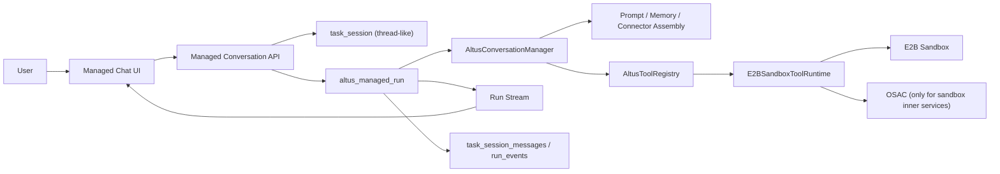

# 02 目标架构与核心对象

## 1. 目标架构总览

## 2. 核心对象

### 2.1 `task_session`

作用：

- managed mode 的对话容器
- 对应 Suna 的 `thread`
- 保存会话级元数据，而不是执行过程瞬时状态

职责：

- 用户身份归属
- 标题、收藏、项目归属
- 当前模式：`managed` 或 `sandbox_direct`
- 当前默认 sandbox binding / connector binding 概要

禁止承载：

- 当前正在执行的 tool 调用瞬时状态
- 当前 streaming 光标
- 当前 delta buffer

### 2.2 `altus_managed_run`

作用：

- 对应 Suna 的 `agent_run`
- managed mode 的唯一执行对象

职责：

- 记录一轮执行的开始、结束、状态、中断原因
- 绑定本轮使用的 sandbox、connector snapshot、prompt snapshot
- 驱动前端的流式订阅

### 2.3 `task_session_messages`

作用：

- 会话历史的权威消息表

消息类型建议统一为：

- `user`
- `assistant`
- `tool_call`
- `tool_result`
- `system`
- `clarification`

managed mode 不再往这里写入旧式的：

- `intent_result`
- `execution_plan`
- `session_started`

这类面向旧 task-creation pipeline 的中间态消息。

### 2.4 `altus_run_events`

作用：

- 保存 run 过程事件
- 用于回放、诊断、恢复

事件与消息区别：

- `message` 面向对话历史
- `run_event` 面向执行轨迹

### 2.5 `E2BSandboxBinding`

作用：

- 描述 managed run 对应的 E2B sandbox 绑定关系

内容：

- `sandboxId`
- `workspaceRoot`
- `status`
- `createdAt`
- `lastActiveAt`

### 2.6 `ConnectorSnapshot`

作用：

- 在 run 启动时把会话已挂载 connector/profile 物化成不可变快照

原因：

- run 期间 connector 变更不能影响当前运行

## 3. 模块边界

### 3.1 API 层

职责：

- 创建/复用 session
- 创建 managed run
- 返回 run stream 地址
- 查询历史消息与 run 状态

不负责：

- 直接执行工具
- 直接拼 prompt

### 3.2 Conversation 层

建议新模块：`AltusConversationManager`

职责：

- 读取 session 历史
- 构建当前轮上下文
- 管理消息持久化
- 启动与收尾 managed run

### 3.3 Runner 层

建议新模块：`AltusManagedRunner`

职责：

- 创建执行上下文
- 注册工具
- 驱动模型循环
- 处理 tool call / assistant output / completion

### 3.4 Tool Runtime 层

建议新模块：`E2BSandboxToolRuntime`

职责：

- 统一封装 shell / file / git / browser / connector tool
- 对接 `e2bConnector`
- 对接 `osacAgentService`

### 3.5 Stream 层

职责：

- 把 run 事件送到前端
- 只做实时传输，不做权威持久化

### 3.6 Prompt Assembly 层

建议新模块：`AltusPromptManager`

职责：

- 统一生成本轮 managed run 的 system prompt
- 装配时间、用户上下文、记忆、文件上下文、connector/MCP 可用能力
- 生成工具索引与必要的工具使用说明
- 输出 `system prompt + optional contextual message` 两段式输入

边界：

- 不再使用 `三层 Agent` 的多段提示词链
- 不把 mode 设计成独立后端 runner 分支
- prompt 装配发生在 `run` 启动阶段，而不是 WebSocket 消息处理中途

## 4. 关键结构性决策

1. managed mode 的核心对象必须从 `session-only` 改为 `session + run`
2. managed mode 不再以 `TaskCreationService` 为核心编排器
3. managed mode 不再依赖 `file-memory-store` 作为执行期权威状态
4. managed mode 的工具执行核心改为 `E2B tool runtime`
5. managed mode 与 direct mode 在代码结构上彻底拆开
6. managed mode 的提示词体系改为 `单一主 system prompt + 动态上下文装配`，而不是旧的多层 agent 提示词级联
7. mode 只影响前端输入组织与 prompt 附加信息，不得在后端演化成第二套执行状态机
8. connector/MCP/tool 可用能力在 run 启动时快照化，run 中途不再从会话外动态漂移

## 5. Suna 代码参照

本篇定义的每个核心对象，都需要对应到 `suna` 的具体代码入口：

- `thread-like session`
  - `referance/suna/backend/core/threads/api.py` -> `/threads/{thread_id}/messages/add`
  - `referance/suna/backend/core/threads/repo.py` -> `create_thread_with_message_and_run(...)`
  - `referance/suna/backend/core/threads/repo.py` -> `get_thread_messages(...)`
- `run`
  - `referance/suna/backend/core/agents/repo.py` -> `create_agent_run_with_id(...)`
  - `referance/suna/backend/core/agents/repo.py` -> `get_agent_run_with_thread(...)`
  - `referance/suna/backend/core/agents/repo.py` -> `update_agent_run_status(...)`
- `ConversationManager`
  - `referance/suna/backend/core/agentpress/thread_manager/manager.py` -> `ThreadManager`
  - `referance/suna/backend/core/agentpress/thread_manager/manager.py` -> `add_message(...)`、`get_llm_messages(...)`、`cleanup()`
- `Runner / Coordinator`
  - `referance/suna/backend/core/agents/runner/executor.py` -> `execute_agent_run(...)`
  - `referance/suna/backend/core/agents/pipeline/stateless/coordinator/stateless.py` -> `StatelessCoordinator.execute(...)`
  - `referance/suna/backend/core/agents/pipeline/context.py` -> `PipelineContext`
- `Prompt Assembly`
  - `referance/suna/backend/core/agents/runner/prompt_manager.py` -> `build_system_prompt(...)`
  - `referance/suna/backend/core/agents/pipeline/prep_tasks.py` -> `prep_prompt(...)`
- `Tool / MCP Assembly`
  - `referance/suna/backend/core/agents/runner/tool_manager.py` -> `register_core_tools()`
  - `referance/suna/backend/core/agents/runner/mcp_manager.py` -> `initialize_jit_loader(...)`、`register_mcp_tools(...)`

oneceo 在实现 `AltusConversationManager / AltusManagedRunner / AltusPromptManager / AltusConnectorMcpManager` 时，必须先对照这些入口，而不是从当前 `TaskCreationService` 衍生新分支。
