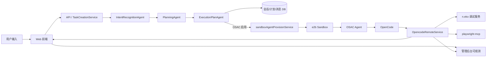
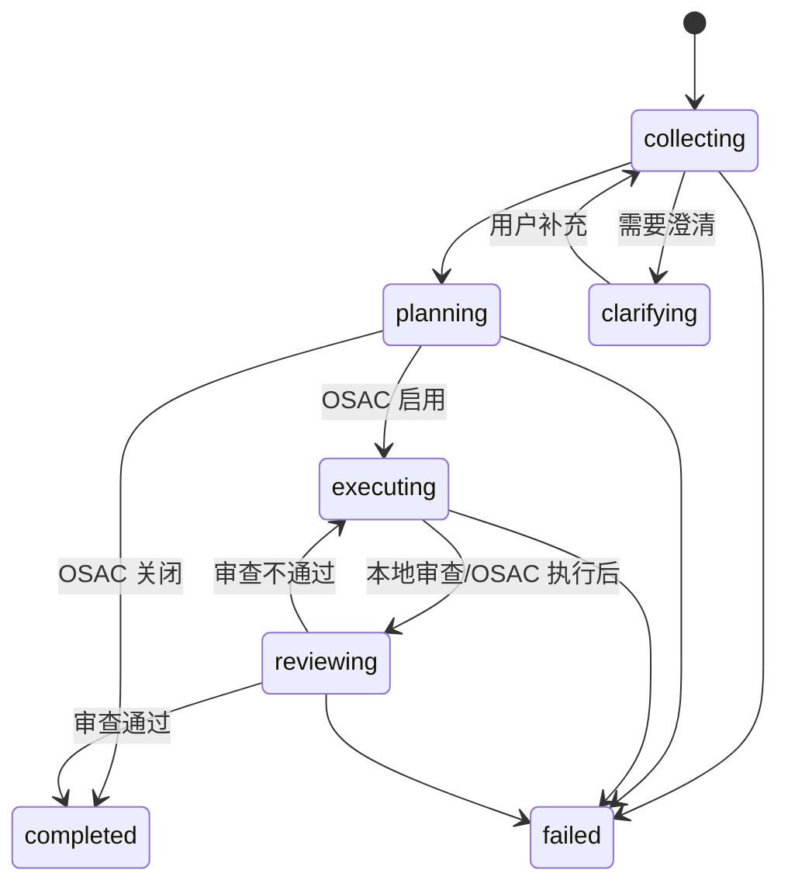
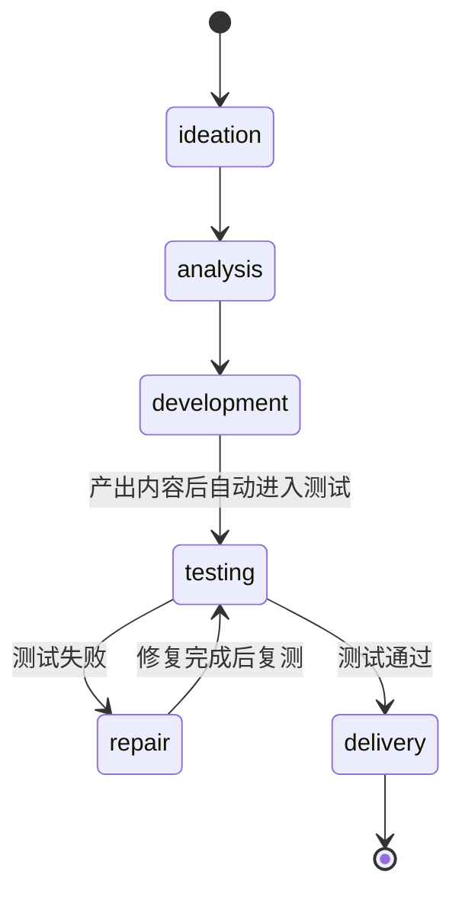
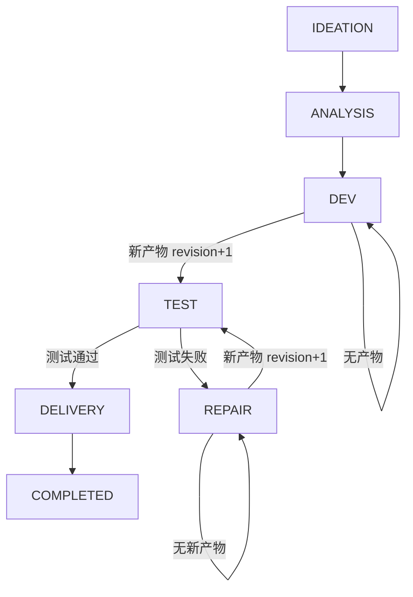

# 当前 Agent 架构（oneceo.ai）

日期：2026-03-04

本文档聚焦**当前代码实现**的基层智能体/编排链路与状态机（以 `oneceo/apps/api` 为主），用于研发协作与后续批注迭代。

---

## 1. 基层智能体与用途

### 1.1 三层 Task Creation Agents（任务创建）

| 层级 | 类名 | 主要职责 | 关键输出 | 代码位置 |
|---|---|---|---|---|
| Layer 1 | `IntentRecognitionAgent` | 意图识别、任务类型判定 | `IntentRecognitionResult` | `oneceo/apps/api/src/agents/task-creation/layers/intent-recognition-agent.ts` |
| Layer 2 | `PlanningAgent` | 任务描述/需求结构化 | `TaskDescription` | `oneceo/apps/api/src/agents/task-creation/layers/planning-agent.ts` |
| Layer 3 | `ExecutionPlanAgent` | 执行计划生成 | `ExecutionPlan` | `oneceo/apps/api/src/agents/task-creation/layers/execution-plan-agent.ts` |

### 1.2 执行审查智能体（Review Gate）

| 名称 | 主要职责 | 关键输出 | 代码位置 |
|---|---|---|---|
| `executionReviewAgent` | 审查执行输出、给出是否通过/修复建议 | `ReviewResult` | `oneceo/apps/api/src/agents/task-creation/layers/execution-review-agent.ts` |

### 1.3 Layer 1 双路径（新增）

Layer 1 在**新任务**与**已存在会话**两种场景下采用不同策略：

1. **新任务（无历史意图）**  
   - 进行意图识别（IntentRecognitionAgent）  
   - 决定任务类型并引导到对应 Layer 2  

2. **已存在会话（有历史意图）**  
   - **跳过意图识别**，复用会话创建时的基础定义  
   - 直接进入规划层（Layer 2），基于历史定义 + 用户补充更新任务描述  

此策略避免在“续聊/补充”时反复识别任务类型导致的误判或重分流。

### 1.3.1 直通模式入口层（新增）

直通模式不再是“完全绕过 Layer 1”。

当前目标架构调整为：

- `Altus 接管模式`：仍走完整三层
- `直通模式`：先经过一个轻量 Layer 1，再决定是否直通执行器

该轻量 Layer 1 仅负责：

1. 判断用户是否在**显式要求平台执行已有功能**
2. 若命中平台能力，则直接调用平台服务
3. 若未命中，则保持原样直通 `OpenCode / ClaudeCode / Codex`

当前 V1 重点能力为任务会话部署相关动作：

- 部署当前网站
- 重新部署
- 回滚部署
- 查询部署状态

### 1.4 Layer 2 子智能体拆解（新增）

Layer 2 已拆解为**独立规划智能体类**，用于后续逐个细化：

- 基类：`oneceo/apps/api/src/agents/task-creation/layers/planners/base-planner.ts`
- 注册表：`oneceo/apps/api/src/agents/task-creation/layers/planners/persona-registry.ts`

#### 当前已预置的领域规划智能体类（可直接细化）

- 编程规划智能体：`software-planner.ts`
- 财务/商业规划智能体：`finance-planner.ts`
- 运营规划智能体：`ops-planner.ts`
- 内容/文案规划智能体：`content-planner.ts`
- 设计规划智能体：`design-planner.ts`
- 研究/分析规划智能体：`research-planner.ts`
- 通用规划智能体：`generic-planner.ts`

每个类内置 `personaPrompt`（可直接替换/扩展），并由 `PlanningAgent` 通过注册表选择。

#### 交付模板与澄清模板（新增）

每个子智能体类包含两类可直接细化的模板字段：
- `clarificationTemplate`: 建议优先使用的澄清问题清单
- `deliverableTemplate`: 默认交付清单模板

`PlanningAgent` 会将这两类模板注入提示词中，作为生成任务描述时的辅助约束。

---

## 2. 编排层核心服务

### 2.1 TaskCreationService（任务创建主编排）

职责：
- 串联 L1/L2/L3
- 持久化会话、消息、意图、计划
- 根据配置是否启用 OSAC 执行
- 负责 **stage / phase** 更新并发出 `status_update` 消息

代码位置：`oneceo/apps/api/src/agents/task-creation/task-creation-service.ts`

### 2.2 OpencodeRemoteService（OpenCode 事件编排）

职责：
- 监听 OSAC/OpenCode 事件（SSE/WS）
- 汇总 diff / tool / file / command 轨迹
- 驱动 **开发→测试→修复→交付** 的状态机
- 触发 Playwright-MCP 测试与 n.eko 画面转发

代码位置：`oneceo/apps/api/src/services/opencode-remote-service.ts`

#### 2.2.1 SSE 文本流落库兜底（新增）

为避免 OpenCode 仅产生流式文本而未发送 `message.final` 时历史内容丢失，系统引入**定期 checkpoint 落库**机制：

- 内存中持续聚合文本流（`textStreams`）
- 每隔一段时间将最新文本写入数据库（避免高频 IO）
- 正常完成时仍会生成 `stream_aggregate` 作为最终输出

可配置项：

- `OPENCODE_STREAM_CHECKPOINT_INTERVAL_MS`  
  默认：`8000`（8 秒）  
  说明：文本流落库间隔；数值越小越及时，IO 越频繁。建议 5s~15s 之间权衡。

### 2.3 OSAC / Sandbox / Debug

- `sandboxAgentProvisionService`：调度 e2b sandbox
- `osacAgentService`：调用 OSAC 执行命令/接入 OpenCode
- `ensureNekoDebug`：启动 n.eko 调试服务
- `ensurePlaywrightMcp`：确保 Playwright MCP 已安装

---

## 3. 系统整体链路（逻辑图）



---

## 4. 状态机（Stage + Phase）

当前系统存在两套并行状态，但**统一由 `updateSessionState` 管理并校验迁移合法性**：
- **Stage（流程阶段）**：`collecting` / `clarifying` / `planning` / `executing` / `reviewing` / `completed` / `failed`
- **Phase（业务阶段）**：`ideation` / `analysis` / `development` / `testing` / `repair` / `delivery`

状态更新入口：`taskCreationFileMemoryStore.updateSessionState`  
位置：`oneceo/apps/api/src/agents/task-creation/file-memory-store.ts`

### 4.0 统一状态更新规则（新增）

- **单一更新入口**：所有 stage / phase / status 更新需走 `updateSessionState`（内部校验合法迁移）。  
- **Stage 由 Phase 派生**：当 phase 更新时，会自动映射到对应 stage。  
- **终态保护**：`completed` / `failed` 后禁止回滚。  
- **Clarifying 保护**：等待用户输入时不允许 phase 覆盖 stage。  

### 4.1 Stage 状态机（统一入口驱动）



### 4.2 Phase 状态机（统一入口驱动）

当前由 OSAC / OpenCode 事件触发，驱动业务闭环：



#### Phase 驱动逻辑（关键规则）

- **development → testing**：OpenCode 执行完成，且检测到 workspace 新产物（revision 增长）
- **testing → repair**：Review Gate 返回 `retry`
- **repair → testing**：修复产生新产物（revision 增长），允许再次测试
- **testing → delivery**：Review Gate 通过/跳过

#### Phase → Stage 映射规则

- ideation → collecting  
- analysis → planning  
- development → executing  
- testing → reviewing  
- repair → executing  
- delivery → reviewing（最终完成时再转 `completed`）  

### 4.3 状态机 Guard 条件（新增）

为避免流程“空转/摇摆”，当前 phase 转移增加明确的 guard 条件：

- **产物基线（workspace baseline）**  
  - 启动时记录 workspace 初始文件列表，后续只有**新增文件**才被视为产物。  
  - 避免默认文件导致误触发 testing。

- **产物版本（artifact revision）**  
  - 每次检测到真实文件变更时 `revision++`  
  - **只有 `revision > testedRevision` 才允许再次测试**  
  - 支持多轮“修复 → 测试 → 修复 → 测试”循环

- **测试证据判定**  
  - Playwright 工具事件或测试日志明确执行 → 视为测试完成  
  - 流式文本提到“Playwright/自动化测试”时，触发 LLM 判定兜底，避免误判  
  - 无测试证据时不进入 testing-review 分支，避免卡住

### 4.4 状态机转移图（含 guard）



### 4.5 状态迁移条件表（详细版）

| 当前 Phase | 目标 Phase | 触发来源 | 必要条件（Guard） | 结果 |
|---|---|---|---|---|
| ideation | analysis | TaskCreationService | 意图识别完成 | 进入任务规划 |
| analysis | development | TaskCreationService | 执行计划已生成 | 启动执行环境 |
| development | testing | OpencodeRemoteService | OpenCode `session.idle` 且检测到**新产物**（revision 增长）且尚未测试 | 下发 Playwright 测试 |
| development | development | OpencodeRemoteService | OpenCode `session.idle` 但未检测到产物 | 继续等待或发出“补产物”提示 |
| testing | repair | Review Gate | Review 返回 `retry` | 进入修复 |
| testing | delivery | Review Gate | Review 返回 `pass` 或 `skipped` | 进入交付 |
| repair | testing | OpencodeRemoteService | 修复后检测到**新产物**（revision 增长） | 重新下发测试 |
| repair | repair | OpencodeRemoteService | 修复后无新产物 | 继续修复 |
| delivery | completed | OpencodeRemoteService | 交付说明生成 | 标记完成 |

#### Guard 说明细化

- **新产物判定**：workspace baseline 记录 + 新文件出现  
- **测试完成判定**：Playwright 工具事件 或 LLM 流式文本判定（可信度≥0.6）  
- **重复测试阻断**：`revision > testedRevision` 才允许再次测试  
- **终态保护**：completed/failed 后禁止回滚


---

## 5. Playwright + n.eko 组合调试流程

当前系统在 `testing/repair` 阶段要求：
- 使用 `playwright-mcp`（可视模式，headless=false）
- 使用 **同一浏览器实例**（CDP 9222）
- 复用首个 context/page，以便画面出现在 n.eko 窗口

关键实现点：
- `TaskCreationService.buildOpencodePrompt` 中写入 Playwright 约束
- `OpencodeRemoteService` 在执行完成后触发 `ensurePlaywrightMcp` + `ensureNekoDebug`

---

## 6. 关键组件与职责映射

| 组件 | 角色 | 责任 | 产出 |
|---|---|---|---|
| TaskCreationService | 任务编排入口 | L1/L2/L3 串联、状态广播 | plan / status_update |
| OpencodeRemoteService | 执行态编排器 | 收集事件、驱动 phase 状态机 | opencode_event / testing / delivery |
| OSAC Agent | 执行代理 | 启动 sandbox，转发 OpenCode | 命令/事件流 |
| E2B Sandbox | 运行环境 | 执行代码、运行 Playwright + n.eko | 产物 + 画面 |
| n.eko | 画面转发 | 输出浏览器实时画面 | 调试预览 |

---

## 7. 现有交互消息类型（关键）

- `status_update`：阶段/状态变化
- `agent_message`：自然语言解释/规划
- `plan_generated`：执行计划
- `opencode_event`：OSAC/OpenCode 事件
- `opencode_status`：OpenCode session 状态
- `opencode_error`：执行错误
- `auto_plan`：用户主动选择“自主规划”（无需澄清）

---

## 8. 当前瓶颈与注意事项（供批注）

- 状态机已统一入口，但仍需评估是否需要合并 `stage`/`phase` 为单状态源
- Playwright 及 n.eko 必须共享 CDP 9222，否则用户端画面为空
- 若 OpenCode 执行未产生文件变更，会阻断自动测试
- OSAC 执行模式存在 `command` 与 `opencode_remote` 两种，需要统一策略

---

## 11. 无澄清自动规划机制（新增）

为面向新手用户，系统支持**无人澄清自动继续**：

1. 当 Layer2 提出澄清问题时，系统进入 `waiting_user`。  
2. 若超时（默认 45 秒，可由 `TASK_CREATION_CLARIFY_TIMEOUT_MS` 配置），自动生成“默认假设”回复并继续规划。  
3. 用户可主动发送 `auto_plan` 指令跳过澄清，直接进入规划。  

此机制保证无须用户补充也能端到端完成任务。  

---

## 9. 可观测性落地点（管理后台）

管理后台可参考以下维度检查：
- 会话状态 / phase / stage
- 全链路时间线（status_update + opencode_event）
- LLM 调用轨迹（intent/planning/execution_plan）
- OSAC 消息流（OpenCode event / diff / tool / file）

---

## 10. 文档引用（代码来源）

- TaskCreationService：`oneceo/apps/api/src/agents/task-creation/task-creation-service.ts`
- OpencodeRemoteService：`oneceo/apps/api/src/services/opencode-remote-service.ts`
- Agents Layers：`oneceo/apps/api/src/agents/task-creation/layers/*`
- File Memory Store：`oneceo/apps/api/src/agents/task-creation/file-memory-store.ts`

```
