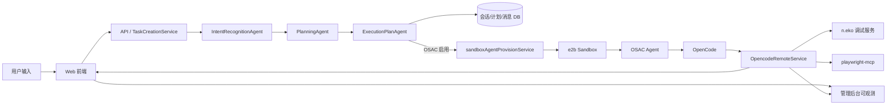
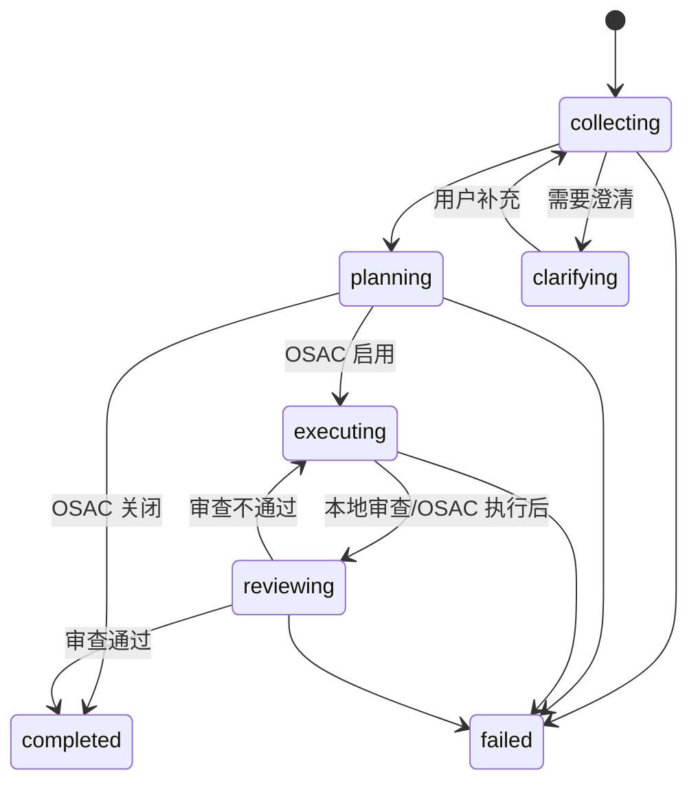
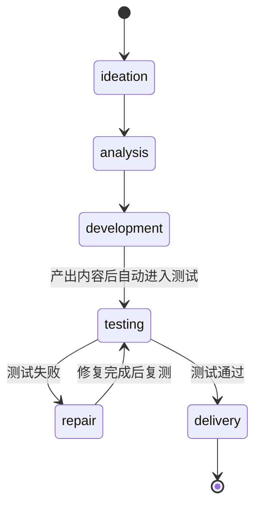

# 当前 Agent 架构（oneceo.ai）

日期：2026-03-02

本文档聚焦**当前代码实现**的基层智能体/编排链路与状态机（以 `oneceo/apps/api` 为主），用于研发协作与后续批注迭代。

---

## 1. 基层智能体与用途

### 1.1 三层 Task Creation Agents（任务创建）

| 层级 | 类名 | 主要职责 | 关键输出 | 代码位置 |
|---|---|---|---|---|
| Layer 1 | `IntentRecognitionAgent` | 意图识别、任务类型判定 | `IntentRecognitionResult` | `oneceo/apps/api/src/agents/task-creation/layers/intent-recognition-agent.ts` |
| Layer 2 | `PlanningAgent` | 任务描述/需求结构化 | `TaskDescription` | `oneceo/apps/api/src/agents/task-creation/layers/planning-agent.ts` |
| Layer 3 | `ExecutionPlanAgent` | 执行计划生成 | `ExecutionPlan` | `oneceo/apps/api/src/agents/task-creation/layers/execution-plan-agent.ts` |

### 1.2 执行审查智能体（Review Gate）

| 名称 | 主要职责 | 关键输出 | 代码位置 |
|---|---|---|---|
| `executionReviewAgent` | 审查执行输出、给出是否通过/修复建议 | `ReviewResult` | `oneceo/apps/api/src/agents/task-creation/layers/execution-review-agent.ts` |

---

## 2. 编排层核心服务

### 2.1 TaskCreationService（任务创建主编排）

职责：
- 串联 L1/L2/L3
- 持久化会话、消息、意图、计划
- 根据配置是否启用 OSAC 执行
- 负责 **stage / phase** 更新并发出 `status_update` 消息

代码位置：`oneceo/apps/api/src/agents/task-creation/task-creation-service.ts`

### 2.2 OpencodeRemoteService（OpenCode 事件编排）

职责：
- 监听 OSAC/OpenCode 事件（SSE/WS）
- 汇总 diff / tool / file / command 轨迹
- 驱动 **开发→测试→修复→交付** 的状态机
- 触发 Playwright-MCP 测试与 n.eko 画面转发

代码位置：`oneceo/apps/api/src/services/opencode-remote-service.ts`

### 2.3 OSAC / Sandbox / Debug

- `sandboxAgentProvisionService`：调度 e2b sandbox
- `osacAgentService`：调用 OSAC 执行命令/接入 OpenCode
- `ensureNekoDebug`：启动 n.eko 调试服务
- `ensurePlaywrightMcp`：确保 Playwright MCP 已安装

---

## 3. 系统整体链路（逻辑图）



---

## 4. 状态机（Stage + Phase）

当前系统存在两套并行状态：
- **Stage（流程阶段）**：`collecting` / `clarifying` / `planning` / `executing` / `reviewing` / `completed` / `failed`
- **Phase（业务阶段）**：`ideation` / `analysis` / `development` / `testing` / `repair` / `delivery`

### 4.1 Stage 状态机（TaskCreationService 侧）



### 4.2 Phase 状态机（OpencodeRemoteService 侧）

当前由 OSAC / OpenCode 事件触发，驱动业务闭环：



#### Phase 驱动逻辑（关键规则）

- **development → testing**：OpenCode 执行完成，且检测到 workspace 产物
- **testing → repair**：Review Gate 返回 `retry`
- **repair → testing**：基于修复反馈再次触发 Playwright 测试
- **testing → delivery**：Review Gate 通过/跳过

---

## 5. Playwright + n.eko 组合调试流程

当前系统在 `testing/repair` 阶段要求：
- 使用 `playwright-mcp`（可视模式，headless=false）
- 使用 **同一浏览器实例**（CDP 9222）
- 复用首个 context/page，以便画面出现在 n.eko 窗口

关键实现点：
- `TaskCreationService.buildOpencodePrompt` 中写入 Playwright 约束
- `OpencodeRemoteService` 在执行完成后触发 `ensurePlaywrightMcp` + `ensureNekoDebug`

---

## 6. 关键组件与职责映射

| 组件 | 角色 | 责任 | 产出 |
|---|---|---|---|
| TaskCreationService | 任务编排入口 | L1/L2/L3 串联、状态广播 | plan / status_update |
| OpencodeRemoteService | 执行态编排器 | 收集事件、驱动 phase 状态机 | opencode_event / testing / delivery |
| OSAC Agent | 执行代理 | 启动 sandbox，转发 OpenCode | 命令/事件流 |
| E2B Sandbox | 运行环境 | 执行代码、运行 Playwright + n.eko | 产物 + 画面 |
| n.eko | 画面转发 | 输出浏览器实时画面 | 调试预览 |

---

## 7. 现有交互消息类型（关键）

- `status_update`：阶段/状态变化
- `agent_message`：自然语言解释/规划
- `plan_generated`：执行计划
- `opencode_event`：OSAC/OpenCode 事件
- `opencode_status`：OpenCode session 状态
- `opencode_error`：执行错误

---

## 8. 当前瓶颈与注意事项（供批注）

- 状态机分散在 TaskCreationService 与 OpencodeRemoteService 两处，需保持同步一致性
- Playwright 及 n.eko 必须共享 CDP 9222，否则用户端画面为空
- 若 OpenCode 执行未产生文件变更，会阻断自动测试
- OSAC 执行模式存在 `command` 与 `opencode_remote` 两种，需要统一策略

---

## 9. 可观测性落地点（管理后台）

管理后台可参考以下维度检查：
- 会话状态 / phase / stage
- 全链路时间线（status_update + opencode_event）
- LLM 调用轨迹（intent/planning/execution_plan）
- OSAC 消息流（OpenCode event / diff / tool / file）

---

## 10. 文档引用（代码来源）

- TaskCreationService：`oneceo/apps/api/src/agents/task-creation/task-creation-service.ts`
- OpencodeRemoteService：`oneceo/apps/api/src/services/opencode-remote-service.ts`
- Agents Layers：`oneceo/apps/api/src/agents/task-creation/layers/*`
- File Memory Store：`oneceo/apps/api/src/agents/task-creation/file-memory-store.ts`

```

