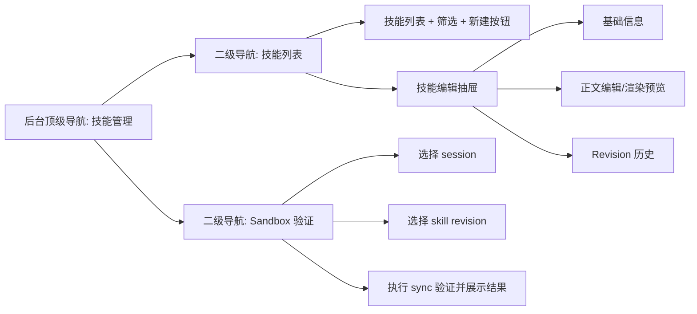

# 06 管理后台信息架构与页面设计

## 1. 设计目标

这部分不是给业务前端做一个“技能设置弹窗”，而是给 oneceo 的平台管理后台增加一套真正可运维的 skill 管理能力。

参照 `suna` 管理页，本次吸收的是以下三个结构原则：

1. 配置页面按能力域拆分，而不是把所有设置堆在一个长表单里
2. 页面展示完全由 API 数据驱动，而不是前端维护静态枚举
3. 编辑动作直接作用于平台能力源，而不是只改前端展示态

同时结合 oneceo 当前后台现状，本次不重做整个 `apps/admin_management` 框架，只在现有骨架上新增一个独立 section。

## 2. 在 oneceo 管理后台中的位置

当前后台顶级 section 是：

1. `KVM 管理`
2. `对话管理`
3. `智能体管理`
4. `执行环境管理`
5. `审计日志`

本次新增：

6. `技能管理`

原因：

1. skill 是平台能力资产，不属于某一个具体 agent 的运行态数据
2. skill 的生命周期是“创建、发布、归档、验证”，与当前 `智能体管理` 的运行状态总览不是一类页面
3. 如果把它塞进 `智能体管理`，后续 revision、渲染预览、sandbox 验证都会继续挤在一个 section 里

结论：

1. `skills` 作为新的顶级 `SectionKey`
2. `agent` 继续只做 agent 运行与能力状态观察
3. `skills` 专门负责平台注册 skill 的生命周期管理
4. 侧边栏必须提供明显入口，不能只做普通列表项

为避免管理员在运维导航里忽略该 section，本次额外要求：

1. 保留常规 `技能管理` nav item
2. 在 sidebar 品牌区下方增加明显的 `平台 Skills` 快捷入口
3. 快捷入口点击后直接切到 `技能管理`

## 3. 页面结构

`技能管理` section 采用“二级导航 + 主内容区”的结构，参照 `suna` 的左导航配置页，但只覆盖本次最小闭环。

二级导航固定为两项：

1. `技能列表`
2. `Sandbox 验证`

其中：

1. `技能列表` 负责 skill 的创建、编辑、发布、归档、revision 查看
2. `Sandbox 验证` 负责对已发布 revision 做运行时同步验证

`revision 历史` 不单独做成二级导航，而是放进 skill 编辑抽屉中，这样路径最短。

## 4. 技能列表页

### 4.1 顶部概览卡片

列表页顶部放 4 个简洁指标卡：

1. `总技能数`
2. `已发布`
3. `已归档`
4. `最近 7 天发布次数`

这不是为了做 BI，而是为了让管理员快速判断系统里当前 skill 的活跃度和变更频率。

### 4.2 筛选与操作栏

操作栏最少包含：

1. 关键字搜索：匹配 `name / slug / description`
2. `status` 过滤：`active / archived / all`
3. `category` 过滤
4. `新建技能` 按钮

不做复杂排序器，默认按 `updated_at desc`。

### 4.3 列表字段

建议使用表格，而不是卡片墙。字段如下：

1. `名称`
2. `slug`
3. `分类`
4. `当前发布 revision`
5. `最近发布时间`
6. `状态`
7. `操作`

操作列保留 4 个动作：

1. `编辑`
2. `预览`
3. `归档 / 启用`
4. `查看 revisions`

其中 `预览` 与 `查看 revisions` 都可以直接打开同一个编辑抽屉，只是默认 tab 不同。

### 4.4 空态与失败态

需要明确三种状态：

1. 没有任何 skill：展示“新建第一个技能”空态
2. 过滤后无结果：展示“调整筛选条件”
3. 接口失败：展示错误信息和 `重试` 按钮

## 5. 技能编辑抽屉

### 5.1 抽屉而不是独立路由

本次采用右侧抽屉，不单独做技能详情路由。

原因：

1. 当前 `admin_management` 还是单页 section 架构
2. 抽屉最适合承接“从列表进入，编辑后返回列表”的工作流
3. 这和 `suna` 的配置对话式编辑体验更接近

### 5.2 抽屉内的 3 个 tab

抽屉内固定为 3 个 tab：

1. `基础信息`
2. `Skill 正文`
3. `Revision 历史`

#### `基础信息`

字段：

1. `name`
2. `slug`
3. `description`
4. `category`
5. `status` 只读展示，不在这里直接切换

说明：

1. `slug` 在 skill 首次创建后默认不允许修改
2. `archive / activate` 走单独操作，不混进正文保存

#### `Skill 正文`

页面元素：

1. Markdown 编辑器
2. `SKILL.md` 渲染预览
3. 渲染后的 frontmatter 预览

顶部按钮只保留两个：

1. `预览渲染`
2. `保存并发布`

本次不做 `保存草稿`。

`保存并发布` 的语义是：

1. 如果是新建 skill，则创建 `platform_skills` + `revision 1`
2. 如果是已有 skill，则生成一个新的 published revision

#### `Revision 历史`

展示形式为时间线列表，字段：

1. `revision_number`
2. `created_at`
3. `created_by`
4. `published_at`
5. 是否为当前发布版本

动作只保留：

1. `查看渲染结果`
2. `复制正文到编辑器`

本次不做“直接把旧 revision 设为发布态”的回滚按钮，避免把发布语义做复杂。

## 6. Sandbox 验证页

### 6.1 目标

这个页面的作用不是编辑 skill，而是证明：

1. 某个 published revision 可以被同步到 sandbox
2. 同步后的 `SKILL.md` 路径、签名、revision 绑定正确
3. 当前验证链路和正式 run 使用的是同一套后端实现

## 7. 用户侧 Settings 的联动要求

管理后台不是 skill 的唯一消费入口，业务前端设置页也需要接入。

职责划分：

1. 管理后台维护平台 skill 与 published revision
2. 用户设置页负责引用平台模板和维护用户自定义 skill
3. attachment picker 只展示用户设置页配置后的可用 skill 集

平台模板和用户设置的关系必须是：

1. 用户引用的是 `platform_skill_id`
2. 管理端发布新 published revision 后，用户引用自动跟随
3. 用户不复制平台模板正文

### 6.2 本次采用的验证方式

只支持“基于现有运行中 session 验证”，不额外创建专用 sandbox。

原因：

1. 这是最短路径
2. oneceo 当前已经有 session/runtime 观测能力
3. 额外创建调试 sandbox 会引入新的生命周期和计费问题

### 6.3 页面元素

验证页最少包含：

1. `sessionId` 输入框或下拉选择
2. `skill` 选择器
3. `revision` 选择器
4. `执行验证` 按钮
5. 结果面板

结果面板展示：

1. 目标 skill slug
2. 目标 revision id
3. 渲染后的 `SKILL.md` 路径
4. 本次 skill signature
5. 是否触发 `opencode serve` 重启
6. 失败信息

### 6.4 验证成功判定

管理后台不自己定义另一套成功标准，只透传后端真实结果。成功至少意味着：

1. revision 已解析成功
2. sandbox 文件已写入
3. metadata 中的 skill signature 已更新
4. 若集合变更，runtime 已完成 restart

## 7. 交互约束

### 7.1 只允许管理已发布链路

后台页面不允许维护“前端可见但未发布”的中间态。

也就是说：

1. 创建 skill 必须直接产生 published revision
2. 编辑 skill 必须直接发布新 revision
3. 前端 picker 只看 published revision

### 7.2 不提供删除能力

skill 不做物理删除，只允许：

1. `active`
2. `archived`

这样可以保证：

1. 旧消息仍然能解析历史 revision
2. sandbox 恢复链路不会因 skill 被删而失真

### 7.3 页面实现边界

为避免继续把 `App.tsx` 做成更大的单文件，技能管理 section 在实现时应拆出独立组件：

1. `SkillManagementSection`
2. `SkillListTable`
3. `SkillEditorDrawer`
4. `SkillRevisionTimeline`
5. `SkillSandboxValidationPanel`

## 8. 结论

管理后台这一块要复刻的不是 `suna` 的视觉外观，而是它已经验证过的结构：

1. 能力管理独立成域
2. API 驱动，不前端硬编码
3. 列表页管理资产，详情页管理配置，运行页验证生效

这正好对应 oneceo skill 平台化后的三个核心动作：

1. 发布 skill
2. 给业务前端消费
3. 在 sandbox 中真实生效
