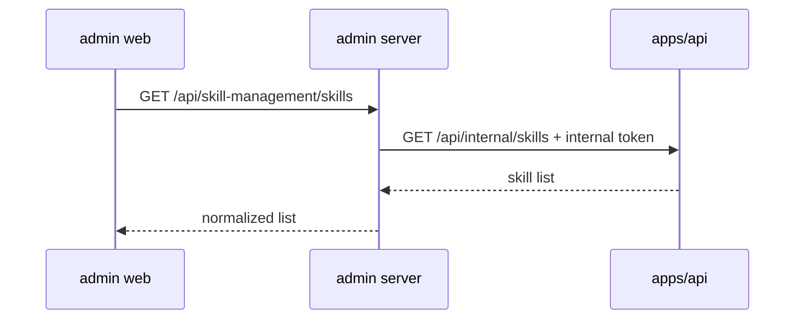
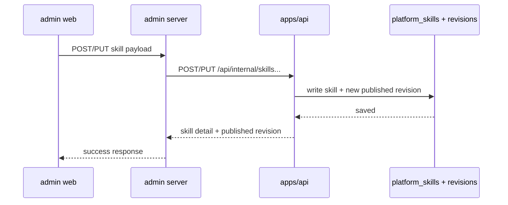
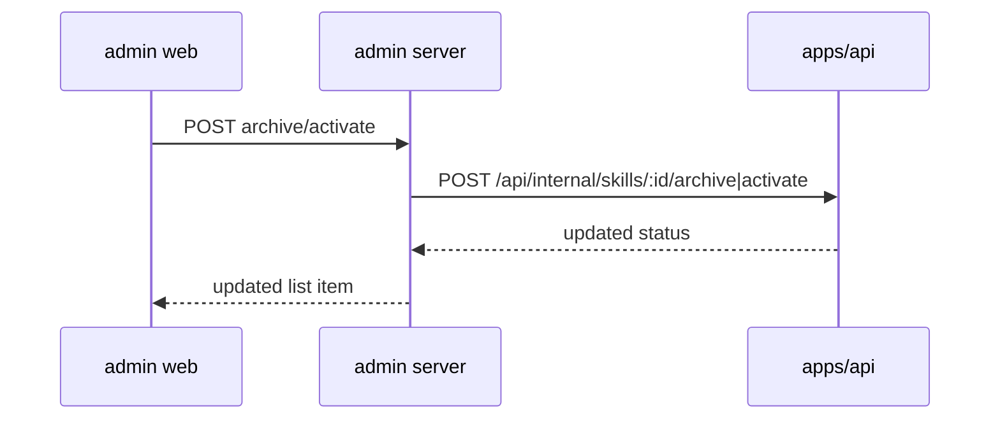
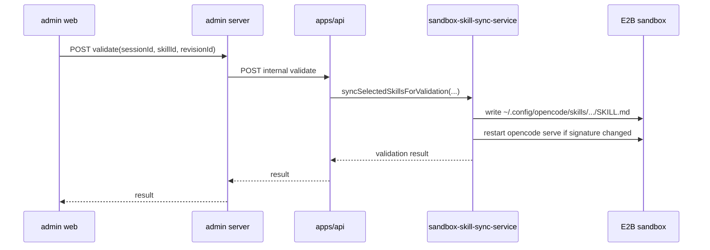

# 07 管理后台接口代理与交互流程

## 1. 总体边界

技能管理涉及三个层级：

1. `apps/admin_management/web`
2. `apps/admin_management/server`
3. `apps/api`

职责必须明确：

1. `web` 只负责展示和操作
2. `admin_management/server` 只负责代理与少量聚合
3. `apps/api` 才是 skill 的真实读写源和 sandbox 消费方

不允许：

1. `admin_management/server` 直接访问主库
2. `admin_management/web` 直连 `apps/api/internal/*`
3. 再出现一份后台专用 skill 数据模型

## 2. 接口分层

### 2.1 `apps/api` 内部接口

建议统一放在 `apps/api/src/routes/internal-skill-routes.ts` 一类位置，作为平台内部接口。

最小接口集如下：

1. `GET /api/internal/skills`
2. `GET /api/internal/skills/:skillId`
3. `POST /api/internal/skills`
4. `PUT /api/internal/skills/:skillId`
5. `POST /api/internal/skills/:skillId/archive`
6. `POST /api/internal/skills/:skillId/activate`
7. `GET /api/internal/skills/:skillId/revisions`
8. `GET /api/internal/skills/:skillId/revisions/:revisionId/rendered`
9. `POST /api/internal/skills/:skillId/revisions/:revisionId/validate`

其中：

1. `POST /skills` 创建 skill 并直接发布首个 revision
2. `PUT /skills/:skillId` 更新 skill 元信息并直接发布新的 revision
3. `rendered` 返回标准化后的 `SKILL.md`
4. `validate` 调用正式的 `sandbox-skill-sync-service`

### 2.2 `apps/admin_management/server` 代理接口

管理后台 server 对 web 暴露自己的代理路由：

1. `GET /api/skill-management/skills`
2. `GET /api/skill-management/skills/:skillId`
3. `POST /api/skill-management/skills`
4. `PUT /api/skill-management/skills/:skillId`
5. `POST /api/skill-management/skills/:skillId/archive`
6. `POST /api/skill-management/skills/:skillId/activate`
7. `GET /api/skill-management/skills/:skillId/revisions`
8. `GET /api/skill-management/skills/:skillId/revisions/:revisionId/rendered`
9. `POST /api/skill-management/skills/:skillId/revisions/:revisionId/validate`

命名故意与主 API 一一对应，这样代理层逻辑最薄。

## 3. 鉴权与访问控制

因为这些接口都是平台级写操作，本次设计不复用业务前端接口。

采用最短路径：

1. `apps/api` 增加内部 header 校验
2. `apps/admin_management/server` 通过固定 internal token 调用
3. `apps/admin_management/web` 仍然只访问本地管理后台 server

建议新增环境变量：

1. `ONECEO_INTERNAL_TOKEN`

建议 header：

1. `x-oneceo-internal-token`

这套机制只服务于管理后台和其他内部服务，不向业务前端暴露。

## 3.1 用户态 skill 接口

除了管理后台内部接口，还需要业务前端自己的用户态接口：

1. `GET /api/task-creation/skills`
2. `GET /api/task-creation/settings/skills`
3. `POST /api/task-creation/settings/skills/platform/:skillId/enable`
4. `POST /api/task-creation/settings/skills/platform/:skillId/disable`
5. `POST /api/task-creation/settings/skills/custom`
6. `PUT /api/task-creation/settings/skills/custom/:customSkillId`
7. `POST /api/task-creation/settings/skills/custom/:customSkillId/archive`
8. `POST /api/task-creation/settings/skills/custom/:customSkillId/activate`

边界：

1. `GET /api/task-creation/skills` 只返回 attachment picker 所需的“当前用户可用 skill 集”
2. `GET /api/task-creation/settings/skills` 返回设置页完整数据，包括平台模板目录、用户已引用的平台模板、用户自定义 skill
3. 这些接口通过 `currentUserResolver` 识别用户

## 4. 数据结构

### 4.1 技能列表项

```ts
type AdminSkillListItem = {
  id: string;
  slug: string;
  name: string;
  description: string;
  category: string;
  status: 'active' | 'archived';
  publishedRevisionId: string | null;
  publishedRevisionNumber: number | null;
  publishedAt: string | null;
  updatedAt: string;
};
```

### 4.2 技能详情

```ts
type AdminSkillDetail = {
  id: string;
  slug: string;
  name: string;
  description: string;
  category: string;
  status: 'active' | 'archived';
  publishedRevisionId: string | null;
  latestBodyMarkdown: string;
  renderedSkillMarkdown: string | null;
  updatedAt: string;
};
```

### 4.3 Revision 列表项

```ts
type AdminSkillRevisionItem = {
  id: string;
  revisionNumber: number;
  createdAt: string;
  createdBy: string | null;
  publishedAt: string | null;
  isPublished: boolean;
};
```

### 4.4 验证结果

```ts
type SkillValidationResult = {
  sessionId: string;
  skillId: string;
  revisionId: string;
  slug: string;
  skillPath: string;
  signature: string;
  restartTriggered: boolean;
  syncedAt: string;
};
```

## 5. 关键交互流程

### 5.1 列表加载



### 5.2 新建或编辑并发布



这里必须注意：

1. `PUT` 不是原地改正文，而是新增 revision
2. `published_revision_id` 在同一次事务里切到新 revision

### 5.3 归档或启用



注意：

1. 归档不删除 revision
2. 启用只是把 skill 重新暴露给业务前端

### 5.4 Sandbox 验证



这个流程要求 `validate` 与正式运行共用同一个 sync service，不能复制一份“后台专用写文件逻辑”。

## 6. `admin_management` 落地文件划分

### 6.1 server 侧

建议新增：

1. `server/services/skill-management-service.ts`
2. `server/routes/skill-management-routes.ts`

建议改造：

1. `server/connectors/oneceo-api-connector.ts`
2. `server/index.ts`
3. `server/config.ts`

职责：

1. connector 负责请求 `apps/api` 内部 skill 接口
2. service 负责极薄的参数编排
3. route 负责 HTTP 入参校验和错误转换

### 6.2 web 侧

建议新增：

1. `web/src/sections/SkillManagementSection.tsx`
2. `web/src/components/skill-management/SkillListTable.tsx`
3. `web/src/components/skill-management/SkillEditorDrawer.tsx`
4. `web/src/components/skill-management/SkillRevisionTimeline.tsx`
5. `web/src/components/skill-management/SkillSandboxValidationPanel.tsx`

建议改造：

1. `web/src/App.tsx`
2. `web/src/api.ts`
3. `web/src/types.ts`

关键要求：

1. `App.tsx` 只负责 section 切换，不再继续吸收技能管理明细代码
2. skill 页面内部状态收口到独立 section 组件

## 7. 与业务前端链路的关系

管理后台发布完成后，业务前端链路不需要重新发版。

原因：

1. 业务前端通过 `GET /api/task-creation/skills` 获取可见技能
2. 可见技能集合来自 `active + published_revision_id 非空`
3. 后台一旦发布或归档，业务前端下次请求就能得到新结果

因此管理后台和业务前端的关系应当是：

1. 后台发布能力
2. 业务前端只消费发布结果
3. sandbox 运行时按消息绑定的 revision 生效

## 8. 结论

管理后台这部分的关键不是“再做一套 skill API”，而是把 oneceo 已经定义好的 skill 平台能力，按正确边界接到后台里：

1. 主 API 负责真实能力
2. 管理后台负责运营入口
3. 验证链路复用正式同步逻辑

这样后续新增 skill、发布 revision、验证 sandbox 生效，都会收敛到同一条主链路。
