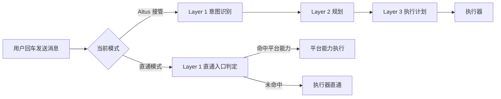

# 直通模式入口功能拦截层设计

日期：2026-03-12  
状态：待评审

## 1. 背景

当前任务创建链路里存在两种模式：

- `Altus 接管模式`：走三层架构，依次经过 Layer 1 意图识别、Layer 2 规划、Layer 3 执行计划，再进入执行器。
- `直通模式`：前端把用户输入直接发给执行器（`OpenCode` / `ClaudeCode` / `Codex`），后端只负责会话落盘、运行时绑定与事件回放。

现状的问题是：直通模式完全没有入口判定层。  
当用户在输入框里明确要求平台执行某个“已有能力”时，例如“帮我部署这个网站”，消息仍会被原样发给执行器，导致：

- 执行器把平台动作误解为普通开发任务；
- 平台明明已有现成服务能力，却没有被优先使用；
- 用户意图和最终执行链路不一致，影响稳定性与可解释性。

因此需要把架构调整为：

- `Altus 接管模式`：仍保持三层。
- `直通模式`：改为“一层入口判定 + 直通执行器”。

## 2. 需求理解

基于当前沟通，本次需求理解如下：

1. 用户按回车发送消息后，直通模式也必须先经过一个 AI 入口层。
2. 该入口层只做一件事：识别“这条消息是否在显式要求平台调用已有功能”。
3. 如果是显式功能请求，则不要把原消息发给执行器，而是直接调用平台已有能力。
4. 如果不是显式功能请求，则不要改写、不要规划、不要澄清，直接原样转发给执行器。
5. 常规开发诉求，例如“开发一个 xxx 功能”“修改某个页面”“把登录流程改成邮箱验证码”，都应该继续直通到执行器。
6. 直通模式新增的这一层，不应演变成 Altus 的完整三层接管逻辑。

## 3. 术语与假设

### 3.1 术语

- `显式功能请求`：用户明确要求平台执行某个已有动作，而不是让执行器写代码或改代码。
- `平台能力`：当前 API 已经具备、可直接调用的服务能力，例如任务会话部署能力。
- `执行器`：当前直通链路里的 `opencode`、`claudecode`、`codex`。  
  注：你在描述中提到的 `CloudCode`，当前仓库现有枚举是 `claudecode`。本文先按同一类执行器理解；若后续确有独立 `CloudCode` 接入，再扩展枚举。

### 3.2 本文默认假设

- “显式要求”按高置信度保守识别处理，宁可少拦截，也不要把普通开发请求误拦截。
- V1 先支持“平台已有、且已在任务会话中可直接调用”的能力；首个明确能力为部署相关能力。
- 如果平台能力识别成功但执行失败，应返回平台错误结果给用户，不再回退给执行器，避免语义错乱。

## 4. 当前现状分析

### 4.1 前端现状

`apps/web/client/src/hooks/useTaskCreationAgent.ts`

- `managed` 模式发送 `user_input` / `user_response`，走 Altus 接管流程。
- `sandbox` 模式发送 `opencode_input`，并在 metadata 中带上 `altusMode: 'sandbox'`、`executor` 等信息。
- 当前直通模式的注释已明确写着“不触发 Altus 编排与澄清逻辑”。

### 4.2 后端现状

`apps/api/src/agents/task-creation/websocket-service.ts`

- `user_input` / `user_response` 进入 `handleUserMessage`，属于 Altus 接管路径。
- `opencode_input` 进入 `handleOpencodeInput`，当前逻辑是：
  - 创建/绑定会话；
  - 落盘用户消息；
  - 初始化 sandbox runtime；
  - 直接调用 `opencodeRemoteService.sendUserInput(...)`。

也就是说，直通模式目前没有 Layer 1。

### 4.3 现有可复用平台能力

当前代码里已经存在任务会话级别的部署能力：

- `POST /api/task-creation/sessions/:sessionId/deployment/deploy`
- `POST /api/task-creation/sessions/:sessionId/deployment/redeploy`
- `POST /api/task-creation/sessions/:sessionId/deployment/rollback`
- `GET /api/task-creation/sessions/:sessionId/deployment`

这说明“帮我部署这个网站”这类请求，在语义上更适合命中平台能力，而不是继续发给执行器理解。

## 5. 目标与非目标

### 5.1 目标

1. 为直通模式增加一个轻量 Layer 1。
2. 该层只负责“平台能力拦截 / 否则放行”。
3. 保持 Altus 接管模式原有三层不变。
4. 对用户保持最小心智负担：仍然是在一个输入框里按回车发送。
5. 让平台能力执行结果进入同一会话历史，前端可正常回放。

### 5.2 非目标

- 不在直通模式里增加规划、任务拆解、澄清追问。
- 不把直通模式升级为 Altus 管理模式的变种。
- 不做“模糊猜你想部署”的激进识别。
- 不在 V1 同时接入所有平台能力。

## 6. 修改后的目标架构

### 6.1 Altus 接管模式

保持不变：

`用户输入 -> Layer 1 意图识别 -> Layer 2 规划 -> Layer 3 执行计划 -> 执行器`

### 6.2 直通模式

新增入口判定层：

`用户输入 -> Layer 1 直通入口判定 -> 命中平台能力则直接执行 / 否则直通执行器`

### 6.3 逻辑图



## 7. 直通模式 Layer 1 设计

### 7.1 职责边界

新增的 Layer 1 只负责输出以下二选一决策：

- `platform_capability`：本条消息应由平台能力处理。
- `passthrough`：本条消息应原样发给执行器。

该层不负责：

- 规划任务；
- 拆解步骤；
- 修改用户原文；
- 生成执行计划；
- 驱动多轮澄清。

### 7.2 建议命名

- Agent 名称：`DirectCapabilityInterceptAgent`
- 服务名称：`direct-mode-entry-service.ts`
- 能力注册表：`direct-mode-capability-registry.ts`

### 7.3 为什么必须是 AI + 规则混合，而不是纯关键词

用户要求的是“有一个 AI 的接入”，但该层又必须足够保守。  
因此建议采用“AI 判定 + 能力白名单校验”混合方案：

1. 先用轻量 LLM 做结构化判定：
   - 是否为显式功能请求；
   - 命中哪个平台能力；
   - 置信度；
   - 简短理由。
2. 再由本地注册表做二次校验：
   - 该能力是否已实现；
   - 当前会话是否满足执行前提；
   - 是否允许在直通模式下触发。
3. 任一环节不通过，统一降级为 `passthrough`。

这样可以同时满足：

- 有 AI 判断能力；
- 不会因为一句模糊中文就误触平台动作；
- 后续新增功能时只要扩展注册表和 prompt schema。

## 8. 判定规则

### 8.1 必须命中的条件

只有同时满足以下条件，才允许拦截：

1. 用户表达的是“立即执行平台动作”，而不是“让执行器开发能力”。
2. 平台内确实存在对应能力。
3. 意图足够明确，置信度达到阈值。
4. 当前上下文满足执行条件。

### 8.2 必须放行的场景

以下消息默认直接发给执行器：

- “帮我开发一个官网，首页要有产品介绍和定价”
- “把登录页改成邮箱验证码登录”
- “修一下这个 bug”
- “新增一个用户权限模块”
- “把这个组件重构一下”

这些都属于开发/修改/实现类需求，不是平台能力调用。

### 8.3 应拦截的典型场景

以下消息应优先命中平台能力：

- “帮我部署这个网站”
- “把当前项目重新部署一下”
- “回滚到上一个部署版本”
- “帮我查看当前部署状态”

### 8.4 保守策略

如果消息同时带有“开发任务 + 功能动作”双重语义，例如：

- “把首页改完后帮我部署”

V1 统一按 `passthrough` 处理，不做多动作拆分。  
原因是该句同时包含开发和部署两类动作，直接拦截会改变原始执行意图。后续若要支持，可在二期增加“复合指令拆分”。

## 9. 平台能力注册表设计

### 9.1 V1 能力范围

建议 V1 先接入以下能力：

- `deploy_session_website`
- `redeploy_session_website`
- `rollback_session_deployment`
- `get_session_deployment_status`

### 9.2 注册表结构

```ts
type DirectModeCapability = {
  id:
    | 'deploy_session_website'
    | 'redeploy_session_website'
    | 'rollback_session_deployment'
    | 'get_session_deployment_status';
  description: string;
  enabledInModes: Array<'sandbox'>;
  requiresSessionId: boolean;
  executor: (input: DirectModeCapabilityInput) => Promise<DirectModeCapabilityResult>;
};
```

### 9.3 为什么使用注册表

注册表有三个作用：

- 限制 AI 只能命中“平台已实现”的能力；
- 避免把业务逻辑写死在 prompt 里；
- 便于后续继续挂接数据库浏览、发布日志查询等已有服务能力。

## 10. 请求处理流程设计

### 10.1 入口流程

直通模式下，`handleOpencodeInput` 改为：

1. 先完成当前已有的会话绑定、落盘、runtime 上下文准备。
2. 调用 `directModeEntryService.process(...)`。
3. `process(...)` 返回二选一结果：
   - `platform_capability`
   - `passthrough`
4. 若为 `platform_capability`：
   - 直接调用注册表对应 executor；
   - 结果写回会话消息流；
   - 不再调用 `opencodeRemoteService.sendUserInput(...)`。
5. 若为 `passthrough`：
   - 保持当前行为，转发给执行器。

### 10.2 建议返回结构

```ts
type DirectModeEntryDecision = {
  action: 'platform_capability' | 'passthrough';
  capabilityId?: string;
  confidence: number;
  reason: string;
};
```

### 10.3 平台能力执行后的消息回写

平台能力执行完成后，建议写入两类消息：

1. `system` / `status_update`
   - 例如“已识别为平台部署请求，正在调用部署服务”
2. `assistant` 或新增 `platform_result`
   - 例如“部署已触发”“当前部署状态为 xxx”“回滚已发起”

这样前端历史回放时可以区分：

- 这是平台动作结果；
- 不是执行器回复；
- 也不是 Altus 规划结果。

## 11. LLM 设计

### 11.1 模型调用原则

该层如需 LLM，必须遵守仓库约束：

- 统一通过 `apps/api/src/connectors/llm-proxy-connector.ts`
- 不允许绕过代理直连上游模型

### 11.2 输出 schema

建议使用严格 JSON 输出：

```json
{
  "isExplicitPlatformRequest": true,
  "capabilityId": "deploy_session_website",
  "confidence": 0.96,
  "reason": "用户明确要求立即部署当前网站"
}
```

### 11.3 Prompt 约束重点

Prompt 中必须明确：

- 你不是规划 agent；
- 你不是代码执行 agent；
- 你只判断“是否命中平台已有能力”；
- 若不确定，必须返回不命中；
- “开发/修改/实现/重构/修复”类请求默认不属于平台能力调用。

## 12. 后端改动建议

### 12.1 新增文件

- `apps/api/src/agents/task-creation/layers/direct-capability-intercept-agent.ts`
- `apps/api/src/services/direct-mode-entry-service.ts`
- `apps/api/src/services/direct-mode-capability-registry.ts`

### 12.2 主要改动点

- `apps/api/src/agents/task-creation/websocket-service.ts`
  - 在 `handleOpencodeInput` 内接入新的入口判定服务。
- `apps/api/src/routes/task-creation-routes.ts`
  - 本期不一定需要新增路由，但需复用现有部署服务逻辑。
- 现有部署服务
  - 尽量直接复用 service/domain 方法，不建议后端通过 HTTP 再调用自己。

### 12.3 为什么后端实现优先

虽然消息从前端输入框触发，但拦截逻辑建议落在后端，原因是：

- 平台能力和鉴权都在后端；
- 不同前端入口可以复用同一判定层；
- 可以保证不会因为前端绕过而把功能消息误发给执行器。

## 13. 前端改动建议

前端 V1 尽量少改：

- 继续在直通模式下发送 `opencode_input`。
- 保持当前 executor 选择逻辑不变。
- 只需要支持渲染新的平台状态消息类型，或者沿用现有系统消息样式。

如需增强体验，可补两个小能力：

- 平台动作中的 loading 文案；
- 平台动作结果的独立样式标识。

但这不应阻塞后端入口层落地。

## 14. 状态与会话要求

为避免新层影响既有直通体验，要求如下：

1. 直通模式命中平台能力时，不进入 Altus 的 `clarifying` / `planning` / `reviewing`。
2. 直通模式未命中时，保持现有 `executing/development` 语义不变。
3. 平台动作的结果也必须进入同一 `sessionId` 历史，便于刷新后重放。
4. 会话 mode 仍保持 `sandbox`，不要因为命中平台功能就切到 `altus`。

## 15. 错误处理

### 15.1 判定失败

- LLM 超时、返回格式错误、注册表未命中：
  - 一律降级为 `passthrough`

### 15.2 能力执行失败

- 若已高置信度命中平台能力，但执行失败：
  - 返回平台错误信息给用户；
  - 不再自动转发给执行器；
  - 以免执行器继续把“部署失败，请重试”之类消息当开发需求理解。

### 15.3 前提不足

例如用户要求部署，但当前会话还没有可部署工作区：

- 直接返回清晰错误：“未找到可部署的工作区，请先生成项目文件”
- 该错误应来自平台能力层，而不是执行器回复。

## 16. 测试方案

### 16.1 后端单元测试

- 显式部署请求 -> 命中 `deploy_session_website`
- 开发类请求 -> `passthrough`
- 模糊请求 -> `passthrough`
- 命中能力但前提不足 -> 返回平台错误

### 16.2 直通模式集成测试

基于现有 `apps/api/tests/opencode-sandbox-direct/` 增加场景：

- `06_platform_capability_deploy_intercept`
- `07_platform_capability_passthrough_for_dev_request`

核心断言：

- 命中平台能力时，不调用执行器输入转发；
- 未命中时，保持原直通链路不变；
- 会话历史里能看到平台动作状态和结果。

### 16.3 前端渲染测试

基于现有 `apps/web/client/src/tests/opencode-sandbox-direct-ui/` 增加场景：

- 平台动作状态渲染
- 平台动作结果渲染
- 平台动作失败提示渲染

## 17. 风险与注意事项

1. 最大风险是误拦截开发请求，所以识别策略必须保守。
2. 不能把“直通模式入口层”做成新的 Altus 编排，否则会破坏模式边界。
3. 如果后续能力越来越多，必须维护统一注册表，不要把能力判断分散在多个 route/service 里。
4. 需要明确平台动作消息在前端的展示语义，避免用户误以为是执行器输出。

## 18. 验收标准

满足以下条件即可认为本次改造达标：

1. Altus 接管模式仍保持原三层流程。
2. 直通模式新增 Layer 1，且只做“平台能力拦截/放行”。
3. 用户输入“帮我部署这个网站”时，系统调用平台部署能力，不把原文发给执行器。
4. 用户输入“开发一个官网”或“修改某个功能”时，系统仍原样直通到执行器。
5. 平台动作结果能在当前会话中展示和回放。
6. 不因新增入口层而影响现有直通模式 SSE、会话续聊、历史刷新能力。

## 19. 待你确认的点

在进入开发前，建议你重点确认以下三点：

1. V1 的平台能力范围是否只先做“部署相关能力”。
2. “显式功能请求”是否接受本文这种保守定义。
3. 复合语句如“开发完后帮我部署”是否先统一放行，不做拆分。

