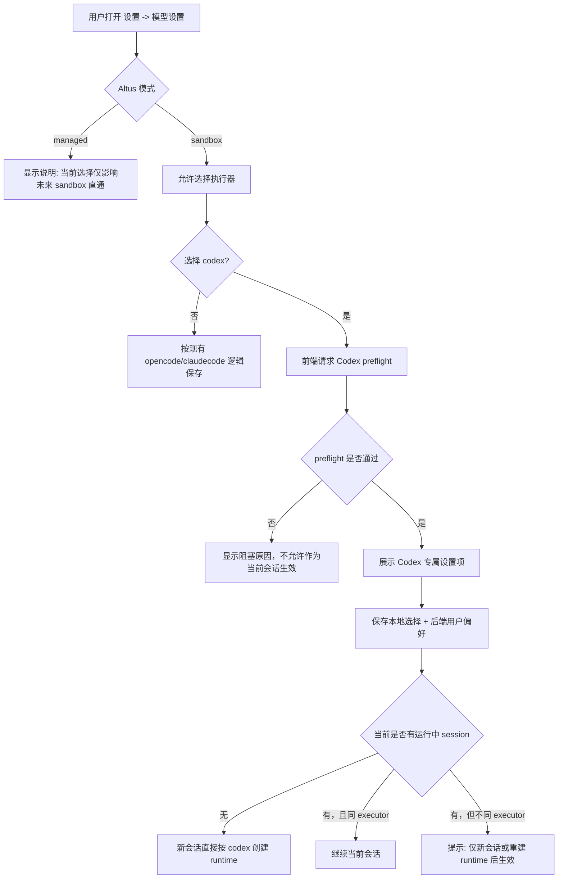

# 设置 - 模型设置 - Codex 模式切换流程设计

日期：2026-03-17  
状态：待评审

## 1. 背景

当前 `oneceo` 的任务创建链路已经把执行器枚举预留为：

- `opencode`
- `claudecode`
- `codex`

但这只是前端选择器和 session 字段层面的预留，真实的 runtime 启动、SSE/历史恢复、sandbox 内桥接协议仍然是 `OpenCode-only`。

本次需求不是单纯把下拉框切到 `codex`，而是先把“设置 -> 模型设置 -> Codex 模式”的切换流程设计清楚，为后续开发“直通 Codex 模式”打基础。

同时需要遵守仓库内已有强约束：

- 所有 E2B 调用必须走 `apps/api/src/connectors/e2b-connector.ts`
- 与 sandbox 内服务通信必须经由 OSAC 链路与编排服务
- 不改 `kvm-orchestrator`
- 设计阶段先出 docs，待确认后再开发

## 2. 需求理解

基于当前沟通，本次目标是：

1. 在 `设置 -> 模型设置` 中把 `codex` 从“占位枚举”升级为“可审的切换方案”。
2. 后续直通 `codex` 模式时，优先复用 E2B 官方 Codex 模板，而不是自建一套等价 runtime。
3. 学习并吸收 `siteboon/claudecodeui` 在以下方面的做法，但要适配 oneceo 的 OSAC/E2B 架构：
   - Codex 远程调用
   - 会话恢复
   - 实时事件流
   - 设置和权限模式管理
4. 禁止把 Codex 硬塞进现有 OpenCode 私有实现里，避免形成更多 `if executor === 'codex'` 的散落逻辑。
5. 每个 session 必须持久化一个明确的“会话身份标识”，用于声明该对话到底属于：
   - `altus`
   - `opencode`
   - `codex`
   - `claudecode`

这个标识一旦在建会话时确定，后续重新打开该对话时必须沿用原身份，不能被当前全局设置覆盖。

## 3. 当前现状

### 3.1 前端现状

关键文件：

- `apps/web/client/src/components/SettingsDialog.tsx`
- `apps/web/client/src/hooks/useTaskCreationAgent.ts`
- `apps/web/client/src/lib/task-creation-client.ts`

当前行为：

- `设置 -> 模型设置` 已有 `executor = opencode / claudecode / codex`
- `altusMode = sandbox / managed`
- 设置值只写 `localStorage`
- 发送消息时，前端会把 `executor` 和 `altusMode` 带到 `createSession` 与 websocket `opencode_input`

这意味着：

- UI 已经能“选中 codex”
- 但这个选择不会驱动真实 Codex runtime
- 现阶段只是把 `session.executor` 记成 `codex`

### 3.2 后端现状

关键文件：

- `apps/api/src/agents/task-creation/websocket-service.ts`
- `apps/api/src/routes/task-creation-routes.ts`
- `apps/api/src/agents/task-creation/file-memory-store.ts`
- `apps/api/src/services/opencode-remote-service.ts`
- `apps/api/src/services/osac-agent-service.ts`
- `apps/api/src/services/sandbox-agent-provision-service.ts`

当前行为：

- 直通模式统一走 `opencode_input -> handleOpencodeInput()`
- runtime 结构里仍是 `runtime.opencodeSessionId`
- 历史恢复、实时事件、完成态推断都绑定 OpenCode
- `sandbox-agent-provision-service` 当前默认准备的是 OpenCode runtime

结论：

- 现在的 “Codex 模式” 只存在于设置枚举和 session 元数据
- 真正要落地，必须把后端从 “OpenCode 专线” 抽成 “按 executor 分发的直通链路”

## 4. 外部参考结论

### 4.1 claudecodeui 的可复用做法

参考仓库：[`siteboon/claudecodeui`](https://github.com/siteboon/claudecodeui)

关键观察：

1. Codex 不走自定义协议发明，而是直接复用官方能力
   - 后端 `server/openai-codex.js` 直接使用 `@openai/codex-sdk`
   - 通过 `startThread()` / `resumeThread()` / `runStreamed()` 驱动会话与流式事件
2. 会话恢复是第一等能力
   - 不是每次新开 runtime
   - 通过 `sessionId/threadId` 恢复既有会话
3. 实时流先在后端被“标准化”，前端只消费统一事件
   - `item.started`
   - `item.updated`
   - `item.completed`
   - `turn.started`
   - `turn.completed`
   - `turn.failed`
4. 设置独立于聊天输入
   - `codex-settings` 单独保存 `permissionMode`
   - 有单独的 `codex auth status`
   - MCP 管理、权限模式、登录状态分开处理

### 4.2 对 oneceo 的适配结论

oneceo 不能照搬它“服务端直接跑 codex sdk/cli”的部署方式，因为 oneceo 有明确边界：

- Codex 必须跑在 E2B sandbox 内
- API 与 sandbox 之间必须走 OSAC/编排链路

因此可复用的是模式，不是部署位置：

1. 复用官方 Codex SDK/CLI，不造私有协议
2. 复用 `session resume + streamed events + normalized envelope` 思路
3. 不复用“API 主进程直接执行 codex”的方式

### 4.3 官方资源

- E2B 官方提供 Codex 模板能力，可作为新 runtime 基座
- OpenAI 官方 Codex 文档已提供产品与运行形态，说明直通 Codex 本身是可行路线

## 5. 设计目标

### 5.1 目标

1. 让 `设置 -> 模型设置 -> Codex` 成为真实可生效的切换入口
2. 切换逻辑对用户清晰可解释，不出现“设置已切换，但当前会话仍走 OpenCode”的暗坑
3. 后端新增 Codex 链路时采用独立服务层，不把 OpenCode 服务继续膨胀
4. 让后续 Codex 直通模式具备：
   - 会话恢复
   - 实时消息
   - 历史回放
   - 运行时状态查询
5. 每个 session 都有稳定的会话身份标识，重开会话时必须恢复原身份，避免 Altus / OpenCode / Codex / ClaudeCode 混用

### 5.2 非目标

- 本轮不实现 Codex 运行时 MCP attach/detach
- 本轮不把 `managed` 模式改造成 Codex 接管模式
- 本轮不在已有 OpenCode runtime 上“兼容运行” Codex
- 本轮不开发代码，只输出设计与改动边界

### 5.3 本轮已完成的 OSAC 侧交付

为了保证这份设计不是停留在抽象层，本轮同步完成了 OSAC 的最小交付验证：

1. 已在 `OSAC_client` 中新增 `EXECUTOR_*` 协议骨架，供后续 `codex` 直通控制面使用
2. 已新增最小 `codex manager`，当前 transport 为 CLI JSON 事件流
3. 已完成本地测试：
   - `cd OSAC_client && PATH=/opt/homebrew/bin:$PATH go test ./...`
4. 已完成 Linux amd64 编译：
   - `OSAC_client/dist/osac-linux-amd64_v1.1.2.fix24`
   - `OSAC_client/dist/osac-linux-amd64_v1.1.2.fix24_debug`

边界说明：

- 这代表 OSAC 侧已经具备“实验接入 Codex”的 binary 和协议基础
- 不代表 oneceo 主仓库已经接入 Codex 主链路
- oneceo 仍需继续完成 `driver`、`executorSessionId`、executor registry、history/event 恢复接线

### 5.4 本轮真实联调结果

本轮已完成真实 E2B sandbox + Codex template + OSAC + oneceo service 的联调，不再只是本地 import smoke。

已验证通过：

1. `codex` 模板 sandbox 内存在可执行 `codex`
   - 实测版本：`codex-cli 0.101.0`
2. `sandbox-agent-provision-service.ts` 能按 `executor=codex` 创建 sandbox，并在 sandbox 内启动 OSAC bridge
3. `osac-agent-service.ts` 能通过 `EXECUTOR_RUNTIME_ENSURE / EXECUTOR_INPUT_SEND` 驱动 Codex
4. `codex-remote-service.ts` 能消费 `EXECUTOR_EVENT`，并把事件写回：
   - file-memory session
   - `task_creation_sessions`
   - `conversation_messages`
5. 实际返回事件包含：
   - `thread.started`
   - `turn.started`
   - `item.completed`
   - `turn.completed`
6. oneceo 主链路实测会话已达到：
   - `driver=codex`
   - `runtime.executorSessionId` 从本地占位值提升为真实 Codex thread id
   - session `status/stage` 最终进入 `completed/completed`

本轮确认的关键兼容要求：

- Codex template 内没有 `opencode` 可执行文件，因此 OSAC 不能再把 `GET_SESSION_LIST`、probe 或 bridge ready 检查硬绑定到 OpenCode。
- 为兼容现有前端恢复逻辑，Codex 事件当前仍保留 `opencodeSessionId` 兼容别名，但真实身份字段必须以 `driver + executorSessionId` 为准。

### 5.5 多轮续聊修正

在真实多轮对话联调中，发现同一 `taskSessionId` 的第二轮输入会触发：

- `error: unexpected argument '-C' found`
- `Usage: codex exec resume [OPTIONS] [SESSION_ID] [PROMPT]`

根因不是 session 绑定错误，而是 OSAC 的 `codex manager` 在首轮与续聊共用了同一套 CLI 参数拼装逻辑，把 `workspace` 通过 `-C <dir>` 传给了：

- `codex exec`
- `codex exec resume`

其中只有 `codex exec` 支持 `-C/--cd`，`codex exec resume` 并不支持该参数，因此续聊必然失败。

本轮修正原则：

1. 不做 resume 特判补丁
2. 统一把 workspace 通过进程工作目录 `cmd.Dir` 传入
3. 首轮与续聊共用同一套正确的进程启动语义

修正后实测结果：

1. 同一会话第二轮输入不再出现 `unexpected argument '-C' found`
2. 第二轮已能在同一 `orchestratorSessionId` 下继续执行真实 Codex 任务
3. 第二轮事件流已包含：
   - `turn.started`
   - `item.completed`
   - `command_execution`
   - `reasoning`

### 5.6 多轮消息一致性修正

在继续针对 Codex 多轮对话做真实验证时，又暴露出两类“看起来像续聊失败，实际是消息层不一致”的问题：

1. 主对话区出现无意义内部日志：
   - `codex_core::rollout::list: state db missing rollout path ...`
2. 第二轮发送后，第一轮问候语、上一轮用户消息会在主对话区被重新拼接一遍

这两个问题的根因分别是：

1. `stderr.line / stdout.line` 被当成普通 `executor_event` 进入了聊天流
2. Codex 的实时消息与历史消息没有使用同一套稳定 `messageKey`
3. 前端对已存在 session 仍会再次调用 `/sessions` 并携带 `initialMessage`
4. history 映射层把 `codex_user_input` 丢掉了，导致用户轮次在 reconcile 时只能依赖另一条预写入消息

本轮修正原则：

1. `stderr.line / stdout.line` 不进入 Codex 主对话区，也不再持久化为聊天正文
2. Codex realtime/history 统一使用稳定 `messageKey`
3. 已存在 session 再发送消息时，不再通过 `/sessions` 重复写入 `initialMessage`
4. `codex_user_input` 在历史恢复时映射回 `user_input`

本轮真实 smoke 结果：

1. 第二条用户消息仅落库 1 次
2. `state db missing rollout path` 噪音消息落库次数为 0
3. 当前 smoke 中 Codex 消息 `messageKey` 无重复

## 6. 设置切换流程设计

### 6.1 页面结构

保留现有 `模型设置` 页签，但在 `executor = codex` 时出现独立配置块。

建议结构：

1. `Altus 控制模式`
   - `sandbox`
   - `managed`
2. `执行器选择`
   - `opencode`
   - `codex`
   - `claudecode`（继续保留占位）
3. `Codex 专属配置`（仅当 `sandbox + codex` 时显示）
   - 认证状态
   - 默认模型
   - 权限模式
   - runtime 模板状态
   - 说明文案

### 6.2 用户操作流



### 6.3 preflight 检查

当用户在设置里选中 `codex` 时，前端立即调用新接口：

- `GET /api/task-creation/executors/codex/status`

返回建议至少包含：

```ts
type CodexExecutorStatus = {
  ready: boolean;
  authStatus: 'ready' | 'missing' | 'expired' | 'unknown';
  templateStatus: 'ready' | 'missing' | 'unknown';
  bridgeStatus: 'ready' | 'not_installed' | 'unknown';
  supportedModels: string[];
  defaultModel?: string;
  reason?: string;
};
```

用途：

- 避免用户选了 `codex` 但实际无法启动
- 给设置页展示真实阻塞原因
- 为后续 runtime start 提供一致的健康检查结果

### 6.4 保存策略

建议采用“双层保存”：

1. 本地即时状态
   - `localStorage.altus_mode`
   - `localStorage.altus_executor`
2. 后端用户偏好
   - 新增 task-creation user settings 接口
   - 保存 Codex 默认模型、权限模式、是否启用

原因：

- 兼容现有前端逻辑，切换即时生效
- 避免 Codex 专属配置只能存在浏览器本地
- 为后续多端一致性预留空间

### 6.5 会话身份标识

除了现有的 `mode` 与 `executor`，建议新增一个对前后端都清晰的 session 级标识：

```ts
type SessionDriver = 'altus' | 'opencode' | 'codex' | 'claudecode';
```

写入规则：

- `managed` 模式创建的会话：`driver = altus`
- `sandbox + opencode`：`driver = opencode`
- `sandbox + codex`：`driver = codex`
- `sandbox + claudecode`：`driver = claudecode`

读取规则：

- 用户重新打开某个 session 时，前端优先读取 `session.driver`
- 不允许用当前 `localStorage.altus_mode` / `localStorage.altus_executor` 覆盖该 session 的身份
- 全局设置只影响“新建会话默认值”，不影响“已有会话恢复值”

这一步是强约束，不是 UI 提示文案。

## 7. 切换生效规则

### 7.1 新会话

当用户尚未进入会话，或点击新建任务：

- 若 `altusMode = sandbox` 且 `executor = codex`
- 前端建会话时写入 `mode=sandbox`、`executor=codex`、`driver=codex`
- 后端启动 runtime 时选择 Codex 路径

这是主流程，也是推荐路径。

### 7.2 已存在会话，且当前 executor 相同

若当前 session 已经是 `executor=codex`：

- 设置修改默认模型 / 权限模式时可提示“影响下一轮输入”
- 不强制新建 session
- 重新打开该 session 时，必须继续按 `driver=codex` 恢复，不读当前全局设置

### 7.3 已存在会话，但当前 executor 不同

若当前 session 是 `opencode`，用户在设置里切到 `codex`：

- 不允许静默热切换当前 session 的执行器
- 默认提示：
  - `推荐：新建会话后生效`
  - `高级选项：重建当前 runtime 后生效`

原因：

- 当前会话已有 native history 和 runtime 绑定
- 静默切 executor 会导致：
  - 历史来源错位
  - provider sessionId 混乱
  - 前端恢复逻辑不可解释

结论：`executor` 对“已有 session”应视为强边界，不做隐式热迁移。

### 7.4 重新打开历史会话

这是本次新增的硬规则：

1. 用户从历史列表打开某个 session
2. 前端先读取 session detail
3. 如果 detail 中存在 `driver`
4. 则当前对话页必须以该 `driver` 恢复：
   - `driver=altus` -> 走 Altus 对话链路
   - `driver=opencode` -> 走 OpenCode 直通链路
   - `driver=codex` -> 走 Codex 直通链路
   - `driver=claudecode` -> 走 ClaudeCode 直通链路
5. 若此时全局设置与 session.driver 不一致，只显示提示，不改写 session

建议提示文案：

- `当前会话使用 Codex 模式。你在设置中的默认执行器是 OpenCode，该设置仅对新会话生效。`

这条规则的优先级高于全局设置。

## 8. 后端目标方案

### 8.1 抽象成按 executor 分发

当前 `handleOpencodeInput()` 需要收敛为通用入口，例如：

```ts
handleSandboxExecutorInput(message) {
  const executor = message.metadata.executor || 'opencode';
  return executorRegistry.get(executor).sendUserInput(message);
}
```

建议新增：

- `apps/api/src/services/sandbox-executor-registry.ts`
- `apps/api/src/services/codex-remote-service.ts`

保持：

- `opencode-remote-service.ts` 继续负责 OpenCode
- `codex-remote-service.ts` 只负责 Codex

### 8.2 runtime 元数据去 OpenCode 化

当前 session runtime 仍为：

```ts
runtime: {
  orchestratorSessionId?: string;
  opencodeSessionId?: string;
}
```

建议演进为：

```ts
runtime: {
  orchestratorSessionId?: string;
  executor?: 'opencode' | 'codex' | 'claudecode';
  executorSessionId?: string;
  opencodeSessionId?: string; // 兼容迁移期
  updatedAt?: string;
}
```

同时 session 主记录建议新增：

```ts
driver?: 'altus' | 'opencode' | 'codex' | 'claudecode';
```

原因：

- Codex 也会有 provider session/thread id
- 不能继续把 runtime 主键命名锁死在 `opencodeSessionId`
- 仅靠 `mode + executor` 不足以表达“这个历史对话打开时该走哪条链路”

### 8.3 runtime provision

当前 `sandbox-agent-provision-service.ts` 主要准备 OpenCode runtime。

Codex 方案建议：

1. 按 `executor=codex` 选择 E2B 官方 Codex 模板
2. 在 sandbox 内启动 Codex bridge
3. bridge 对上使用官方 Codex SDK/CLI
4. bridge 对外经 OSAC 暴露统一接口

注意：

- 不是让 API 主进程直接跑 `codex`
- 仍由 E2B sandbox 承载执行器
- 所有对 bridge 的调用都必须经过 OSAC

### 8.4 历史与实时事件

借鉴 claudecodeui 的模式，Codex 侧建议统一产出标准化事件：

- `session_created`
- `turn_started`
- `item`
- `turn_completed`
- `turn_failed`
- `error`

oneceo 再把这些事件映射到自己的 timeline 消息。

建议不要继续沿用 `opencode_event` 作为通用名字，而是新增通用层：

- `executor_event`
- `status_update`
- `agent_message`
- `error`

其中 `metadata.executor = codex | opencode`

这样能避免前端为了 Codex 继续消费一个名字叫 `opencode_event` 的事件类型。

### 8.5 历史读取接口

当前很多接口名和实现都写死为 OpenCode：

- `/sessions/:id/opencode/events`
- `loadNativeMessageHistory()`
- `inspectNativeSessionProgress()`

建议新增通用接口层，例如：

- `GET /api/task-creation/sessions/:id/executor/events`
- `GET /api/task-creation/sessions/:id/executor/history`

内部再按 `session.executor` 分发到：

- `opencode`
- `codex`

## 9. Codex 专属设置项设计

### 9.1 默认模型

需要保存 `defaultModel`，用于新 session 默认值。

### 9.2 权限模式

参考 claudecodeui，可先采用如下映射：

- `default`
  - `sandboxMode = workspace-write`
  - `approvalPolicy = untrusted`
- `acceptEdits`
  - `sandboxMode = workspace-write`
  - `approvalPolicy = never`
- `bypassPermissions`
  - `sandboxMode = danger-full-access`
  - `approvalPolicy = never`

说明：

- 这是后续 Codex bridge 的推荐映射
- 是否全部开放，仍需结合 oneceo 安全策略最终确认

### 9.3 认证状态

设置页应显示 Codex 当前可用性，而不是仅靠失败时报错。

至少需要区分：

- 已就绪
- 未认证
- 模板未配置
- bridge 未安装
- 平台暂不可用

## 10. 拟改动文件范围

前端高概率改动：

- `apps/web/client/src/components/SettingsDialog.tsx`
- `apps/web/client/src/hooks/useTaskCreationAgent.ts`
- `apps/web/client/src/lib/task-creation-client.ts`
- `apps/web/client/src/locales/zh.json`
- `apps/web/client/src/locales/en.json`

后端高概率改动：

- `apps/api/src/agents/task-creation/websocket-service.ts`
- `apps/api/src/agents/task-creation/file-memory-store.ts`
- `apps/api/src/routes/task-creation-routes.ts`
- `apps/api/src/services/sandbox-agent-provision-service.ts`
- `apps/api/src/services/osac-agent-service.ts`
- `apps/api/src/config/e2b-config.ts`

后端新增建议：

- `apps/api/src/services/codex-remote-service.ts`
- `apps/api/src/services/sandbox-executor-registry.ts`
- 可能还需要 `codex-event-normalizer.ts` 或 `codex-history-adapter.ts`

### 10.1 当前代码最小落点复盘

结合当前仓库代码，后续接入 `codex` 模式时最小必须动到的点如下。

#### A. session 结构与 file-memory-store

文件：

- `apps/api/src/agents/task-creation/file-memory-store.ts`

当前现状：

- `FileSessionRecord` 只有 `mode`、`executor`
- `runtime` 仍写死为：
  - `orchestratorSessionId`
  - `opencodeSessionId`
- 已有查找方法也写死为：
  - `findSessionByOrchestratorSessionId()`
  - `findSessionByOpencodeSessionId()`

最小改造建议：

1. `FileSessionRecord` 增加 `driver`
2. `runtime` 增加：
   - `executor`
   - `executorSessionId`
3. `updateRuntimeBinding()` 改成支持通用 executor runtime 绑定，而不是只写 `opencodeSessionId`
4. 增加通用查找方法，例如：
   - `findSessionByExecutorSessionId()`
5. `createSession()`、`updateSessionExecutor()` 相关调用点要同步能写入 `driver`

#### B. 任务创建路由 / 建会话接口

文件：

- `apps/api/src/routes/task-creation-routes.ts`

当前现状：

- `POST /sessions` 已接收 `mode` 与 `executor`
- 但只会把它们落到 file-memory-store
- `toSessionSummary()`、`buildFileSessionFromDb()`、`buildLightweightFileSessionFromDb()` 对 sandbox 直通的推断仍然默认：
  - `mode = sandbox`
  - `executor = opencode`
- `/messages/recent`、`/messages/history`、`reconcileRecoveredOpencodeCompletion()` 只在 `executor=opencode` 或 `runtime.opencodeSessionId` 时走 native 恢复逻辑

最小改造建议：

1. 建会话接口补 `driver`
2. detail / summary 输出补 `driver`
3. `resolveTaskSessionRecord()` 和所有历史恢复判断从 `opencode-only` 提升为 `driver/executor` 分发
4. 新增通用 executor history/events 接口层，避免继续扩散 `/opencode/...` 路径

#### C. WebSocket 输入入口

文件：

- `apps/api/src/agents/task-creation/websocket-service.ts`

当前现状：

- 前端直通消息类型仍然是 `opencode_input`
- `handleMessage()` 收到后固定进入 `handleOpencodeInput()`
- `handleOpencodeInput()` 内部最终固定调用 `opencodeRemoteService.sendUserInput()`
- 新建或续聊时虽然会读取 `metadata.executor`，但只用于 `updateSessionExecutor()`，不会真正改变后续发送链路

最小改造建议：

1. 保留现有消息类型兼容期也可以，但后端入口必须先抽成通用层
2. `handleOpencodeInput()` 应演进为通用 sandbox executor dispatch，例如：
   - 统一 session 初始化
   - 再按 `executor/driver` 分发到对应 remote service
3. `sendToClient()` 中 runtime 元数据持久化不能再只认 `opencodeSessionId`

#### D. 前端设置与消息发送

文件：

- `apps/web/client/src/components/SettingsDialog.tsx`
- `apps/web/client/src/hooks/useTaskCreationAgent.ts`
- `apps/web/client/src/lib/task-creation-client.ts`

当前现状：

- 设置页已经支持保存 `executor=codex`
- sandbox 直通时，前端会把：
  - `mode=sandbox`
  - `executor`
  - `initialMessage`
  发给 `POST /api/task-creation/sessions`
- 真正发消息时仍固定发：
  - `type: 'opencode_input'`
  - `metadata.altusMode = 'sandbox'`
  - `metadata.executor = readExecutor()`
- runtime ready 后补发 pending prompt 的逻辑也仍写死 `opencode_input`

最小改造建议：

1. 设置页切到 `codex` 时增加 preflight 请求
2. 前端打开历史 session 时优先读取 `session.driver`，不要再只读本地设置
3. 直通消息发送从“名字叫 opencode_input 的兼容消息”逐步演进为通用 executor 输入语义

#### E. 当前写死 OpenCode 的服务

文件：

- `apps/api/src/services/opencode-remote-service.ts`
- `apps/api/src/services/opencode-event-stream-service.ts`
- `apps/api/src/services/osac-agent-service.ts`
- `apps/api/src/services/sandbox-agent-provision-service.ts`
- `apps/api/src/utils/opencode-history-recovery.ts`
- `apps/api/src/utils/opencode-workspace.ts`

当前现状：

- `opencode-remote-service.ts` 负责 prompt、native history、完成态推断、事件订阅后的 timeline 归一
- `opencode-event-stream-service.ts` 负责 OpenCode 事件归一和落盘
- `osac-agent-service.ts` 目前暴露的是 `ensureOpencodeServer()`、OpenCode session create/send/http request 等能力
- `sandbox-agent-provision-service.ts` 主要准备的是 OpenCode runtime、worktree 和 server

最小改造建议：

1. 新增 `codex-remote-service.ts`
2. 新增 `sandbox-executor-registry.ts`
3. `osac-agent-service.ts` 新增 `EXECUTOR_*` 通用封装，OpenCode 旧接口保留兼容
4. `sandbox-agent-provision-service.ts` 按 executor 选择 template/bootstrap
5. 历史恢复和事件归一从 `opencode-*` 工具函数逐步提升成 executor-aware 层

### 10.2 与本轮 OSAC 交付的对应关系

本轮主仓库设计与 OSAC 侧已完成的交付对应关系如下：

1. oneceo 主仓库提出的 `driver + executorSessionId + executor 分发`
   - 已有对应的 OSAC `EXECUTOR_*` 协议骨架可承接
2. oneceo 需要的 `codex runtime ensure / create / resume / input / interrupt / status`
   - OSAC 已有最小 handler 和 manager
3. oneceo 需要的 sandbox 内 binary
   - 已产出 `v1.1.2.fix22`

但仍未完成：

1. oneceo `websocket-service.ts` 还没有消费 `EXECUTOR_*`
2. oneceo `osac-agent-service.ts` 还没有新增 Codex 高层封装
3. oneceo `sandbox-agent-provision-service.ts` 还没有按 executor 选择 Codex template/bootstrap
4. oneceo `routes/history/detail` 还没有切换到 `driver + executorSessionId`

## 11. 风险与待确认项

1. Codex 在 sandbox 内的认证方案
   - 需要确认最终是平台托管、用户级注入，还是通过统一代理转换
2. Codex bridge 采用 SDK 还是 CLI
   - 推荐优先 SDK，CLI 作为配置/诊断补充
3. 历史会话的来源
   - 需确认官方模板/SDK 在 sandbox 内如何稳定读取既有 session/thread 历史
4. 现有 `managed` 模式与 executor 选择的关系
   - 建议先明确：`managed` 下 executor 只作为未来 sandbox 直通默认值，不立即生效
5. MCP 支持边界
   - 继续沿用当前文档约束，V1 不做 Codex runtime MCP attach/detach
6. 当前 OSAC `EXECUTOR_*` 只是最小协议骨架
   - 现阶段只接通 `codex`
   - 真实 `resume/stream/history` 仍需在 E2B sandbox 内实机对 Codex CLI/SDK 验证
7. `OSAC_client/` 已在主仓库 `.gitignore` 中忽略
   - OSAC 源码和 binary 不会出现在主仓库 `git status`
   - 交付时必须显式记录二进制版本号与路径

## 12. 建议开发顺序

1. 先做设置切换与后端偏好接口
2. 再做 runtime 元数据去 OpenCode 化
3. 再接入 Codex bridge + OSAC 通路
4. 最后补实时事件、历史恢复与会话详情页兼容

## 13. 当前实现进度

截至 2026-03-17，本设计的第一阶段已开始落地到主仓库代码，已完成：

1. `file-memory-store.ts`
   - 新增 `session.driver`
   - `runtime` 新增 `executor / executorSessionId`
   - 新增 `findSessionByExecutorSessionId()`
2. `websocket-service.ts`
   - 直通输入已收口到 `sandbox-executor-registry`
   - OpenCode 继续走原链路，Codex/ClaudeCode 预留统一入口
3. `osac-agent-service.ts`
   - 已新增 `EXECUTOR_*` 请求封装，供后续 `codex-remote-service` 接线使用
4. `codex-remote-service.ts`
   - 已开始真正调用 `osac-agent-service.EXECUTOR_*`
   - 已能处理 `EXECUTOR_SESSION_READY / EXECUTOR_INPUT_ACCEPTED / EXECUTOR_EVENT / EXECUTOR_ERROR`
   - 已接入 websocket 订阅通道
5. `task-creation-routes.ts`
   - 建会话/detail summary 已补 `driver`
   - runtime 归一开始支持 `executorSessionId`
6. `sandbox-agent-provision-service.ts` / `osac-connector.ts`
   - 已按 `executor=codex` 选择 `E2B_CODEX_TEMPLATE`
   - 已在 E2B sandbox 内启动 OSAC bridge，并向 metadata 写入 `osacEndpoint / osacAuthToken`
   - 已解除 `osac-connector.ts` 对 E2B 模式的硬拦截，允许 `EXECUTOR_*` 通过 OSAC 连接 Codex sandbox
7. `Codex session recovery compatibility`
   - Codex 事件 metadata 已兼容写入 `executorSessionId`
   - 为前端现有恢复逻辑保留 `opencodeSessionId` 兼容别名，避免会话重开时前端状态错乱

当前仍未完成：

1. `task-creation-routes.ts` 的 history/recent/status 恢复仍是 `OpenCode-only`
2. `codex-remote-service.ts` 目前只完成最小发送/事件回传，尚未实现 history adapter / native 对账
3. 工作区浏览、部署、连接器运行时管理等 API 仍主要按 OpenCode 语义设计，Codex 只完成主对话直通
4. 还未做 E2B sandbox 内 Codex 实机联调
5. 当前开发环境未配置 `E2B_API_KEY`，因此本轮只能完成静态接线与 focused import 验证，不能完成真实 sandbox smoke

---

本设计的核心结论只有一句：

`Codex 模式` 不能只做成一个前端下拉项，而要做成“设置可切换、会话可边界化、runtime 可恢复、事件可回放”的完整 executor 分发能力。
