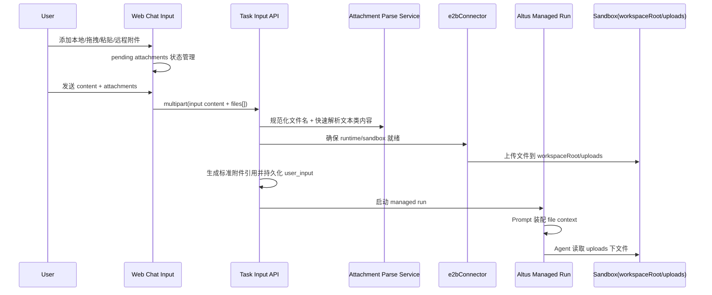

# 02 端到端链路与附件协议

## 1. 目标链路总览



## 2. 目标用户流

### 2.1 输入阶段

用户可通过以下方式把文件加入当前待发送输入：

- 本地选择文件
- 拖拽文件到输入框
- 粘贴图片到输入框
- 输入公开分享链接导入远程文件
- 选择技能模板生成虚拟附件
- 选择 zip 文件时，按规则解包并导入内部文件

### 2.2 提交阶段

前端发送的不是“文本请求 + 附件上传请求”两条链，而是统一的“用户输入请求”：

- 文本内容
- 文件数组
- 客户端消息 key
- 可能的展示元信息

### 2.3 服务端处理阶段

服务端处理顺序固定为：

1. 解析输入
2. 校验文件类型、数量、大小
3. 规范化文件名
4. 解析文本类文件内容
5. 确保 session runtime/sandbox
6. 上传到 `workspaceRoot/uploads`
7. 生成标准附件引用
8. 写入 `user_input` 消息
9. 启动 managed run

### 2.4 Agent 使用阶段

Agent 获得两类附件上下文：

1. 用户消息中的标准附件引用
2. Prompt assembly 注入的文本类附件摘录

## 3. 标准附件落点

统一使用：

- `uploads/` 作为 workspace 内的相对目录
- 实际绝对路径为 `${workspaceRoot}/uploads`

原因：

1. 与 `suna` 的“工作区 uploads 目录”心智一致。
2. 保持 `oneceo` 现有 `workspaceRoot` 机制，不把 Altus/Sandbox 根目录错误写死成 `/workspace`。
3. 用户与 Agent 都容易理解。
4. 工作区内可直接访问，不需要隐藏目录心智转换。
5. 后续文件树、预览面板、下载链接都可直接复用。

明确废弃：

- `workspaceRoot/.attachments`

## 4. 标准附件引用协议

### 4.1 用户消息中的 canonical 格式

每个已成功处理的附件，统一写入消息内容：

```text
[Attached: product-spec.pdf (2.4 MB) -> uploads/product-spec.pdf]
```

如果发生自动重命名：

```text
[Attached: product-spec.pdf (2.4 MB) -> uploads/product-spec_20260327_101530_1.pdf]
```

### 4.2 协议要求

1. `Attached` 为固定关键字。
2. 左侧保留用户原始文件名。
3. 右侧保留 Sandbox 内实际路径。
4. 只写相对 `workspace` 的路径，即 `uploads/...`。
5. 该协议由服务端生成，前端不自行拼接。

### 4.3 为什么不能继续用自然语言列表

当前 `oneceo` 的：

- “已添加以下附件，可直接在工作区中访问”

有三个问题：

1. 不稳定，容易被模型当成普通说明文本。
2. 不利于前端后续做统一解析。
3. 不利于做引用去重、文件追踪、消息比对。

## 5. 消息元数据协议

除消息文本中的 canonical 引用外，仍保留结构化元数据，供前端渲染与业务追踪使用。

建议在 `user_input` 消息中写入：

```json
{
  "attachments": [
    {
      "sourceName": "product-spec.pdf",
      "storedName": "product-spec.pdf",
      "path": "uploads/product-spec.pdf",
      "size": 2516582,
      "mimeType": "application/pdf",
      "uploadedAt": "2026-03-27T10:15:30.000Z",
      "status": "ready"
    }
  ],
  "attachmentContext": [
    {
      "path": "uploads/product-spec.pdf",
      "sourceName": "product-spec.pdf",
      "size": 2516582,
      "mimeType": "application/pdf",
      "parsedText": "......"
    }
  ],
  "originalInput": "请根据附件梳理 PRD",
  "attachmentContextIncluded": true
}
```

### 5.1 元数据用途

- 前端显示附件 chips
- 消息回放
- run 诊断
- 后续产物引用
- Prompt assembly 的稳定输入来源

### 5.2 权威性规则

权威顺序定义为：

1. Sandbox 中的实际文件
2. 消息元数据中的结构化附件记录
3. 消息内容中的附件引用块

其中：

- 用户界面渲染优先使用元数据
- Agent/审计可同时依赖消息文本中的 canonical 引用

## 6. 文本类附件内容上下文

### 6.1 设计目标

与 `suna` 对齐，文本类附件不能只上传路径，必须让 Agent 在本轮执行时拿到核心内容。

### 6.2 处理规则

服务端在收到文件后：

1. 识别文件类型。
2. 对文本、Markdown、JSON、CSV、代码、常见文档文本提取类文件做快速解析。
3. 对单文件解析文本做长度上限截断。
4. 生成本轮 `file context`。
5. 将截断后的解析结果持久化到该条 `user_input` 消息的 `metadata.attachmentContext` 中。

### 6.3 注入方式

不把解析全文直接塞进用户消息正文。

统一由 managed prompt assembly 从最近相关 `user_input.message.metadata.attachmentContext` 中读取并注入：

```text
--- ATTACHED FILE CONTENTS ---
### product-spec.md (12,431 bytes)
...
--- END OF ATTACHED FILES ---
```

### 6.4 图片类规则

图片类附件：

- 只保留 canonical 附件引用和结构化元数据
- 不在 v1 中做 OCR 或视觉描述注入

## 7. 文件名规范化与重名处理

### 7.1 规范化

服务端统一做：

- 路径分隔符剔除
- Unicode 规范化
- 非法字符替换
- 长度截断

### 7.2 重名处理

若 `${workspaceRoot}/uploads` 下已存在同名文件，则自动改名，不覆盖原文件。

规则与 `suna` 保持一致：

- 优先保留原文件名
- 冲突时追加时间戳和序号

## 8. 约束与限制

建议沿用并整理为统一配置：

- 单文件大小上限
- 单次消息附件数量上限
- 压缩包内文件数量上限
- 压缩包解压总大小上限
- 允许类型白名单

这些限制由：

- 前端先行校验
- 服务端二次校验

## 9. 与当前 oneceo 的替换关系

需要替换的当前做法：

1. `appendAttachmentsToPrompt(...)` 生成自然语言附件列表。
2. 先调用 `/sessions/:sessionId/attachments`，再单独发文本。
3. 默认写入 `.attachments/`。

替换后的目标做法：

1. 发送统一的 `content + files[]` 输入请求。
2. 服务端生成 canonical 引用块。
3. 文件统一落到 `${workspaceRoot}/uploads`，消息中只记录相对路径 `uploads/...`。
4. prompt assembly 从消息元数据中的 `attachmentContext` 注入文本类附件上下文。
