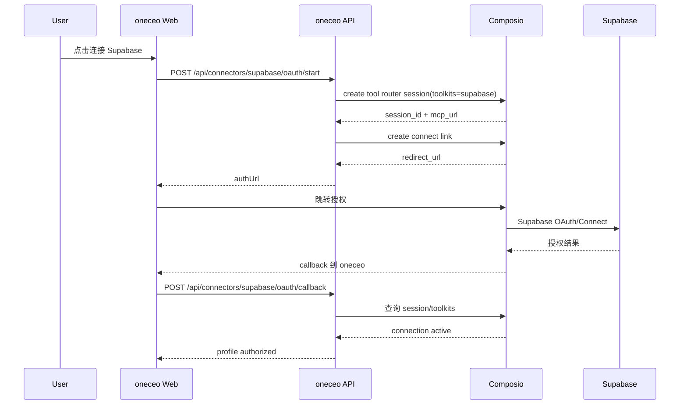
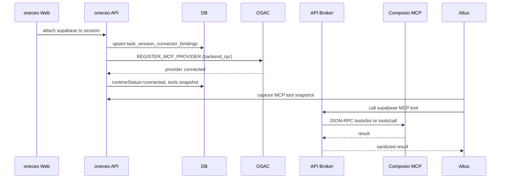

# 20260429 Supabase 按 Notion 模式接入 Composio MCP 方案 [20260429-2305已采用]

状态：`[20260429-2305已采用]`

更新时间：2026-04-29

## 1. 背景与目标

当前 Supabase 仍为 token + remote MCP 直连模式，Composio 已成为 Notion/Figma 的统一授权与 MCP Broker。用户希望“模仿 Notion MCP 的内容”并“全面接入 Composio”，因此 Supabase 需要整体迁移到 Composio Tool Router + oneceo API broker 方案，移除旧 token/remote MCP 主路径。

目标：

1. Supabase 使用方式对齐 Notion：Composio Connect Link 授权 + API broker 暴露 MCP tools。
2. Supabase 不再使用用户手填 token 或直连 MCP，sandbox 不接收任何 Supabase/Composio token。
3. Supabase attach/run 的 runtime transport 统一为 `api_brokered_mcp`。
4. 连接器 guide、错误提示、恢复逻辑、工具快照与 Notion 一致。

## 2. 参照基线

必须对齐：

1. Notion Composio 方案与运行时修复：
   - docs/agent研发文档/20260429_Notion改走Composio_MCP_OAuth清理方案_[20260429-1958已采用].md
   - docs/agent研发文档/20260429_Notion_Composio_runtime_recovery_correction_[20260429-2055已采用].md
2. Figma 复刻 Notion 的完整路径：
   - docs/features/connectors/figma_composio_notion_style_mcp_oauth_doc_[20260429-2145已采用].md
3. Composio Supabase toolkit 资料与 slug：
   - https://docs.composio.dev/toolkits/supabase

## 3. 范围与非目标

范围内：

1. Supabase connectorKey 维持 `supabase` 不变。
2. Supabase 授权入口改为 Composio Connect Link。
3. Supabase profile secret 改为保存 Composio MCP URL + headers（服务端密文）。
4. Supabase attach 后注册 `backend_rpc` hosted provider，API broker 调用 Composio MCP。
5. 移除 Supabase token/remote MCP 直连主路径（含前端表单与 guide）。
6. 全面删除旧 Supabase token/remote MCP 流程代码与配置读取，不保留兼容分支。

非目标：

1. 不保留 token 直连作为兼容或 fallback。
2. 不在 sandbox 内安装/调用 Supabase MCP CLI。
3. 不扩展 Supabase 二级产品能力（Auth/Storage/Functions）以外的 UI 设计。
4. 不新增数据库表或迁移脚本。

## 4. 产品使用模式

### 4.1 设置页连接 Supabase

1. 用户点击“连接 Supabase”。
2. 后端创建或复用默认 profile。
3. 前端调用 `POST /api/connectors/supabase/oauth/start`。
4. 后端通过 Composio 创建 tool router session + connect link。
5. 用户完成授权并回到 oneceo callback。
6. 后端确认 Composio connection active，保存 profile secret 与 metadata。
7. 前端显示 Supabase 已连接。

### 4.2 会话中挂载 Supabase

1. 用户在 task session 内点击“连接并用于当前会话”。
2. OAuth start 携带 `returnToSessionId`。
3. callback 成功后自动 attach 到当前 session。
4. runtime transport 统一为 `api_brokered_mcp`。
5. Altus run 启动前捕获 Supabase MCP tool snapshot。

### 4.3 Agent 使用 Supabase

1. 先调用 `load_connector_guide(connectorKey=supabase)`。
2. 使用已挂载的 `supabase__COMPOSIO_SEARCH_TOOLS` 查询可用动作。
3. 再调用 `supabase__COMPOSIO_GET_TOOL_SCHEMAS` 与 `supabase__COMPOSIO_MULTI_EXECUTE_TOOL` 完成执行。
4. 严禁在 sandbox 内安装/运行 Supabase MCP CLI 或读取 token。

## 5. 架构概览

### 5.1 授权链路



### 5.2 会话运行时链路



## 6. 数据与状态设计

### 6.1 user_connector_profiles

metadata 目标结构：

```json
{
  "provider": "composio",
  "composioUserId": "oneceo_app_user_123",
  "composioSessionId": "trs_xxx",
  "composioToolkitSlugs": ["supabase"],
  "composioConnectedAccountId": "ca_xxx",
  "connectionStatus": "active",
  "lastConnectionCheckAt": "2026-04-29T00:00:00.000Z"
}
```

secret 解密后结构：

```json
{
  "source": "composio",
  "composioMcpUrl": "https://...",
  "composioMcpHeaders": {
    "x-api-key": "***"
  }
}
```

约束：

1. 不再写入 `accessToken`。
2. 旧 token profile 不做自动转换，统一提示重新连接。

### 6.2 task_session_connector_bindings

attach 后 binding 内容：

```json
{
  "provider": "composio",
  "brokerMode": "api_only",
  "toolkitSlugs": ["supabase"],
  "allowedTools": [],
  "tokenInSandbox": false
}
```

`runtimeTransport` 固定为 `api_brokered_mcp`。

## 7. 连接器定义设计

`apps/api/src/connectors/definitions/supabase.ts` 目标形态：

```ts
export function buildSupabaseDefinition(): ConnectorDefinition {
  const toolkitSlugs = resolveSupabaseToolkitSlugs();
  const available = Boolean(asText(process.env.COMPOSIO_API_KEY)) && toolkitSlugs.length > 0;
  return {
    key: 'supabase',
    name: 'Supabase',
    authMode: 'oauth',
    available,
    oauth: { supported: available, provider: 'composio' },
    runtime: { type: 'remote', transport: 'streamable_http', headerTemplate: 'none' },
    composio: {
      provider: 'composio',
      toolkitSlugs,
      authStrategy: 'composio_connect_link',
      brokerMode: 'api_only',
      allowTokenInSandbox: false,
         allowedTools: resolveSupabaseAllowedTools(),
      toolNamePrefix: 'supabase'
    }
  };
}
```

同时移除旧 `configFields` 中的 access token 输入框与文案。

## 8. 关键代码改动清单

后端：

1. `apps/api/src/connectors/definitions/supabase.ts`
   - 切换为 Composio OAuth + composio 配置字段。
   - 删除 token configFields。
2. `apps/api/src/services/user-connector-service.ts`
   - Supabase profile 读取逻辑对齐 Figma：缺少 composio secret 时标记 `needs_auth`。
   - OAuth start/complete 走 `composioConnectorService`。
3. `apps/api/src/services/connector-registry.ts`
   - Supabase 作为 composio provider 时走 hosted provider 分支。
   - 删除 Supabase token header/remote url 构造与依赖。
4. `apps/api/src/services/session-connector-service.ts`
   - 复用现有 composio binding 生成逻辑，确保 runtimeTransport=`api_brokered_mcp`。
5. `apps/api/src/services/session-mcp-recovery-service.ts`
   - Supabase 与 Notion/Figma 一样只认可 `api_brokered_mcp`。
6. `apps/api/src/services/altus-managed-setup-service.ts`
   - MCP tool snapshot 只收录 connected + brokered Supabase provider。
7. `apps/api/src/services/altus-managed-tool-runtime.ts`
   - 增加 Supabase legacy MCP CLI/remote MCP shell 拦截与提示。
8. `apps/api/src/services/connector-guide-service.ts`
   - Supabase guide 文案改为 Composio router tools 使用方式。

前端：

1. `apps/web/client/src/lib/connector-guides.ts`
   - Supabase quick link 改为 Composio toolkit 文档。
   - 步骤与提示改为 Connect Link 授权，不再提示 token。
2. 相关 i18n 文案更新（Supabase guide 及连接器卡片提示）。

配置与文档：

1. `apps/.env.example` 新增 `COMPOSIO_SUPABASE_TOOLKITS` / `COMPOSIO_SUPABASE_ALLOWED_TOOLS`。
2. 注释停用旧 Supabase token/remote MCP 变量与说明。

## 9. 环境变量策略

新增/使用：

```text
COMPOSIO_API_KEY=...
COMPOSIO_SUPABASE_TOOLKITS=supabase
COMPOSIO_SUPABASE_ALLOWED_TOOLS=
```

说明：`COMPOSIO_SUPABASE_ALLOWED_TOOLS` 为空表示不限制工具，使用 Supabase toolkit 全量能力。

停用（仅保留 legacy 注释）：

- 任何 Supabase MCP remote URL / headers / token 直连配置。

## 10. 迁移策略

1. 旧 Supabase token profile 不做自动迁移。
2. 读到非 composio secret 的 Supabase profile 统一标记 `needs_auth` 并提示重新连接。
3. 旧 token profile 不进入 attach/recovery/snapshot。

## 11. 验证与测试

最小验证：

1. `pnpm --filter api type-check`
2. 新增/更新 tests：
   - Supabase composio provider 不被 recovery 迁移
   - MCP snapshot 仅包含 `api_brokered_mcp` Supabase provider

手动验证：

1. 完成 Supabase Connect Link 授权。
2. attach 后 run 内可调用 `supabase__COMPOSIO_SEARCH_TOOLS`。
3. 旧 token profile 显示重新连接提示，不再暴露 MCP tools。

## 12. 风险与观测

1. Composio router tools schema 体积较大，需通过 `COMPOSIO_SEARCH_TOOLS` 先过滤。
2. Supabase 权限较敏感，guide 必须强调确认目标项目与资源。
