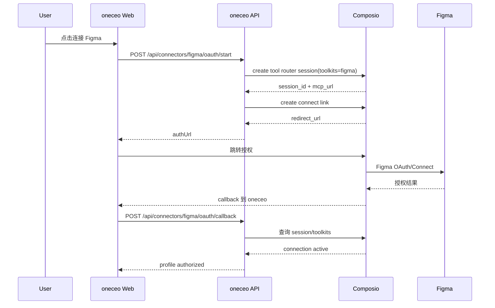
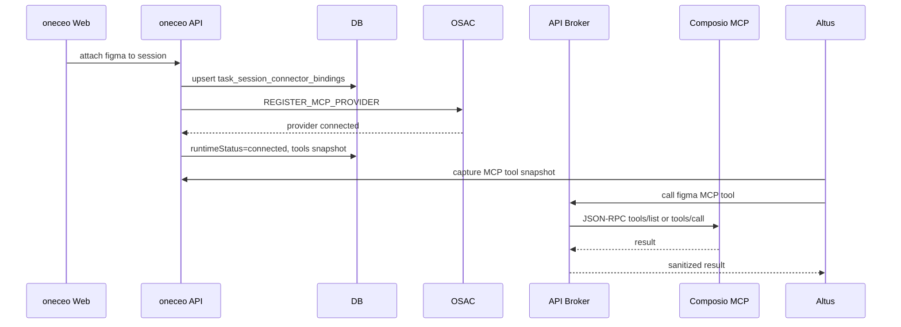

# Figma 按 Notion 使用模式接入 Composio MCP OAuth 方案 [20260429-2145已采用]

## 1. 背景与目标

### 1.1 需求背景

当前仓库里 Notion 已经从“用户手动配置 token / sandbox 内自行装 MCP”调整为“oneceo 平台侧通过 Composio Connect Link 托管授权，并通过 API broker 把 MCP 工具投影到会话中”。用户希望 Figma 也模仿 Notion 的使用模式加入连接器体系。

本方案已由用户确认进入代码实现阶段，状态更新为 `[20260429-2145已采用]`，后续实现、测试与验收以本文档为准。

### 1.2 目标

- Figma 使用方式对齐 Notion：一键连接、授权后自动生成默认 profile、可挂载到当前 task session、run 内通过已挂载 MCP tools 使用。
- 直接删除用户手填 Figma Personal Access Token 路径，Figma 只能通过 Composio Connect Link/OAuth 托管授权接入。
- Composio 侧使用 Figma toolkit；官方 Figma toolkit 页面显示支持 OAuth2 和 API Key，本方案采用 OAuth2/managed auth 主路径。
- Figma MCP 不在 sandbox 内安装、下载、配置或暴露用户 token，sandbox 只接收 oneceo API broker 后的 provider。
- Figma 的会话挂载、恢复、工具快照、guide 加载、错误提示复用 Notion 当前链路。
- 保持最短路径实现：只把 Figma 纳入已验证的 Notion Composio 模式，不额外设计多套兼容路径。

### 1.3 非目标

- 不保留 Figma token 模式作为任何可用路径，包括主路径、备用路径、灰度路径和故障 fallback。
- 不新增 sandbox 内 Figma MCP CLI 安装流程。
- 不绕过 `session-connector-service`、`session-mcp-recovery-service`、`connector-registry` 或现有连接器状态表。
- 不改动 KVM 旧链路。
- 不在本轮实现 Figma 文件级精细权限管理、团队库同步、设计系统资产索引等二级能力。

## 2. 参照基线

### 2.1 直接参照 Notion 现状

Figma 应以当前 Notion Composio 接入方式为直接实现依据：

- 连接器定义：`apps/api/src/connectors/definitions/notion.ts`
- Composio 授权与 MCP broker：`apps/api/src/services/composio-connector-service.ts`
- 用户连接器授权：`apps/api/src/services/user-connector-service.ts`
- 会话挂载与 runtime 注册：`apps/api/src/services/session-connector-service.ts`
- MCP 恢复：`apps/api/src/services/session-mcp-recovery-service.ts`
- Altus run 工具快照：`apps/api/src/services/altus-managed-setup-service.ts`
- 工具调用前 guide 强制加载：`apps/api/src/services/altus-managed-tool-runtime.ts`
- 连接器使用指引：`apps/api/src/services/connector-guide-service.ts`
- 前端连接器中心：`apps/web/client/src/components/ConnectorCenterPanel.tsx`
- 前端连接器 guide：`apps/web/client/src/lib/connector-guides.ts`

### 2.2 当前 Figma 差距

当前 Figma 已经存在连接器定义，但仍然是 token/remote MCP 模式：

- `apps/api/src/connectors/definitions/figma.ts`
  - `authMode: 'token'`
  - 依赖 `FIGMA_MCP_REMOTE_URL`
  - 使用 `X-Figma-Token` header template
  - 前端 guide 指向 Figma personal access token

这与 Notion 当前模式不一致。目标是把 Figma 改成 Composio 托管连接器，与 Notion 同样通过 oneceo API broker 暴露 MCP 工具。

### 2.3 必须删除的旧路径

以下路径在实现时必须直接删除，不允许隐藏、降级保留或仅从 UI 暂时屏蔽：

- 前端 Figma access token 输入框。
- Figma guide 中引导用户去 Figma 生成 Personal Access Token 的文案和链接。
- `create/update connector profile` 中 Figma `accessToken` 作为有效认证输入的分支。
- `connector-registry` 中 Figma `X-Figma-Token` header 生成分支。
- `FIGMA_MCP_REMOTE_URL` / `FIGMA_MCP_REMOTE_HEADERS_JSON` 作为 Figma 主链运行依赖。
- 旧 Figma token profile 自动挂载、自动恢复、自动生成 runtime 的能力。

实现后，任何 Figma token profile 都只能显示为“需要通过 Composio 重新连接”，不能继续驱动 MCP provider。

## 3. 产品使用模式

### 3.1 设置页连接 Figma

用户在设置页或连接器中心看到 Figma 卡片：

1. 未连接时显示“连接 Figma”。
2. 点击后后端自动创建或复用默认 profile。
3. 前端调用 `POST /api/connectors/figma/oauth/start`。
4. 后端通过 Composio 创建 tool router session 和 Connect Link。
5. 浏览器跳转到 Composio/Figma 授权页。
6. 授权完成后回到 oneceo callback。
7. 后端确认 Composio connection active，写入 profile secret 和 metadata。
8. 前端显示 Figma 已连接。

### 3.2 会话中挂载 Figma

用户在 task session 内打开连接器弹窗：

1. Figma 未授权时，按钮文案为“连接并用于当前会话”。
2. OAuth start 时携带 `returnToSessionId`。
3. callback 成功后自动 attach 到当前 session。
4. attach 后 session 内展示 Figma 为 attached/connected。
5. Altus run 启动前捕获 Figma MCP provider 和 tools snapshot。
6. Agent 第一次使用 Figma MCP tool 前必须先调用 `load_connector_guide(connectorKey=figma)`。

### 3.3 Agent 使用 Figma 的方式

Agent 不应该尝试在 sandbox 内获取 Figma token 或安装 Figma MCP。正确路径是：

1. 发现会话已挂载 Figma。
2. 调用 `load_connector_guide(connectorKey=figma)`。
3. 使用已投影的 Figma Composio router tools。
4. 如果需要查找可用动作，先用 `figma__COMPOSIO_SEARCH_TOOLS` 搜索。
5. 再用 schema lookup 和 execute tool 完成读取或写入。

涉及写入 Figma 文件、修改设计内容、创建节点、发布注释等会对第三方产生效果的动作时，仍应按操作确认策略处理。

## 4. 总体架构

### 4.1 授权链路



### 4.2 会话运行时链路



### 4.3 核心原则

- Composio API Key 只存在 oneceo API 服务端。
- Figma 用户授权只落在 Composio connection 和 oneceo profile metadata/secret 中。
- sandbox 不接收 Figma token、Composio API key、Figma OAuth secret。
- 会话只保存 provider 状态、runtime provider id、tool snapshot 和恢复状态。

## 5. 数据与状态设计

### 5.1 复用现有表

- `user_connector_profiles`
  - 保存 Figma 默认 profile、授权状态、展示名、metadata、加密 secret。
- `connector_auth_requests`
  - 保存 OAuth/Connect Link state、callback、returnToSessionId、过期时间、防重放状态。
- `task_session_connector_bindings`
  - 保存 Figma 与 session 的 desiredState、runtimeStatus、providerId、runtimeTransport、tool snapshot。
- `task_session_mcp_recovery_jobs`
  - 复用 session reconcile 任务恢复 Figma provider。
- `task_session_run_mcp_tool_snapshots`
  - 保存 Altus run 启动时可见的 Figma MCP tools。

### 5.2 Profile metadata

Figma profile metadata 建议字段：

```json
{
  "provider": "composio",
  "composioUserId": "oneceo_app_user_<appUserId>",
  "composioSessionId": "<tool_router_session_id>",
  "composioToolkitSlugs": ["figma"],
  "composioConnectedAccountId": "<connected_account_id>",
  "connectionStatus": "active",
  "lastConnectionCheckAt": "2026-04-29T00:00:00.000Z"
}
```

### 5.3 Profile secret

Figma profile secret 建议字段：

```json
{
  "source": "composio",
  "composioMcpUrl": "https://...",
  "composioMcpHeaders": {
    "x-api-key": "***"
  }
}
```

要求：

- secret 必须走现有 `connector-secret-service` 加密。
- 日志、debug、tool result sanitize 不得输出 `x-api-key`、OAuth token、Figma token。
- 如果 profile secret 缺少 `composioMcpUrl`，attach 必须失败并给出明确错误，不进入半连接状态。

### 5.4 Runtime transport

Figma 采用和 Notion 一致的 broker transport：

- `runtime.type = 'remote'`
- `runtime.transport = 'streamable_http'`
- `runtime.headerTemplate = 'none'`
- `composio.brokerMode = 'api_only'`
- `composio.allowTokenInSandbox = false`
- binding 中的 `runtimeTransport = 'api_brokered_mcp'`

## 6. 连接器定义设计

### 6.1 Figma definition 目标形态

`apps/api/src/connectors/definitions/figma.ts` 应从 token 模式调整为 Composio OAuth 模式：

```ts
export function buildFigmaDefinition(): ConnectorDefinition {
  const toolkitSlugs = resolveFigmaToolkitSlugs();
  const available = Boolean(asText(process.env.COMPOSIO_API_KEY)) && toolkitSlugs.length > 0;

  return {
    key: 'figma',
    category: 'app',
    name: 'Figma',
    description: '通过 Composio 托管 Figma 授权与 MCP 工具调用，sandbox 只接收 API broker provider。',
    icon: 'figma',
    isNew: true,
    sortOrder: 50,
    authMode: 'oauth',
    available,
    availabilityReason,
    configFields: [],
    oauth: {
      supported: available,
      provider: 'composio',
    },
    activityMatcherVerified: true,
    visibleInMenu: true,
    runtime: {
      type: 'remote',
      transport: 'streamable_http',
      headerTemplate: 'none',
    },
    composio: {
      provider: 'composio',
      toolkitSlugs,
      authStrategy: 'composio_connect_link',
      brokerMode: 'api_only',
      allowTokenInSandbox: false,
      allowedTools: resolveFigmaAllowedTools(),
      toolNamePrefix: 'figma',
    },
  };
}
```

### 6.2 环境变量

新增或调整：

- `COMPOSIO_API_KEY`
- `COMPOSIO_API_BASE_URL`，可选，默认 `https://backend.composio.dev`
- `COMPOSIO_FIGMA_TOOLKITS`，默认 `figma`
- `COMPOSIO_FIGMA_ALLOWED_TOOLS`，可选，用于灰度限制工具集合

移除主路径依赖：

- `FIGMA_MCP_REMOTE_URL`
- `FIGMA_MCP_REMOTE_HEADERS_JSON`

注意：上述历史 env 对 Figma 连接器不再是运行时输入。实现时应删除 Figma 对它们的读取逻辑，而不是保留为兼容路径。

### 6.3 Toolkit slug 校验

Composio 官方 Figma toolkit 页面路径为 `/toolkits/figma/`，工具页展示 Figma toolkit 标识为 `FIGMA`，并列出 OAuth2/API Key 两种认证方式。oneceo 现有 Notion Composio 实现使用小写 toolkit slug 数组，因此 Figma 默认按 `figma` 接入；如果 Composio API 对大小写或版本有差异，通过 `COMPOSIO_FIGMA_TOOLKITS` 覆盖，不改动整体架构。

参考资料：

- https://docs.composio.dev/toolkits/figma/
- https://docs.composio.dev/tools/figma
- https://docs.composio.dev/toolkits/notion_mcp_oauth
- https://docs.composio.dev/mcp/introduction

## 7. 后端改造清单

### 7.1 `apps/api/src/connectors/definitions/figma.ts`

- 新增 `parseCsvEnv`、`resolveFigmaToolkitSlugs`、`resolveFigmaAllowedTools`。
- 将 `authMode` 从 `token` 改为 `oauth`。
- 删除 accessToken config field。
- 将 availability 从 `FIGMA_MCP_REMOTE_URL` 改为 `COMPOSIO_API_KEY + toolkitSlugs`。
- 添加 `composio` 配置，保持和 Notion 同类字段。
- 删除 `urlEnv: 'FIGMA_MCP_REMOTE_URL'`、`headersEnv: 'FIGMA_MCP_REMOTE_HEADERS_JSON'`、`headerTemplate: 'figma'`。

### 7.2 `apps/api/src/services/composio-connector-service.ts`

现有 `startAuthorization`、`confirmAuthorization`、`executeRpc` 已按 connectorKey 泛化，Figma 应直接复用。

需要确认：

- `startAuthorization` 支持 `connectorKey: 'figma'`。
- `toolkitSlugs` 来自 Figma definition。
- `toolNamePrefix` 生成 `figma__...` 工具名。
- `COMPOSIO_SEARCH_TOOLS` 参数规范对 Figma 同样生效。

### 7.3 `apps/api/src/services/user-connector-service.ts`

需要对齐 Notion：

- Figma connector-level OAuth start 走 `composioConnectorService.startAuthorization`。
- callback 走 `composioConnectorService.confirmAuthorization`。
- OAuth 成功后默认 profile 名称建议为 `Figma Default`。
- 如果 callback 携带 `returnToSessionId`，继续自动 attach。
- 如果已有 Figma token profile，迁移后必须标记为需要重新授权；后端不得读取旧 token、不得把旧 token 转换为 Composio secret、不得用旧 token 自动 attach。

### 7.4 `apps/api/src/services/session-connector-service.ts`

Figma attach 时必须走 API broker provider：

- provider name 建议 `oneceo-figma-composio-mcp`。
- `rpcNamespace = 'mcp'`。
- `runtimeTransport = 'api_brokered_mcp'`。
- runtime context 里传入 `connectorKey='figma'`、profile secret、profile metadata、catalog item。
- attach 成功后保存 `runtimeAttachedToolsJson`。

### 7.5 `apps/api/src/services/connector-registry.ts`

- 对 Figma Composio 模式不再生成 `X-Figma-Token` header。
- 删除 `headerTemplate: 'figma'` 以及对应的 Figma header template 分支。
- activity matcher 保持 Figma provider/tool 名识别。
- 如果 connector item 带 `composio.brokerMode='api_only'`，由 API broker 处理 JSON-RPC，不向 sandbox 下发凭据。

### 7.6 `apps/api/src/services/session-mcp-recovery-service.ts`

当前 Notion 有特殊校验：只有 `runtimeTransport='api_brokered_mcp'` 且存在 runtime tools 才认为恢复完成。

Figma 接入后应将特殊判断扩展为“Composio brokered connector 集合”：

```ts
const COMPOSIO_BROKERED_CONNECTORS = new Set(['notion', 'figma']);
```

校验要求：

- Notion 和 Figma 都必须是 `api_brokered_mcp`。
- Notion 和 Figma 都必须有 `runtimeAttachedToolsJson`。
- 其他非 broker connector 继续按现有逻辑判断。

### 7.7 `apps/api/src/services/altus-managed-setup-service.ts`

当前 MCP snapshot 对 Notion 特判 `api_brokered_mcp`。Figma 接入后同样扩展为 brokered connector 集合，避免 Altus run 捕获到未完成或错误 transport 的 provider。

### 7.8 `apps/api/src/services/altus-managed-tool-runtime.ts`

需要新增 Figma 误用拦截：

- 禁止在 sandbox shell 中安装或运行 Figma MCP CLI。
- 禁止要求用户提供 Figma token 给 sandbox。
- 如果检测到 legacy Figma MCP shell 命令，应返回错误并提示使用已挂载的 Figma Composio tools。

Notion 当前已有类似拦截，Figma 应复用同类机制。

### 7.9 `apps/api/src/services/connector-guide-service.ts`

新增 Figma guide：

- 说明 Figma 通过 oneceo API broker + Composio Tool Router 使用。
- 禁止 sandbox 内安装、curl、运行 Figma MCP。
- 第一次使用前必须调用 `load_connector_guide(connectorKey=figma)`。
- 工具查找从 `figma__COMPOSIO_SEARCH_TOOLS` 开始。
- 写入 Figma 文件、创建/修改节点、发布评论前必须明确目标 file/page/node。
- 如果用户只提供 Figma URL，先解析 file key/page/node，再读取结构，不要假设目标范围。

## 8. 前端改造清单

### 8.1 `apps/web/client/src/lib/connectors-client.ts`

- `ConnectorKey` 已包含 `figma`，保持。
- Figma OAuth 使用 connector-level start/callback。
- 删除 Figma `accessToken` 字段输入、校验、提交和本地状态。

### 8.2 `apps/web/client/src/components/ConnectorCenterPanel.tsx`

Figma 应进入和 Notion 一致的统一 OAuth 卡片逻辑：

- `shouldUseConnectorLevelOauth` 增加 `figma`。
- `shouldUseUnifiedConnectorCard` 增加 `figma`。
- 无 profile 时点击连接自动创建或复用默认 profile。
- callback path 可复用通用 query 参数模式；如需固定 path，可新增 `/figma/callback`，但建议优先复用通用连接器 OAuth callback，减少特殊入口。
- OAuth 成功且有 `targetSessionId` 时自动 attach。

### 8.3 `apps/web/client/src/lib/connector-guides.ts`

Figma guide 从 token 文档切换为 Composio/Figma 连接说明：

- 链接指向内部连接器说明或 Composio/Figma OAuth 文档。
- 步骤改为“点击连接、完成授权、在会话中挂载”。
- tips 强调“不要把 Figma token 粘贴进会话或 sandbox”。
- 删除 Figma Personal Access Token 生成页面链接。

### 8.4 `apps/web/client/src/locales/zh.json` 与 `en.json`

更新 Figma 文案：

- `connectors.guides.figma.*`
- Figma 连接按钮、授权成功、授权失败、自动挂载失败提示。
- 删除 personal access token 引导文案，不使用“可选 token”“手动 token”“备用 token”等表达。

## 9. 接口行为

### 9.1 OAuth start

`POST /api/connectors/figma/oauth/start`

入参：

```json
{
  "redirectUri": "https://oneceo.example.com/settings?connector=figma",
  "returnToSessionId": "optional-session-id"
}
```

出参：

```json
{
  "success": true,
  "data": {
    "authUrl": "https://...",
    "requestId": "...",
    "state": "..."
  }
}
```

### 9.2 OAuth callback

`POST /api/connectors/figma/oauth/callback`

入参：

```json
{
  "state": "...",
  "code": "optional-if-composio-provides-code",
  "redirectUri": "https://oneceo.example.com/settings?connector=figma"
}
```

出参：

```json
{
  "success": true,
  "data": {
    "profile": {
      "connectorKey": "figma",
      "profileName": "Figma Default",
      "authStatus": "authorized"
    },
    "returnToSessionId": "optional-session-id"
  }
}
```

### 9.3 会话挂载

`POST /api/task-creation/sessions/:sessionId/connectors/figma/attach`

行为：

- 校验 session 归属当前 app user。
- 校验 Figma profile 授权状态。
- 注册 brokered MCP provider。
- 保存 runtime provider 与 tools。
- 返回 session connector status。

### 9.4 会话卸载

`POST /api/task-creation/sessions/:sessionId/connectors/figma/detach`

行为：

- desiredState 改为 detached。
- 从 runtime 移除 provider。
- 清空 runtime provider id、tools、恢复状态。

## 10. 错误场景

### 10.1 Composio 未配置

条件：

- `COMPOSIO_API_KEY` 缺失。
- `COMPOSIO_FIGMA_TOOLKITS` 为空。

行为：

- Figma 卡片显示 unavailable。
- 后端 start OAuth 返回明确错误。
- 不展示 token 输入作为替代方案。

### 10.2 授权未完成

条件：

- callback 后查询 Composio session/toolkit，connection inactive。

行为：

- profile 保持 needs_auth 或 error。
- 提示重新连接 Figma。
- 不创建 attached binding。

### 10.3 Attach 失败

条件：

- profile 已授权，但 OSAC provider 注册失败。
- MCP tools/list 失败。

行为：

- 保留 profile authorized。
- session binding 标记 failed 或 pending_recover。
- 允许用户重试 attach。
- 不回滚 OAuth 授权。

### 10.4 Sandbox 恢复

条件：

- session 已 attached，但 sandbox 重建或恢复。

行为：

- recovery job 调用 `sessionConnectorService.reconcileByOrchestratorSessionId`。
- Figma provider 必须重新注册并拿到 tools。
- 未拿到 tools 时不能标记 recovered。

### 10.5 工具写入风险

条件：

- Agent 准备修改 Figma 文件、节点、评论或共享状态。

行为：

- 必须明确目标 file/page/node。
- 高影响或外部可见写入需按确认策略处理。
- 不允许从历史、剪贴板、浏览记录推断目标 Figma 文件。

## 11. 测试方案

### 11.1 API 单元测试

新增或更新：

- `apps/api/tests/user-connector-service.test.ts`
  - Figma OAuth start 调用 Composio。
  - Figma callback 写入 authorized profile。
  - Composio inactive 时失败。
  - 旧 token profile 不被当作 authorized Composio profile。

- `apps/api/tests/session-connector-service.test.ts`
  - Figma attach 注册 `api_brokered_mcp` provider。
  - attach 保存 runtime tools。
  - detach 清理 runtime provider。

- `apps/api/tests/session-mcp-recovery-service.test.ts`
  - Figma brokered provider 没有 tools 时不能视为 recovered。
  - Figma brokered provider transport 错误时不能视为 recovered。
  - Figma 和 Notion 同时 attached 时恢复全部完成才成功。

- `apps/api/tests/altus-managed-setup-service.test.ts`
  - Figma tool snapshot 只采集 connected + api_brokered_mcp provider。

### 11.2 Web 测试

新增或更新：

- `apps/web/client/src/tests/connector-center-panel.test.ts`
  - Figma 显示 OAuth 连接卡片。
  - 未授权时不展示 access token 输入。
  - callback 成功后显示已连接。
  - 带 session 的 callback 自动 attach。

### 11.3 手工验收

1. 清空 Figma profile。
2. 打开连接器中心，点击 Figma 连接。
3. 完成 Composio/Figma 授权。
4. 回到 oneceo 后 Figma 显示 authorized。
5. 在 task session 中 attach Figma。
6. 启动 Altus run。
7. Agent 调用 `load_connector_guide(connectorKey=figma)`。
8. Agent 可见并可调用 `figma__COMPOSIO_SEARCH_TOOLS` 等工具。
9. 重建或恢复 sandbox 后，Figma provider 自动恢复。
10. detach 后 run 内不再可调用 Figma tools。

## 12. 发布与迁移

### 12.1 发布前

- 确认 Composio Figma toolkit slug。
- 配置 `COMPOSIO_API_KEY`。
- 配置 `COMPOSIO_FIGMA_TOOLKITS`。
- 如需灰度，配置 `COMPOSIO_FIGMA_ALLOWED_TOOLS`。
- 移除生产主路径对 `FIGMA_MCP_REMOTE_URL` 的依赖。

### 12.2 旧 token profile 处理

本方案不做兼容性运行路径。旧 token profile 直接废止运行能力，并进入以下状态：

- UI 显示“需要重新连接”。
- 后端不使用旧 accessToken 生成 Figma runtime。
- 用户重新走 Composio/Figma OAuth 后生成新的 authorized profile secret。
- 清除授权或重新连接时，可删除旧 token secret；删除本地或云端数据前仍按确认策略执行。

### 12.3 灰度策略

最短路径灰度只允许通过可见性和工具 allowlist 控制：

- 环境未配置 Composio 时 Figma unavailable。
- `COMPOSIO_FIGMA_ALLOWED_TOOLS` 限制可用工具。
- 不引入 token fallback 或 sandbox fallback。

## 13. 验收标准

必须全部满足：

1. Figma 卡片不再要求用户输入 Figma token。
2. 代码中不存在可提交 Figma `accessToken` 并使 profile 授权成功的路径。
3. Figma runtime 不再读取 `FIGMA_MCP_REMOTE_URL` 或生成 `X-Figma-Token`。
4. 旧 Figma token profile 不能 attach，不能进入 recovered，不能进入 MCP tool snapshot。
5. 用户可通过一键连接完成 Composio/Figma 授权。
6. Figma 授权成功后写入 authorized profile。
7. 带 `returnToSessionId` 的授权成功后自动 attach 到当前 session。
8. Figma attach 后 binding 的 runtime transport 为 `api_brokered_mcp`。
9. Figma MCP tools 能进入 Altus run snapshot。
10. Agent 首次使用 Figma MCP tool 前会被 guide 机制约束。
11. sandbox 内不会出现 Figma token、Composio API key、Figma OAuth secret。
12. sandbox 恢复后 Figma provider 可重新注册并恢复 tools。
13. detach 或清除授权后，Figma tools 不再可用。

## 14. 实施顺序

1. 更新本文档状态为 `[yyyymmdd-hhmm已采用]`。
2. 修改 Figma connector definition。
3. 复用并补齐 Composio OAuth start/callback 分支。
4. 改造 Figma attach runtime 为 API brokered MCP。
5. 扩展 recovery/snapshot 中的 Notion 特判为 brokered connector 集合。
6. 新增 Figma connector guide 与误用拦截。
7. 更新前端 Figma 卡片与文案。
8. 补 API 和 Web 测试。
9. 执行最小验证：
   - `node --import tsx --test --experimental-test-isolation=none tests/user-connector-service.test.ts`
   - `node --import tsx --test --experimental-test-isolation=none tests/session-connector-service.test.ts`
   - `node --import tsx --test --experimental-test-isolation=none tests/session-mcp-recovery-service.test.ts`
   - `pnpm --filter web exec vitest run client/src/tests/connector-center-panel.test.ts`
   - `npm run build`

## 15. 待确认问题

进入代码实现前需要确认：

1. Figma 是否需要固定 callback path，例如 `/figma/callback`，还是复用现有通用 OAuth callback query 模式。
2. 第一阶段允许的 Figma tools 范围，是全部开放，还是通过 `COMPOSIO_FIGMA_ALLOWED_TOOLS` 只开放 read/search 类工具。
3. 是否使用 Composio managed Figma app，还是在 Composio 中配置自有 Figma OAuth credentials；两者不影响 oneceo 内部 broker 架构，但会影响部署配置与授权页面归属。

## 16. 状态

- 当前状态：`[20260429-2145已采用]`
- 编写日期：2026-04-29
- 适用范围：Figma 连接器按 Notion Composio MCP OAuth 使用模式接入
- 下一步：按本文档进入实现阶段。

## 17. 2026-04-29 运行问题修正

### 17.1 现象

实际运行中，Figma provider 可以成功挂载，工具列表中也可以看到 `figma__COMPOSIO_SEARCH_TOOLS`，但调用搜索型元工具时容易出现底层 Tool Router 超时，随后 managed run 因模型连续未继续调用工具而终止。

### 17.2 原因

Figma 和 Notion 的授权、挂载、API-brokered MCP 链路一致，但 Figma toolkit 当前工具数量更多、schema 体量更大。公开 Composio Figma toolkit 页面显示 Figma 最新版本为 `20260415_00`，工具数为 `53`。因此 Figma 的 `COMPOSIO_SEARCH_TOOLS` 作为远端搜索型元工具，比 Notion 更容易超过 OSAC/managed tool 调用窗口。

### 17.3 修正

- Figma 的 `COMPOSIO_SEARCH_TOOLS` 不再转发到远端 Composio Tool Router 搜索。
- oneceo 平台侧返回确定性的 Figma 常用工具发现结果，包括：
  - `FIGMA_GET_CURRENT_USER`
  - `FIGMA_DISCOVER_FIGMA_RESOURCES`
  - `FIGMA_GET_FILE_METADATA`
  - `FIGMA_GET_FILE_JSON`
  - `FIGMA_GET_FILE_NODES`
  - `FIGMA_RENDER_IMAGES_OF_FILE_NODES`
  - `FIGMA_GET_COMMENTS_IN_A_FILE`
  - `FIGMA_ADD_A_COMMENT_TO_A_FILE`
- 真实执行仍通过 Composio 的 `COMPOSIO_GET_TOOL_SCHEMAS` 与 `COMPOSIO_MULTI_EXECUTE_TOOL` 完成，避免把认证或业务执行绕出 Composio。
