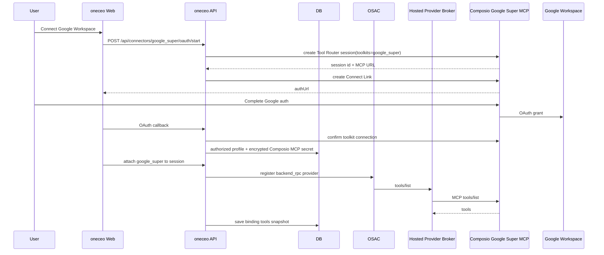
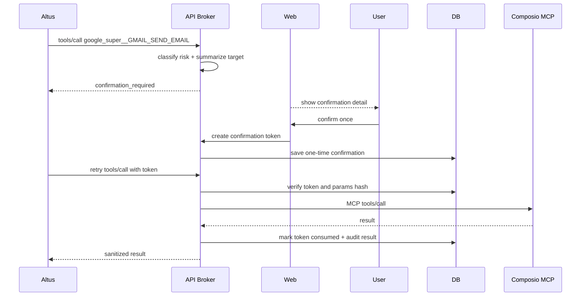

# Google Super 接入 Composio MCP OAuth 方案 [20260504-1118已采用]

状态：`[20260504-1118已采用]`

编写日期：2026-05-04

## 1. 背景与目标

用户确认 Google Workspace 能力不按 Drive、Docs、Sheets、Calendar、Gmail 分阶段拆接，直接接入 Composio 的 `Google Super` toolkit。oneceo 内部仍必须沿用当前连接器、MCP、OSAC、会话绑定、run snapshot 与恢复链路，不能让 sandbox 直连 Composio，也不能把 Google token、Composio API key 或 MCP header 下发给前端、模型或 sandbox。

目标：

1. 新增 `google_super` 连接器，底层使用 Composio `Google Super` toolkit，toolkit slug 固定为 `googlesuper`。
2. 用户通过 Composio Connect Link 完成 Google Workspace 授权。
3. 授权成功后可把 `google_super` attach 到 task session。
4. Altus run 只看到 oneceo API broker 投影后的 MCP tools。
5. 高风险 Google 操作在真正执行前必须让用户确认一遍；确认只覆盖本次明确 tool call，不成为长期默认放行。
6. 审计记录必须能复核用户、会话、run、tool、目标对象、确认状态与执行结果。

非目标：

1. 不拆成多个连接器 key，例如 `gmail`、`google_drive`、`google_calendar`。
2. 不新增 Google 官方 OAuth 直连链路。
3. 不保留“手工粘贴 Google token/API key”的兼容路径。
4. 不让 sandbox 安装或运行任何 Google Workspace MCP server。
5. 不新增另一套 MCP provider 状态表；继续复用现有 profile、binding、recovery job、tool snapshot。

## 2. 直接实现依据

直接复用当前 Composio MCP 模式：

1. `apps/api/src/services/composio-connector-service.ts`
2. `apps/api/src/services/connector-registry.ts`
3. `apps/api/src/services/user-connector-service.ts`
4. `apps/api/src/services/session-connector-service.ts`
5. `apps/api/src/services/hosted-provider-host-service.ts`
6. `apps/api/src/services/session-mcp-recovery-service.ts`
7. `apps/api/src/services/altus-managed-setup-service.ts`
8. `apps/api/src/services/connector-guide-service.ts`
9. `apps/web/client/src/components/ConnectorCenterPanel.tsx`
10. `apps/web/client/src/lib/connector-guides.ts`

参考现有文档：

1. `docs/agent研发文档/20260429_Notion改走Composio_MCP_OAuth清理方案_[20260429-1958已采用].md`
2. `docs/features/connectors/figma_composio_notion_style_mcp_oauth_doc_[20260429-2145已采用].md`
3. `docs/features/connectors/github_composio_notion_style_mcp_oauth_doc_[20260430-1356已采用].md`

## 3. 产品行为

### 3.1 连接器中心

连接器中心新增 Google Super 卡片：

1. 未授权时显示“连接 Google Workspace”。
2. 点击后调用统一 connector OAuth start。
3. 后端创建 Composio Tool Router session，并为 Google Super 生成 Connect Link。
4. 用户在 Composio/Google 授权页完成授权。
5. callback 返回 oneceo 后，后端确认 Composio connection active，写入 authorized profile。
6. 授权成功后，用户可把 Google Super 用于当前会话。

### 3.2 会话 attach

用户在 task session 中 attach Google Super：

1. 后端校验当前 app user 拥有该 profile。
2. 后端校验 profile 是 Composio authorized。
3. `task_session_connector_bindings` 写入 `desiredState='attached'`。
4. OSAC 注册 backend RPC provider。
5. API broker 调 Composio MCP `tools/list`，保存 runtime tools。
6. Altus run 启动时采集 Google Super MCP tool snapshot。

### 3.3 工具暴露与模型引导

Google Super tools 全量可见/可用，但不能把全部 tool schema 一次性灌进模型上下文。Google Super 工具数量多、schema 体积大，直接注入会降低模型选工具质量，也会增加上下文噪音。

运行时策略：

1. `COMPOSIO_GOOGLE_SUPER_ALLOWED_TOOLS` 默认留空，表示 oneceo 不在连接器层限制 Google Super tools。
2. Altus prompt / connector guide / dynamic context 只引导模型优先使用搜索与 schema 查询类工具。
3. 模型需要具体 Google 能力时，先调用 `google_super__COMPOSIO_SEARCH_TOOLS` 查找候选工具。
4. 确定具体工具后，再调用 `google_super__COMPOSIO_GET_TOOL_SCHEMAS` 获取当前工具 schema。
5. 最后通过 `google_super__COMPOSIO_MULTI_EXECUTE_TOOL` 或 Composio 返回的执行工具完成调用。
6. 不把 Google Super 的全量 schema 直接追加到 stable prompt、run prompt 或一次性 MCP context block。

该策略不减少 Google Super 能力范围，只改变“给 AI 看见和选择工具”的方式。

### 3.4 高风险确认

高风险操作需要用户确认一遍，确认规则如下：

1. agent 第一次请求执行高风险 tool 时，后端不直接转发到 Composio。
2. 后端返回 `confirmation_required` 类型的 tool result，内容包含：
   - connector：`google_super`
   - tool name
   - 动作类型
   - 目标对象摘要，例如 email recipient、calendar event、drive file、sheet id、doc id
   - 主要参数摘要
   - 预期影响
3. 前端在会话内展示确认层，用户明确确认后，后端生成一次性 confirmation token。
4. agent 或运行时带 confirmation token 重试同一个 tool call。
5. managed 模式下，批准后优先由后端隐式恢复并重放原始待确认 tool call，用户时间线不额外展示注入提示。
6. 后端校验 token 只匹配同一 user、session、run、tool、参数摘要和有效期。
7. 校验通过后只执行这一次 tool call。
8. 执行完成或失败后 token 立即失效。

确认不是 OAuth 授权，不改变 Google scope，也不代表后续同类动作自动放行。

## 4. 高风险工具分类

Google Super 暴露的工具数量与命名可能随 Composio 更新，因此分类不能只依赖固定 tool 名。实现时采用“工具名规则 + 参数语义”的最短路径分类。

低风险，默认允许执行：

1. list/search/get/read 类操作。
2. 读取 Drive 文件元数据。
3. 读取 Docs/Sheets/Calendar/Gmail 中用户已授权可见的数据。
4. Composio meta tools：`COMPOSIO_SEARCH_TOOLS`、`COMPOSIO_GET_TOOL_SCHEMAS`。

高风险，必须确认：

1. Gmail：send、reply、forward、draft send、delete、archive、label mutation。
2. Calendar：create、update、delete event，邀请参会人，改时间，取消会议。
3. Drive：create、update、delete、move、share、permission mutation、upload、copy。
4. Docs：create、update、batch update、insert、delete、comment mutation。
5. Sheets：create、update、append、clear、batch update、delete sheet、权限变更。
6. Tasks：create、update、delete、complete。
7. 任何 tool 名或 schema 中出现 `delete`、`remove`、`send`、`share`、`permission`、`invite`、`update`、`create`、`write`、`append`、`clear`、`move`、`copy`、`upload` 等写入语义。

确认摘要必须尽量展示真实对象，不允许只显示“将执行某 Google 操作”。如果参数中缺少可复核目标，例如没有收件人、文件 id、event id、spreadsheet id，后端应拒绝执行并要求 agent 先补齐目标。

## 5. 总体架构



高风险执行链路：



## 6. 数据与状态

### 6.1 连接器定义

新增文件：

```text
apps/api/src/connectors/definitions/google-super.ts
```

目标定义：

```ts
export function buildGoogleSuperDefinition(): ConnectorDefinition {
  const toolkitSlugs = parseCsvEnv('COMPOSIO_GOOGLE_SUPER_TOOLKITS', ['googlesuper']);
  const available = Boolean(process.env.COMPOSIO_API_KEY) && toolkitSlugs.length > 0;

  return {
    key: 'google_super',
    category: 'app',
    name: 'Google Workspace',
    description: '通过 Composio Google Super 接入 Google Workspace MCP 工具。',
    icon: 'google',
    authMode: 'oauth',
    available,
    configFields: [],
    oauth: { supported: available, provider: 'composio' },
    runtime: {
      type: 'remote',
      transport: 'streamable_http',
      headerTemplate: 'none',
    },
    composio: {
      provider: 'composio',
      toolkitSlugs,
      authStrategy: 'composio_connect_link',
      brokerMode: 'api_only',
      allowTokenInSandbox: false,
      allowedTools: parseCsvEnv('COMPOSIO_GOOGLE_SUPER_ALLOWED_TOOLS'),
      toolNamePrefix: 'google_super',
    },
  };
}
```

Composio Google Super toolkit slug 采用 `googlesuper`。如果后续 Composio 平台变更 slug，只通过 `COMPOSIO_GOOGLE_SUPER_TOOLKITS` 修正，不在代码内做多 slug 猜测。

### 6.2 Profile metadata

`user_connector_profiles.metadataJson`：

```json
{
  "provider": "composio",
  "composioUserId": "oneceo_app_user_<appUserId>",
  "composioSessionId": "<tool_router_session_id>",
  "composioToolkitSlugs": ["google_super"],
  "composioConnectedAccountId": "<connected_account_id>",
  "composioDisplayName": "user@example.com",
  "connectionStatus": "active",
  "lastConnectionCheckAt": "2026-05-04T00:00:00.000Z"
}
```

`user_connector_profiles.secretCiphertext` 解密后：

```json
{
  "source": "composio",
  "composioMcpUrl": "https://...",
  "composioMcpHeaders": {
    "x-api-key": "***"
  }
}
```

### 6.3 Confirmation 状态

新增一张最小表或等价 DAO，命名建议：

```text
task_session_mcp_tool_confirmations
```

字段建议：

1. `id`
2. `app_user_id`
3. `task_session_id`
4. `agent_run_id`
5. `connector_key`
6. `tool_name`
7. `arguments_hash`
8. `summary_json`
9. `status`：`pending`、`approved`、`consumed`、`expired`、`rejected`
10. `expires_at`
11. `approved_at`
12. `consumed_at`
13. `created_at`
14. `updated_at`

该表只保存参数摘要和 hash，不保存完整 Gmail 正文、完整文件内容、完整表格数据。完整敏感内容继续只存在当前 tool call 请求上下文中。

## 7. 后端修改范围

### 7.1 connector definition

修改：

1. `apps/api/src/connectors/definitions/index.ts`
2. `apps/api/src/connectors/definitions/types.ts`
3. 新增 `apps/api/src/connectors/definitions/google-super.ts`

要求：

1. `CONNECTOR_KEYS` 增加 `google_super`。
2. `resolveOauthProvider` 不新增 Google 官方 provider。
3. `google_super` 只进入 Composio OAuth 分支。

### 7.2 Composio service

文件：`apps/api/src/services/composio-connector-service.ts`

要求：

1. 不新增 `startGoogleSuperAuthorization` 专属方法。
2. 继续复用 `startAuthorization`、`confirmAuthorization`、`executeRpc`。
3. `executeRpc` 对 `tools/call` 增加确认前置检查钩子。
4. 确认检查只对 `connectorKey === 'google_super'` 生效。
5. meta tools 不进入高风险确认。

### 7.3 Hosted provider broker

文件：`apps/api/src/services/hosted-provider-host-service.ts`

要求：

1. `google_super` 进入现有 Composio hosted provider 分支。
2. 执行前传入 task session、run id、user id，供确认 token 校验和审计使用。
3. 失败结果必须脱敏，不输出 Google OAuth token、Composio header 或敏感邮件正文。

### 7.4 Session attach/recovery/snapshot

修改：

1. `apps/api/src/services/session-connector-service.ts`
2. `apps/api/src/services/session-mcp-recovery-service.ts`
3. `apps/api/src/services/altus-managed-setup-service.ts`
4. `apps/api/src/services/connector-registry.ts`

要求：

1. `google_super` runtime transport 为 `api_brokered_mcp`。
2. provider 注册 payload 不包含 token/header/MCP URL。
3. recovery 只有在 provider 恢复且 tools/list 成功后才算 recovered。
4. run snapshot 只采集 connected + api_brokered_mcp 的 Google Super tools。

### 7.5 确认服务

新增服务建议：

```text
apps/api/src/services/mcp-tool-confirmation-service.ts
```

职责：

1. `classifyRisk(connectorKey, toolName, args, schema?)`
2. `buildConfirmationSummary(connectorKey, toolName, args)`
3. `createPendingConfirmation(...)`
4. `approveConfirmation(...)`
5. `verifyAndConsumeConfirmation(...)`
6. `writeAuditEvent(...)`

实现约束：

1. 参数 hash 必须稳定，使用 JSON canonicalize 后 hash。
2. token 只能一次性使用。
3. token 绑定 user、session、run、connector、tool、arguments hash。
4. token 默认有效期建议 10 分钟。
5. 参数变化后必须重新确认。

## 8. 前端修改范围

### 8.1 连接器中心

修改：

1. `apps/web/client/src/components/ConnectorCenterPanel.tsx`
2. `apps/web/client/src/lib/connectors-client.ts`
3. `apps/web/client/src/lib/connector-guides.ts`
4. `apps/web/client/src/locales/zh.json`
5. `apps/web/client/src/locales/en.json`

要求：

1. Google Super 走统一 OAuth 连接卡片。
2. 不展示 token 输入。
3. 授权成功后展示 Google 账号摘要。
4. 会话 attach 与 detach 行为和 Notion/Figma/GitHub Composio 连接器一致。

### 8.2 高风险确认 UI

前端需要在会话运行区显示确认层：

1. 标题：确认 Google Workspace 操作。
2. 内容：tool、目标对象、主要参数、影响说明。
3. 操作：确认执行、拒绝。
4. 确认后调用后端 approve 接口。
5. 确认或拒绝都必须通过 managed input 提交结构化 `mcpToolConfirmation` metadata，不能只依赖自然语言提示。
6. 后端要基于该 metadata 做恢复：
   - 确认时优先隐藏重放同一个 Google Workspace tool call，并仅在内部补充 `confirmationToken` 与 `confirmationAgentRunId`
   - 仅在无法隐藏重放的异常诊断场景下，才允许保留后端内部恢复提示；该提示不得落到用户可见时间线
   - 拒绝时要求 AI 不得重试该高风险 tool call
7. 拒绝后把 confirmation 标记为 rejected，agent 本次 tool call 不执行。

UI 必须符合“任务塔台”原则：高密度、对象清晰、后果可复核，不使用泛化弹窗文案。

## 9. 接口设计

### 9.1 OAuth start

```http
POST /api/connectors/google_super/oauth/start
```

入参：

```json
{
  "redirectUri": "https://oneceo.example.com/google-super/callback",
  "returnToSessionId": "optional-session-id"
}
```

出参：

```json
{
  "success": true,
  "data": {
    "authUrl": "https://...",
    "requestId": "...",
    "state": "..."
  }
}
```

### 9.2 OAuth callback

```http
POST /api/connectors/google_super/oauth/callback
```

行为复用通用 Composio callback，成功后 profile 为 `authorized`。

### 9.3 确认创建

高风险 tool call 触发时，后端返回 tool result：

```json
{
  "type": "confirmation_required",
  "connectorKey": "google_super",
  "toolName": "google_super__GMAIL_SEND_EMAIL",
  "confirmationId": "...",
  "summary": {
    "action": "send_email",
    "target": "user@example.com",
    "impact": "Send one email from the connected Google account."
  }
}
```

### 9.4 确认审批

```http
POST /api/task-creation/sessions/:sessionId/mcp-confirmations/:confirmationId/approve
```

出参：

```json
{
  "success": true,
  "data": {
    "confirmationToken": "...",
    "expiresAt": "2026-05-04T00:10:00.000Z"
  }
}
```

## 10. 环境变量

新增：

```text
COMPOSIO_API_KEY=
COMPOSIO_API_BASE_URL=https://backend.composio.dev
COMPOSIO_GOOGLE_SUPER_TOOLKITS=googlesuper
COMPOSIO_GOOGLE_SUPER_ALLOWED_TOOLS=
GOOGLE_SUPER_CONFIRMATION_TOKEN_TTL_SECONDS=600
```

说明：

1. `COMPOSIO_GOOGLE_SUPER_ALLOWED_TOOLS` 为空时，允许 Composio Google Super 返回的全部 tools 可用。
2. 全量可用不等于全量 schema 注入模型；模型必须优先通过搜索工具和 schema 查询工具按需发现。
3. 即使全部 tools 可见，高风险 tools 仍必须走一次性确认。
4. 不新增 Google OAuth client id/secret 环境变量。

## 11. 测试计划

API 测试：

1. catalog 在 `COMPOSIO_API_KEY` 存在时显示 `google_super` available。
2. OAuth start 调用 Composio Tool Router session，并使用 `COMPOSIO_GOOGLE_SUPER_TOOLKITS`。
3. callback 后写入 authorized profile，secret 只有 Composio MCP URL/header。
4. attach 后 binding transport 为 `api_brokered_mcp`。
5. tools/list 返回 `google_super__...` 前缀工具。
6. run prompt 或 dynamic MCP context 不直接包含 Google Super 全量 schema。
7. connector guide 明确要求先调用 `google_super__COMPOSIO_SEARCH_TOOLS`，再按需调用 schema 查询与执行工具。
8. read/search/get 类工具不要求确认。
9. send/update/delete/share 类工具返回 `confirmation_required`。
10. 用户确认后，同一参数 hash 的同一 tool call 可执行一次。
11. 参数变化、token 过期、token 已消费、用户/session/run 不匹配时拒绝执行。
12. recovery 后 Google Super provider 重新注册且 tools/list 成功。

Web 测试：

1. Connector center 展示 Google Super OAuth 卡片。
2. 不显示 token 输入框。
3. 授权成功后显示 connected。
4. 高风险确认层展示目标、影响、确认/拒绝按钮。
5. 确认后继续执行；拒绝后不执行。

安全验证：

1. 前端响应不包含 Composio MCP headers。
2. OSAC payload 不包含 Google token、Composio API key、MCP URL。
3. 日志与 tool result 脱敏 `authorization`、`access_token`、`refresh_token`、`id_token`、`api_key`、`x-api-key`。
4. 确认审计能查到 user、session、run、tool、summary、status。

## 12. 验收标准

1. 用户可以通过 Composio Connect Link 授权 Google Super。
2. `google_super` profile 授权成功后可 attach 到 task session。
3. Google Super MCP tools 进入 Altus run snapshot。
4. sandbox 内没有 Google token、Composio key、MCP URL/header。
5. 低风险读取工具可直接执行。
6. 高风险工具必须先返回确认请求。
7. 用户确认一次后，只允许执行本次同参数 tool call。
8. 确认 token 不能复用，不能跨 session/run/user 使用。
9. recovery 后 provider 和 tools 能恢复。
10. detach 后 Google Super tools 不再可用。

## 13. 待用户确认项

进入代码实现前需要确认：

1. Composio Google Super toolkit slug 是否按 `google_super` 配置；如果你后台看到的 slug 不同，需要告诉我以便写入 env 文档。
2. 是否接受 `connectorKey='google_super'`，UI 展示名为 `Google Workspace`。
1. Composio Google Super toolkit slug 已确认使用 `googlesuper`。
2. connectorKey 已确认使用 `google_super`，UI 名称显示 `Google Workspace`。
3. tools 已确认全量可见/可用，但上下文不一次性灌全部 schema，必须优先引导模型调用搜索工具与 schema 查询工具。
4. high-risk 已确认执行前用户确认一次，仅本次同参数调用有效。
5. confirmation table 已确认新增 `task_session_mcp_tool_confirmations`。

## 14. 当前状态

状态：`[20260504-1118已采用]`

原因：用户已明确要求按本文档进入代码实现阶段，状态更新为 `[20260504-1118已采用]`。

## 2026-05-11 UI 展示补充：Google Workspace 图标

Google Workspace / Google Super 是统一 Google 工作区能力入口，不应在连接器中心、项目默认连接器选择器或会话连接器展示中使用信封 / Mail 图标作为主视觉。信封会把用户理解引导到 Gmail 单点能力，和 Google Workspace 覆盖 Drive、Docs、Sheets、Calendar、Gmail 的 MCP 能力范围不一致。

展示规则：

1. `google_super` 的用户可见名称仍为 `Google Workspace`。
2. `icon: "google"` 在前端展示层解析为单色 Google G 标识，不再解析为信封图标；图标继承当前位置文字色，避免四色品牌色在高密度连接器弹层中过度突出。
3. 不新增 `gmail` 级别连接器，也不把 Google Super 拆成多个入口。
4. 连接器卡片、详情弹窗、项目默认连接器选择器等复用统一 `resolveConnectorIcon("google")` 的位置必须保持一致。

## 2026-05-11 连接器弹层开启项排序补充

会话输入框旁的连接器弹层中，已开启的 MCP / connector 需要优先展示在列表顶部，避免当前会话已启用能力被原始目录顺序埋在中间。

展示规则：

1. 弹层列表合并 app connector 与 custom MCP profile 后，先按“当前行是否已开启”分组排序。
2. 已开启项统一展示在最上方。
3. 已开启组内部保持原始相对顺序；未开启组内部也保持原始相对顺序，避免列表跳动过大。
4. custom MCP 只有在当前行 profile 与 `attachedProfileId` 一致时才视为已开启，避免多个 custom MCP profile 误判。
