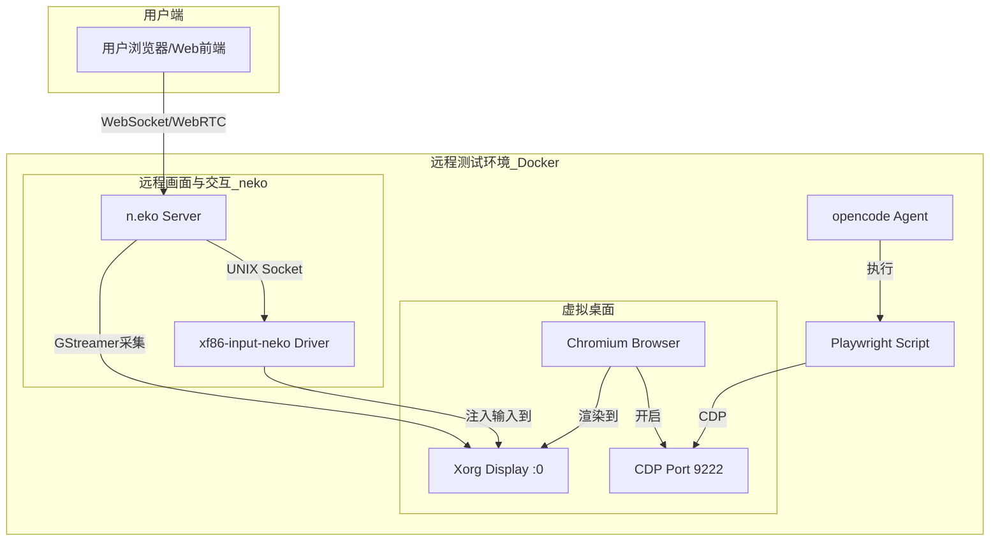

# opencode 集成 Playwright 与 n.eko 远程测试方案

**作者**: Manus AI
**日期**: 2026年02月26日

## 1. 方案概述

本方案旨在为 `opencode` AI 编程代理设计并实现一套完整的远程自动化测试与实时画面转发系统。通过深度集成 Playwright 和 n.eko，我们将构建一个“可观测、可介入”的远程开发与测试环境。`opencode` 将利用 Playwright 强大的浏览器自动化能力执行测试脚本，同时，n.eko 会将整个操作过程的实时画面通过 WebRTC 流式传输给用户。当自动化流程遇到人机验证等障碍时，用户可以无缝介入，通过远程控制完成验证，确保测试流程的顺利进行。

该方案的核心是让 **Playwright** 和 **n.eko** 共享并协同控制同一个在虚拟桌面环境中运行的 **Chromium** 浏览器实例。

## 2. 核心架构

我们将在一个隔离的 Linux 环境中（推荐使用 Docker 容器）部署以下核心组件：

| 组件 | 作用 | 关键配置/交互 |
| :--- | :--- | :--- |
| **Xorg** | 虚拟显示服务器 | 创建一个虚拟桌面环境（如 `:0`），供浏览器渲染 UI。 |
| **Chromium** | 目标浏览器 | 运行 Web 应用，同时开启远程调试端口（CDP）和在 Xorg 上渲染。 |
| **n.eko** | 画面转发与交互 | 采集 Xorg 桌面，通过 WebRTC 编码并流式传输；接收用户输入。 |
| **xf86-input-neko** | 自定义输入驱动 | 一个 X11 输入驱动，接收 n.eko 转发的用户输入并注入 Xorg。 |
| **Playwright** | 自动化测试框架 | 连接到 Chromium 的 CDP 端口，执行 `opencode` 生成的测试脚本。 |
| **opencode Agent** | 任务主控 | 负责编排测试流程，调用 Playwright API，并向用户提供 n.eko 的访问链接。 |
| **Web 前端** | 用户界面 | 嵌入 n.eko 的 WebRTC 客户端，展示远程桌面并捕获用户输入。 |

### 架构图



## 3. 实施步骤与关键配置

### 3.1. 环境搭建 (Dockerfile)

建议使用 Dockerfile 构建一个包含所有依赖的镜像。基础镜像可以选择带有桌面环境的 Ubuntu，例如 `ubuntu:22.04`。

```dockerfile
# 基础镜像
FROM ubuntu:22.04

# 安装基础依赖
RUN apt-get update && apt-get install -y \
    xorg \
    chromium-browser \
    nodejs \
    npm \
    python3 \
    python3-pip \
    supervisor \
    # ... 其他 n.eko 和 playwright 的依赖

# 安装 Playwright
RUN npm i -g playwright && playwright install chromium

# 安装和配置 n.eko
# (参考 n.eko 官方文档下载二进制文件和 xf86-input-neko 驱动)
# ...

# 配置 Xorg
COPY xorg.conf /etc/X11/xorg.conf

# 配置 supervisord
COPY supervisord.conf /etc/supervisor/supervisord.conf

# ... 其他配置

CMD ["/usr/bin/supervisord", "-c", "/etc/supervisor/supervisord.conf"]
```

### 3.2. 配置 Xorg 与输入驱动

`xorg.conf` 的配置至关重要，它需要定义一个虚拟显示设备（`dummy` 驱动）和一个自定义的输入设备（`neko` 驱动）。

**`/etc/X11/xorg.conf`**: 
```conf
Section "ServerLayout"
    Identifier "DefaultLayout"
    Screen 0 "Screen0"
    InputDevice "NekoInput" "SendCoreEvents"
EndSection

Section "InputDevice"
    Identifier "NekoInput"
    Driver "neko"
    Option "SocketPath" "/tmp/xf86-input-neko.sock"
EndSection

Section "Device"
    Identifier "Card0"
    Driver "dummy"
EndSection

Section "Screen"
    Identifier "Screen0"
    Device "Card0"
    Monitor "Monitor0"
    DefaultDepth 24
    SubSection "Display"
        Depth 24
        Modes "1280x1024" # 根据需要调整分辨率
    EndSubSection
EndSection

# ... 其他配置
```

### 3.3. 启动与管理服务 (Supervisord)

使用 `supervisord` 来管理所有后台服务的生命周期，确保它们按正确的依赖顺序启动。

**`/etc/supervisor/supervisord.conf`**: 
```ini
[program:xorg]
command=/usr/bin/Xorg :0 -config /etc/X11/xorg.conf
priority=10

[program:neko]
command=/path/to/neko serve --config /path/to/neko.yml
environment=DISPLAY=":0"
depends_on=xorg
priority=20

[program:chromium]
command=/path/to/start-chromium.sh
environment=DISPLAY=":0"
depends_on=xorg
priority=30

# opencode agent 进程
[program:opencode]
command=/path/to/opencode-agent-entrypoint
priority=40
```

### 3.4. 配置 Chromium

创建一个启动脚本 `start-chromium.sh` 来封装 Chromium 的启动参数。核心是开启远程调试端口。

**`start-chromium.sh`**:
```bash
#!/bin/bash
chromium-browser \
    --no-sandbox \
    --window-size=1280,1024 \
    --remote-debugging-port=9222 \
    --user-data-dir=/data/browser-profile \
    --no-first-run \
    # ... 其他优化参数参考 Manus 实现
```

### 3.5. 配置 n.eko

`neko.yml` 配置文件需要指定视频源（X Display）、编码参数和认证信息。

**`neko.yml`**:
```yaml
server:
  bind: "0.0.0.0:8080" # neko 的 HTTP 和 WebSocket 服务端口
capture:
  display: ":0" # 必须与 Xorg 的 Display 匹配
  video_codec: "h264"
  video_bitrate: 3000
  audio_codec: "opus"
webrtc:
  ice_servers: # 配置 STUN/TURN 服务器
    - urls: ["stun:stun.l.google.com:19302"]
  epr: 51000-51100 # WebRTC 临时端口范围
member:
  provider: "multiuser"
  multiuser:
    admin_password: "your_strong_admin_password"
    user_password: "your_strong_user_password"
```

### 3.6. Playwright 连接

`opencode` 的 Playwright 脚本需要使用 `browserType.connectOverCDP()` 方法来连接到已经运行的 Chromium 实例，而不是启动一个新的。

```python
from playwright.sync_api import sync_playwright

def run_test():
    with sync_playwright() as p:
        # 连接到在 Docker 容器内运行的 Chromium 实例
        browser = p.chromium.connect_over_cdp("http://localhost:9222")
        context = browser.contexts[0]
        page = context.pages[0]

        # --- opencode 的测试逻辑 ---
        page.goto("https://example.com")
        print(page.title())
        # ...

        browser.close()
```

### 3.7. 用户访问与交互流程

1.  `opencode` Agent 启动测试任务。
2.  Agent 通过 API（或直接调用）获取 n.eko 的访问令牌（使用 `admin_password` 或 `user_password` 登录 n.eko 的 `/api/login` 端点）。
3.  Agent 将包含令牌的 n.eko 访问 URL（如 `http://<your-server-ip>:8080?token=<neko-token>`）提供给用户。
4.  用户在浏览器中打开此 URL，n.eko 的 Web 前端加载，并通过 WebRTC 建立连接，开始接收实时画面。
5.  同时，`opencode` 的 Playwright 脚本在后台执行自动化操作。
6.  **用户介入**：当 Playwright 脚本遇到无法处理的步骤（如 CAPTCHA），它可以暂停执行。此时，用户可以通过 n.eko 传输的画面看到当前页面，并使用自己的鼠标和键盘进行远程操作。`xf86-input-neko` 驱动会将这些操作注入到虚拟桌面，从而完成人机验证。
7.  验证通过后，Playwright 脚本可以继续执行后续步骤。

## 4. 结论

通过上述方案，我们可以为 `opencode` 打造一个功能强大的远程测试与编程环境。它不仅实现了测试过程的完全自动化和可视化，还通过创新的用户介入机制解决了自动化流程中的常见痛点。该方案复现了 Manus Sandbox 的核心技术精髓，具有高度的可行性和实用价值，能够显著提升 `opencode` 的开发与测试效率。

---

### References

*   [1] n.eko - A self hosted virtual browser that runs in docker and uses WebRTC. [https://github.com/m1k1o/neko](https://github.com/m1k1o/neko)
*   [2] Playwright - Connect over CDP. [https://playwright.dev/docs/api/class-browsertype#browser-type-connect-over-cdp](https://playwright.dev/docs/api/class-browsertype#browser-type-connect-over-cdp)
*   [3] X.Org - The X.Org project provides an open source implementation of the X Window System. [https://www.x.org/](https://www.x.org/)
*   [4] Supervisord - A Process Control System. [http://supervisord.org/](http://supervisord.org/)
